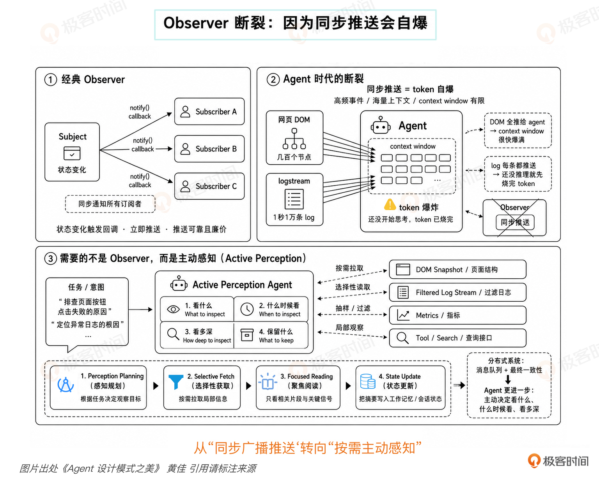

# 01｜范式之变：GoF 的崩塌和分布式的血脉进化

**作者**：黄佳

---

## 一句话脉络

- GoF 解决"代码怎么组织" → 分布式解决"服务怎么存活" → **Agent 解决"模型怎么被约束地行动"**
- 第二代不是推翻第一代，第三代不是推翻第三代——是问题层次往上推进了一层



---

## GoF 底层假设（四个）

单进程 / 共享内存 / 同步调用 / 确定性失败

这四个假设在 2010 年代分布式时代已经开始受冲击，到了 2024 年 Agent 时代彻底不够用了。

---

## 分布式模式对 GoF 假设的冲击

| GoF 假设 | 分布式现实 |
|---|---|
| 共享内存 | 网络分区，节点间不能瞬间看到对方状态 |
| 同步调用 | 异步消息，调用方等不到响应可能是消息丢了 |
| 单点失败 | 部分失败，30% 节点挂了系统仍要工作 |
| 确定性 | CAP 三选二，不能全要 |

**分布式 9 个核心模式的共同特征**：把"不确定性"作为首要关注点来处理。失败不是 Exception，是 default。

## GoF 四种模式在 Agent 时代的断裂

### 1. Singleton 断裂

**经典假设**：状态全局共享，所有调用者看到同一份内存里的同一份数据。

**Agent 现实**：上下文窗口有 token 上限，每次对话会被重置。你在第一次对话里放的"全局配置"，上下文压缩时可能消失；新对话时 Agent 压根没见过。

**→ 需要的不是 Singleton，是分层记忆架构**（工作记忆 / 短期记忆 / 长期记忆 / 程序性记忆）

---

### 2. Factory 断裂

**经典假设**：产品类型在编译时已知，`createSedan() / createSUV()`。

**Agent 现实**：Agent 的"产品"是动作，而动作空间在编译期是开放的。MCP 协议让 Agent 在运行时动态发现新工具——明天可能接到一个今天不存在的 MCP server。

**→ 需要的是语义工具路由（Semantic Tool Routing）**，让 Agent 根据自然语言意图动态匹配工具描述

---

### 3. Observer 断裂

**经典假设**：推送可靠且廉价，状态变化触发回调，所有 subscribers 立刻收到。

**Agent 现实**：DOM 节点几百个，全推给 Agent 做 Observer，上下文窗口秒爆；logstream 一秒一万条，每条都推送，token 烧完还没开始想事情。

**→ 需要的是主动感知（Active Perception）**，Agent 自己决定看什么、什么时候看、看多深

---

### 4. Strategy 断裂（最有代表性）

**经典假设**：开发者编码时决定用哪个策略，`calculator.setStrategy(new VIPPricing())`。

**Agent 现实**：Claude Code 修 bug 的 7 步里，没有任何一次 `setStrategy()` 调用。每一步的策略选择都是 LLM 在运行时自己做的：

```
看到 lock 用法可疑 → 切到 race condition
假设"不是 timing 问题" → 切到 stale data
假设需要看更多 caller → 切到 grep mode
寻找所有 cache.get 调用点
```

**→ Strategy 模式没消失，是被搬到了 Agent 脑子里，由 LLM 在每一步动态切换**

---

## 断裂的根因：决策权从开发者搬到大模型

GoF 所有模式假设：**架构师在设计时做出所有结构性决策**

Agent 系统要求：**系统本身在运行时、不确定性情况下做出决策**

- GoF 时代：编译期决策 + 运行时执行
- Agent 时代：运行时决策 + 运行时执行

决策权从开发者手里搬到 LLM——这个搬家足以让 GoF 整个 23 模式集体失重。

### 对照表

| GoF 模式 | Agent 时代的对应 |
|---|---|
| Singleton | MemoryArchitecture（04 记忆模块 · 4 层记忆） |
| Factory | SemanticToolRouter（04 行动模块 · 工具调用和 MCP 语义匹配） |
| Observer | ActivePerception（02 感知模块 · Agent 自己决定看什么） |
| Strategy | LLM 在 reason() 里每一步自己挑 |

---

## 三种不确定性（Agent 时代的新地基）

### 1. 输出不确定（Output uncertainty）

同一个 prompt 跑十次，给十种不同答案。传统软件 retry 假设幂等，失败重跑得同样结果；LLM retry 可能得到完全不一样的答案，引出新的行为分支。

→ 熔断器（Circuit Breaker）、幂等键（Idempotency-Key）整套要重新装

### 2. 行为不确定（Behavioral uncertainty）

Agent 自己决定要不要调用工具、先调哪个、要不要问澄清问题、要不要继续展开。行为轨迹不再是代码里写死的流程图。ReAct Agent 在 Reasoning 和 Acting 之间循环切换，长度、内容、每步做什么，不是设计阶段能预测的。

### 3. 环境不确定（Environmental uncertainty）

Agent 操作的世界本身在变。今天看到的页面布局明天可能变了；上次读过的 Codebase 这次可能已被同事改过。世界不会停下来等 Agent。

---

## 核心判断：把不确定性当作默认运行条件

> **传统软件工程把不确定性当边缘情况来处理（try-catch 一下）。Agent 工程必须把不确定性当作默认运行条件。**

也就是说，要从一开始就默认系统会漂、会偏、会重复、会失控，在这个前提下设计结构，不能等出了问题再打补丁。

---

## Harness：新一代工程地基

### 定义

当系统的关键决策越来越多地在运行时由模型作出时，工程师的工作重心从"写功能逻辑"变成"设计边界条件"：

- 模型在什么上下文下思考
- 模型能看到哪些信息
- 模型能调哪些工具
- 模型在什么条件下必须停下来
- 模型做错以后，系统如何把它拉回来
- 模型做过什么，谁来留痕，谁来审计

**这一整层不是 prompt。这一整层就是 Harness。**

Harness 在模型思考之前、之中、之后，给它立边界、留痕迹、做审计。它不替代模型思考。

### 核心判断

> **Agent 架构，就是在不确定性之下设计有界资源的分配。**
> Agent architecture is the design of bounded resource allocation under uncertainty.
>
> **模型负责花钱，Harness 负责管账。**

模型天然擅长生成可能性，但不天然擅长节制。它会花、会试、会探索、会走弯路。问题是它花到哪里、花多少、什么时候该停——模型会花是默认前提。

Harness 的意义：不负责创造智能，负责约束智能的开销与后果。

### 工程杠杆

- 调 prompt = 局部修补，让"这次别犯"
- 做 Harness = 把局部错误上升为系统纪律，让"以后都别这么犯"

**新一代工程师最重要的能力：把企业的流程、知识、权限、风险、审计，沉淀成一套 Agent 可以消化、可以复用、可以持续迭代的 Harness 结构。**

---

## 分布式模式到 Agent 模式的演进（血脉进化）

第二代和第三代之间是**推进**的关系，不是断裂。旧模式没有过时，是被抬高了一个层次。

| 第二代分布式模式 | 第三代 Agent 模式的进化 |
|---|---|
| 长事务补偿 | 规划—执行（Agent 任务不是一步完成，先拆任务，再执行，失败再重新规划）|

---

## 双轴正交框架的定位

Agent 时代模式的核心张力不再是"做什么对象操作"，而是：

> **花什么资源 × 怎么花**

- Y 轴（认知功能）回答：**资源花在哪里**（感知 / 记忆 / 推理 / 行动 / 反思 / 协作 / 治理）
- X 轴（执行拓扑）回答：**资源怎么花出去**（链式 / 路由 / 并行 / 编排 / 循环 / 层级）

---

## 思考题

1. 三代设计模式演进，根因分析是否到位？对你展望 Agent 时代新架构有何启发？
2. 你的项目里写过哪几个 GoF 模式？挑 3 个用得最多的，说说它们各自的核心假设是什么？
3. 你做过的微服务系统里用了 9 个分布式模式哪几个？哪些是生产系统不可或缺的？
4. 你目前的项目里最关键的类（配置管理器、连接池、事件总线、策略容器），如果改造成 Agent 版本，会先碰到哪种断裂？
5. Harness vs Prompt：如果给你 1 周提升 Agent 可靠性，你选 (a) 调 prompt 让模型这次别犯错 / (b) 改 harness 让模型永远没机会犯错？为什么？

---

## 关键对话总结

以下内容来自学习过程中的互动讨论，帮助建立理论到实践的理解桥梁。

### 1. Singleton 到底断在哪

**直觉**：Agent 系统里 Singleton 没有用武之地，因为不需要全局唯一实例。

**根因**：Singleton 的核心假设是"状态全局共享，所有调用者看到同一份数据"——这需要稳定的内存空间来保证。但 Agent 的工作空间是上下文窗口，窗口有 token 上限，每次对话可能被重置或压缩。

**暴露的真实需求**：Agent 不是不需要全局状态，而是需要**分层记忆架构**来代替 Singleton 的"全局性"：
- 工作记忆（当前上下文）
- 短期记忆（当前会话）
- 长期记忆（跨会话持久化）
- 程序性记忆（固化技能）

问题层次被推高了一级——不是"不要单例"，是"单例装不下现在的问题规模"。

### 2. 决策权搬家：四个断裂的根因

GoF 所有模式隐含一个假设：**架构师在设计时做出所有结构性决策。** 编译时定好一切，运行时只管执行。

Agent 系统截然相反：**模型在运行时、不确定性情况下做出决策。**

| | GoF 时代 | Agent 时代 |
|---|---|---|
| 决策时机 | 编译期 | 运行时 |
| 执行方式 | 确定性执行 | 边规划边执行 |
| 不确定性角色 | 边缘情况（try-catch） | 默认运行条件 |

这个"决策权从开发者搬到 LLM"的转移，让 GoF 的 23 个模式集体失重：

| GoF 模式 | 断裂原因 | Agent 替代方案 |
|---|---|---|
| Singleton | 上下文窗口不保证全局性 | 分层记忆架构 |
| Factory | 动作空间在运行时开放 | 语义工具路由 |
| Observer | 全量推送撑爆上下文 | 主动感知（Agent 自己决定看什么） |
| Strategy | 策略选择由 LLM 推理时动态切换 | LLM 在 reason() 里每一步自己挑 |

### 3. "不确定性是默认条件"的两个比喻

**食堂打饭比喻**

- 传统软件：排队 → 打菜 → 刷卡 → 走人。异常（队伍太长、余额不足）是意外情况，有应急预案。
- Agent 系统：让实习生去打饭——"随便打点好吃的"。他到食堂发现菜跟昨天不一样（环境不确定）、刷卡余额不够（失败不确定）、碰到领导改变计划（行为不确定）。**每一步都是现场决策，没有"正常流程"。**

**开车 vs 自动驾驶**

- 开车（传统软件）：知道终点在哪，90% 时间按计划行驶，堵车是异常。
- 自动驾驶（Agent 系统）：知道终点在哪，但路况每秒钟都在变。**不是"偶尔出状况"，是"状况才是常态"。**

> 设计的时候就从"系统会漂、会偏、会重复、会失控"出发，不是从"系统会完美执行"出发。

### 4. Harness 的落地：你的真实案例

你做过一个生成完整应用的 Agent，遇到了两个核心问题：

1. **上下文爆炸**——Agent 一次性承载太多信息
2. **生成成功率低**——端到端一次性生成，出错后难以定位

你的改进方案（这就是 Harness 的雏形）：

| 你的做法 | Harness 框架对应 |
|---|---|
| 提前准备项目模板、通用代码 | **限定动作空间**——给模型边界，不是让它从零生成 |
| 先生成一个个子任务 | **分解不确定性**——大问题切成可控小块 |
| 每次只完成一个子任务 | **编排 + 验证**——每步可追溯、可回退 |

你凭直觉找到的答案，正是这门课后面会系统性展开的**"规划—执行"模式**：不是让模型一次性做完，而是把大问题拆成小步骤，每一步给限制条件。

### 5. 一句话带走

> **模型负责花钱（token、时间、动作），Harness 负责管账。调 prompt 是局部修补让"这次别犯"，做 Harness 是把局部错误上升为系统纪律让"以后都别这么犯"。**