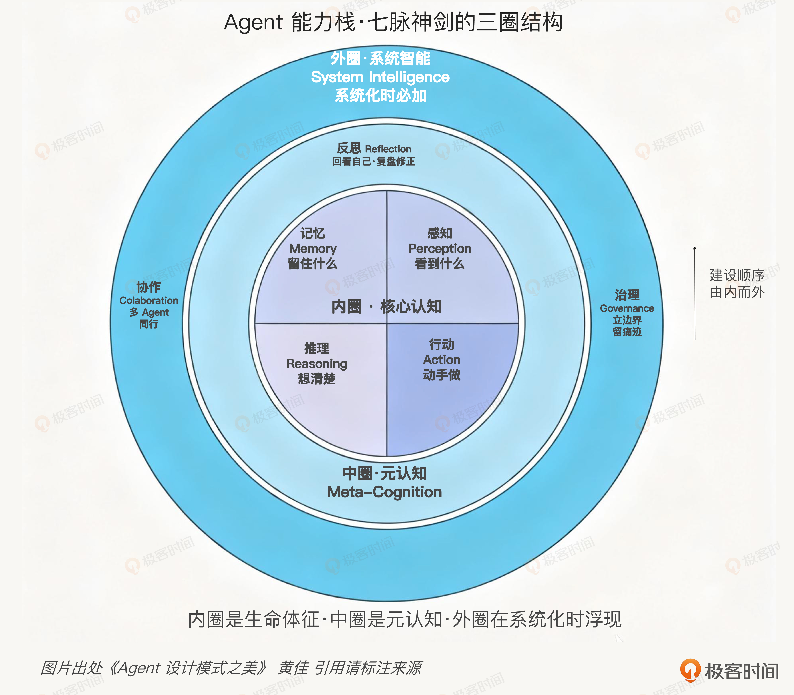
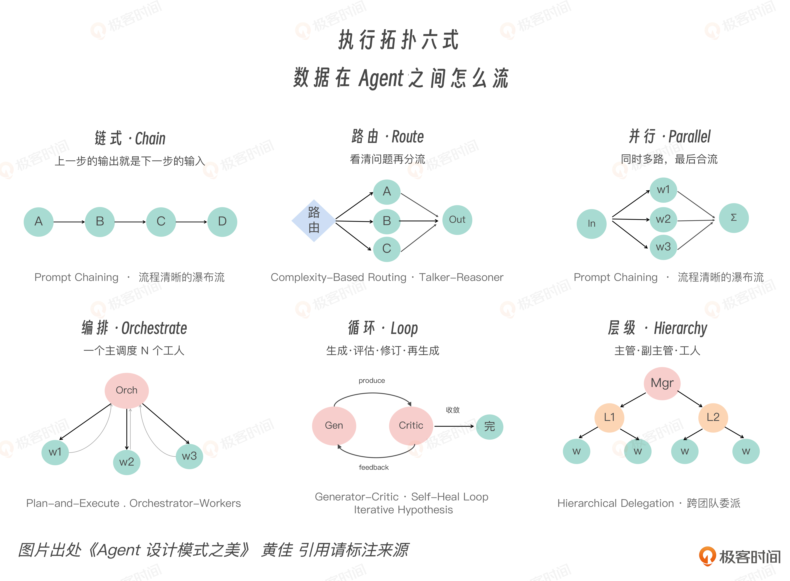
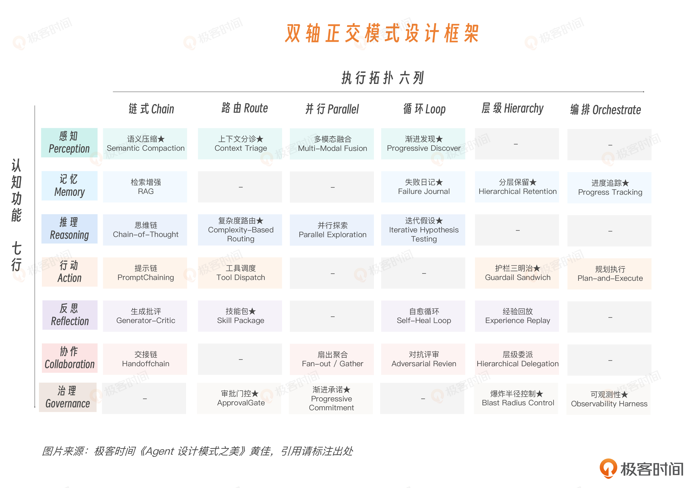

# 02｜双轴框架（上）：理解认知功能与执行拓扑

**作者**：黄佳

---

## 一句话脉络

- 双轴框架 = **What（认知功能）** × **How（执行拓扑）**
- 纵轴回答"Agent 在消耗哪种资源"
- 横轴回答"错误如何在系统里传播"

---

## 为什么需要双轴坐标系

业界 5 类主流分类说法（Weng 数模块、Anthropic 数 Workflow、Andrew Ng 数模式、Chip Huyen 数工程角色）都对，但都不是同一层的东西——像从不同方向给同一个立方体画三视图，每个视图都是真的，但没有一张能还原整体结构。

三大盲区：

1. **感知盲区** — 默认 LLM 拿到的 input 是对的，但生产系统最先死的往往就是 input。感知是注意力预算的第一道闸，不是前处理小步骤。
2. **反思盲区** — Reflection 常被折进 Reasoning，好像只是推理的技巧。但反思是把"一次性回答"推进到"可迭代改进"的关键机制，应该独立成脉。
3. **治理盲区** — Demo 可以没有治理，工程不能没有。治理必须和行动能力一起设计，不是上线前临时补丁。

---

## 纵轴：七脉（认知功能）



| 认知层 | 资源预算 | 核心问题 |
|---|---|---|
| 感知 | 注意力预算 | 什么信息值得进入模型，什么留在外面 |
| 记忆 | 连续性预算 | Agent 跨时间保留什么 |
| 推理 | 不确定性预算 | 怎么从前提走到结论 |
| 行动 | 可逆性预算 | Agent 能对世界做什么，做了之后能否撤回 |
| 反思 | 校正预算 | 刚才做得对不对，错在哪里，下一步怎么改 |
| 协作 | 分工预算 | 任务怎么拆给多个 Agent |
| 治理 | 信任预算 | Agent 的能力如何被限制、记录、审计、追责 |

### 七脉三层

```
内圈（核心认知）：感知 → 记忆 → 推理 → 行动
    让 Agent 能用

中圈（元认知）：反思
    让 Agent 可靠

外圈（系统智能）：协作 + 治理
    让 Agent 能上线
```

### 七脉失配后的表现

| 缺哪脉 | 失控表现 |
|---|---|
| 缺感知 | token 失控 |
| 缺记忆 | 连续性失控 |
| 缺推理 | 判断失控 |
| 缺行动约束 | 世界状态失控 |
| 缺反思 | 错误失控 |
| 缺协作 | 规模失控 |
| 缺治理 | 信任失控 |

---

## 横轴：六式（执行拓扑）



| 拓扑 | 动词 | 错误传播方式 |
|---|---|---|
| Chain（链式） | 传 | 错误级联——一步走偏，顺流而下，下游不会纠错反而包装错误 |
| Route（路由） | 选 | 错误分派——路由错了后面再强也难救 |
| Parallel（并行） | 撒 | 错误聚合——merge 不做好，只是把噪声并行化 |
| Orchestrate（编排） | 协 | 错误分解——该选链式的拆成并行，该共享状态的拆成独立 |
| Loop（循环） | 转 | 错误复合——越改越忙，越忙越偏 |
| Hierarchy（层级） | 分 | 错误放大或隔离——隔离没做好，父级泄漏给子级，权限继承太宽 |

### 关键洞见

> 横轴不是流程图轴，而是**错误的传播路径轴**。选择了拓扑，就是选择了错误如何在系统里移动。

### 各拓扑核心要点

- **Chain**：优点可预测，缺点错误会顺流而下。链越长中间格式越重要。
- **Route**：核心是分类器质量。路由的工程价值在于降低平均成本和风险，不在于提高上限。
- **Parallel**：关键在 merge，不在 fan-out。数学题可以多数投票，创意题不能。
- **Orchestrate**：失败模式是拆错边界。该委派给专家的留在中心硬做。
- **Loop**：核心是停止条件、评估信号、每轮改动幅度。没有这些会越转越偏。
- **Hierarchy**：失败模式是隔离没做好——父级上下文泄漏给所有子级，权限继承太宽。

---

## 双轴合一的判断标准



> **纵七脉定资源得失，横六式断错误路径。**

一个 Agent 架构缺哪一脉，就会在哪一类资源上失控。
选择了拓扑，就是选择了错误如何传播。

---

## 思考题

1. 你正在做或见过的 Agent 系统，最容易失控的是哪一类资源？
2. 找一个熟悉的 Agent 工作流，判断它主要采用哪种执行拓扑，这种拓扑最容易让错误沿什么路径传播？
3. 为什么"用了几个 Agent""接了几个工具"还不足以说明系统设计得好？用七脉和六式重新描述这个系统。

---

## 关键对话总结

### 1. 为什么需要双轴框架

市面上已有的 Agent 分类（Weng 数模块、Anthropic 数 Workflow、Andrew Ng 数模式、Chip Huyen 数工程角色）都是从不同方向给同一个立方体画三视图——每个视图都是真的，但没有一张能还原整体结构。双轴框架就是那个**立方体本身**。

### 2. 纵轴七脉：七种资源预算

七脉回答的不是"Agent 能做多少事"，而是 **"Agent 在花什么资源"**：

| 脉 | 你管的是什么预算 | 缺了会怎样 |
|---|---|---|
| 感知 | 注意力预算——什么信息值得看 | token 失控 |
| 记忆 | 连续性预算——跨时间保留什么 | 连续性失控 |
| 推理 | 不确定性预算——怎么从前提走到结论 | 判断失控 |
| 行动 | 可逆性预算——做了能不能撤回 | 世界状态失控 |
| 反思 | 校正预算——刚才对不对，下一步怎么改 | 错误失控 |
| 协作 | 分工预算——任务怎么拆给多个 Agent | 规模失控 |
| 治理 | 信任预算——怎么限制、记录、审计 | 信任失控 |

七脉又分三层：

```
内圈（核心认知）：感知 → 记忆 → 推理 → 行动   让 Agent 能用
中圈（元认知）：   反思                          让 Agent 可靠
外圈（系统智能）：  协作 + 治理                  让 Agent 能上线
```

### 3. 实战案例：你的生成应用 Agent 失控在哪一脉

你做过的生成完整应用的 Agent，最容易失控的是**记忆脉**——Agent 要生成多个文件、多次决策、多轮修改，上一轮决定了什么下一轮还记不记得，就是记忆脉管的事。

你的解决方案（"先生成一个个任务，每次只做一个"）本质上是**降低对记忆的依赖**——每一步要记的东西变少了，上下文就不容易炸。

### 4. 横轴六式：错误的传播路径

横轴回答的不是"流程怎么走"，而是**"错误怎么传播"**。选了拓扑，就是选了错误在系统里怎么移动。

| 拓扑 | 动词 | 错误传播方式 |
|---|---|---|
| Chain（链式） | 传 | 错误级联——一步走偏，下游不会纠错反而包装错误 |
| Route（路由） | 选 | 错误分派——路由错了后面再强也难救 |
| Parallel（并行） | 撒 | 错误聚合——merge 没做好，噪声只会放大 |
| Orchestrate（编排） | 协 | 错误分解——拆错边界，中心做不了的事硬做 |
| Loop（循环） | 转 | 错误复合——越改越偏 |
| Hierarchy（层级） | 分 | 错误放大或隔离——父级泄漏给子级，权限太宽 |

### 5. 实战案例：Chain 的致命弱点

你的生成应用天然是**Chain**——生成文件 A → 生成文件 B → 生成文件 C，每个步骤依赖前面的输出。Chain 的致命弱点就是**错误级联**：中间任何一个模块结构错了，后面依赖它的文件只会越偏越离谱。

你的改进方案（先生成任务列表，再逐个完成）本质上是在**把 Chain 拆成 Orchestrate**：先规划再执行，每步有独立验证，错误被隔离在单个任务内。

### 6. 一句话带走

> **纵七脉定资源得失，横六式断错误路径。** 双轴框架是一张坐标图，后面所有 Agent 模式（感知、记忆、推理、行动……）都可以在这张图上定位——它属于哪一脉（花什么资源），用哪种拓扑（错误怎么传）。