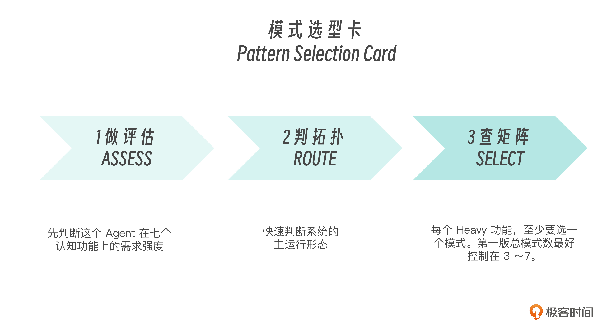
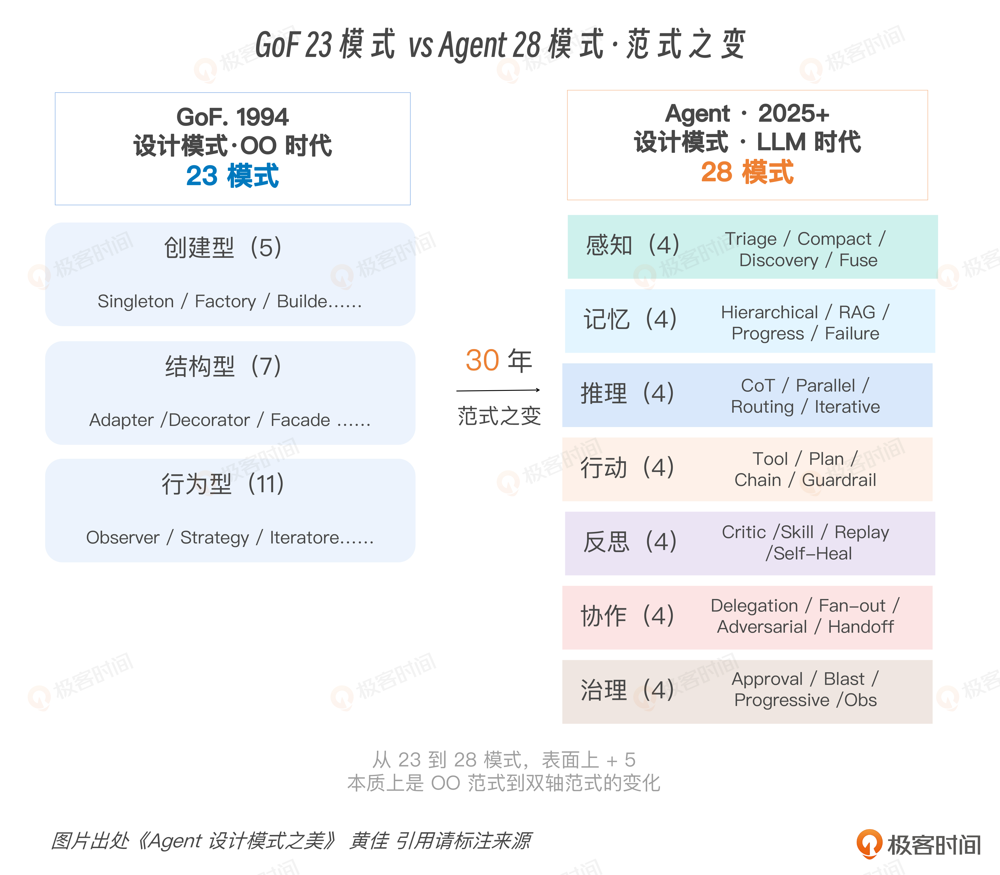

# 03｜双轴框架（下）：理解与使用 Agent 设计坐标系

**作者**：黄佳

---

## 一句话脉络

- 双轴正交 = 每个模式必须有"功能 × 拓扑"的唯一地址
- 7×6 = 42 格矩阵，当前放入 28 个模式，留 14 个空格
- 空格是设计判断，不是因为没想全

---

## 为什么必须正交

**正交的意思：纵轴和横轴各自回答不同问题，彼此不能互相替代。**

只说"我们用了推理"，不知道是链式推理还是循环推理。
只说"我们用了循环"，不知道是推理循环还是反思循环。

同一认知功能，换拓扑，工程后果完全不同；同一拓扑，放不同认知功能，含义也不同。

**举例：推理 × 链式 vs 推理 × 循环**

```python
# 推理 × 链式：串行推理
def reasoning_chain(question):
    decomposition = llm("把问题拆成三个子问题：" + question)
    answers = llm("依次回答这些子问题：" + decomposition)
    final = llm("基于这些回答，给出最终答案：" + answers)
    return final
# 成本可预测，延迟可预测，失败模式清晰

# 推理 × 循环：迭代修正
def reasoning_loop(question, max_iter=5):
    answer = llm("先给出一个答案：" + question)
    for _ in range(max_iter):
        critique = llm("检查这个答案的问题，没问题输出 DONE：" + answer)
        if "DONE" in critique:
            break
        answer = llm("根据批评修订答案：" + answer + "\n批评：" + critique)
    return answer
# 成本不固定，有自我修正能力，也有过度反思风险
```

两者都属于 Reasoning，但 token 预算、等待时间、可观测性、停止条件、错误恢复路径完全不同。

---

## 42 格矩阵



7 个认知功能 × 6 种执行拓扑 = 42 格

当前放入 28 个模式，14 个空格。

### 空格的几种情况

| 空格类型 | 说明 |
|---|---|
| 结构性不成立 | 感知 × 层级：感知本身不是层级委派问题，硬塞会混淆协作×层级和治理×层级 |
| 已被其他格覆盖 | 反思 × 编排：容易退化成生成批评的变体，没有独立工程骨架 |
| 未来研究方向 | 记忆 × 并行：多个 Memory Store 并行查询再投票，但还没有稳定 production 形态 |

**空格是设计判断，不是没想全。**

---

## Pattern Selection Card：三步选型法



### 第一步：ASSESS — 对七脉打分

每个认知功能评 None / Light / Heavy。

### 第二步：ROUTE — 判断主拓扑

| 任务特征 | 优先拓扑 |
|---|---|
| 低协作 + 短任务 | Chain / Route |
| 中等复杂 + 多步骤 | Orchestrate / Loop |
| 多专家 + 宽任务 | Parallel / Hierarchy |
| 高风险动作 | Governance + Route / Chain / Hierarchy |

### 第三步：SELECT — 查矩阵

每个 Heavy 功能至少选一个模式。
第一版总模式数控制在 3~7 个。
目标是找到最小可行稳定组合，不是炫技。

### 实例：代码评审 Agent 选型

| 认知功能 | 评分 | 对应模式 |
|---|---|---|
| 感知 | Heavy | Context Triage（感知 × 路由） |
| 记忆 | Light | short-term state（第一版不引入复杂长期记忆） |
| 推理 | Heavy | Complexity Routing 或 Structured Reasoning（推理×路由或链式） |
| 行动 | Light→Medium | 第一版只读不写；未来升级到 Plan-and-Execute（行动×编排） |
| 反思 | Heavy | Generator-Critic（反思×链式）或 Self-Heal（反思×循环） |
| 协作 | Light | 第一版单 Agent，不急着上多智能体 |
| 治理 | Light→Medium | trace 必做；能写代码则必须加 Approval Gate（治理×路由） |

**第一版 Argus 三个模式：Context Triage + Structured Reasoning/Complexity Routing + Generator-Critic**

---

## 双轴评审法：五个锋利问题

1. **这个 Agent 的七脉状态是什么？** — 感知/记忆/推理/行动/反思/协作/治理分别是 None/Light/Heavy？不要先争技术方案，先澄清认知需求。

2. **每个 Heavy 功能落在哪个拓扑？** — 如果没人说得清，说明团队还没真正设计，只是在堆能力。

3. **主要错误传播路径是什么？** — 这个问题能直接带出测试策略。

4. **哪些格子刻意留空？** — 空格必须有理由，没做是因为不需要还是忘了？

5. **从 v1 到 v2 的升级路径是什么？** — 第一版用 Chain，未来是否升级 Loop？单 Agent 是否升级并行专家？

---

## Compound Error 公理

> 单步 95% 正确率听起来很高，但 10 步连续执行成功率 ≈ 0.95^10 ≈ 60%，20 步 ≈ 36%。

每多一个节点，多一个出错点；每多一轮循环，多一次偏航机会；每多一个工具，多一条误调用路径。

**应对复合错误四条路：**

| 策略 | 做法 |
|---|---|
| 减少步数 | 能一次可靠完成的，不要为了显得 Agentic 拆成十步 |
| 提高单步质量 | 上下文给准、工具描述写清、schema 约束明确，单步从 95% 到 99% 对长链收益巨大 |
| 加 verification | 在中间状态就加入 Reflection 或外部 checker 挑错，不等最终结果才发现错 |
| fail fast | 明显错了就停，不要带着脏状态继续生成。Agent 世界也需要 Circuit Breaker |

**每个模式都要能回答：它在减少步数、提高单步、增加校验，还是让系统更早失败？四个都不符合，可能只是装饰。**

---

## 双轴框架的工程价值

1. **给每个模式唯一坐标** — "我们用了编排者-工作者"这句话分不清是推理×编排还是协作×层级。两个坐标合起来才是唯一地址。

2. **给设计决策提供反向** — 查"记忆×循环"有什么模式，比从零想"怎么做记忆"快 100 倍。矩阵是导航工具。

---

## 思考题

1. 拿你正在做的 Agent，把七脉打成 None/Light/Heavy。哪一脉最被低估？
2. 找一个你们团队说过的工作流设计，把它拆成双轴坐标——到底是 Reasoning × Orchestrate，还是 Collaboration × Hierarchy？
3. 选一个 Loop 型设计，写出它的停止条件。如果写不出来，这个 Loop 很可能还不能上线。
4. 从矩阵里找一个空格，判断它是结构性不成立、被其他格覆盖，还是未来研究方向。

---

## 关键对话总结

### 1. 正交的核心：同一功能 × 不同拓扑 = 完全不同

"推理 × 链式"和"推理 × 循环"都是推理脉，但因为横轴不同（链式 vs 循环），工程后果天差地别：

| | 推理 × 链式 | 推理 × 循环 |
|---|---|---|
| 成本 | 固定 | 不固定 |
| 延迟 | 可预测 | 可能发散 |
| 修正能力 | 无（一步错步步错） | 有自我修正 |
| 风险 | 错误级联 | 过度反思 |

反过来，"循环 × 推理"和"循环 × 反思"横轴相同（都是循环），纵轴不同——解决的根本不是同一个问题：
- 循环 × 推理 → 答案越改越好
- 循环 × 反思 → 行为越改越可靠

**正交的价值**：说"我们用了编排者-工作者"分不清是推理×编排还是协作×层级。两个坐标合起来才是唯一地址。

### 2. Pattern Selection Card 实战：你的生成应用 Agent

用三步选型法评估你之前做的生成完整应用的 Agent：

**第一步 ASSESS：给七脉打分**

| 脉 | 评分 | 理由 |
|---|---|---|
| 感知 | Light | 输入就是需求描述，不需要复杂的分诊 |
| 记忆 | Heavy | 多文件、多轮生成，上下文管理是核心痛点 |
| 推理 | Medium | 需要理解需求→拆任务，但不需要复杂多步推理 |
| 行动 | Heavy | 生成代码文件对世界有真实副作用 |
| 反思 | Light | 目前没有自我纠正环节 |
| 协作 | None | 单 Agent |
| 治理 | Light | 没有审计、审批 |

**第二步 ROUTE：选主拓扑**

你的任务特征属于"中等复杂 + 多步骤" → 优先选用 **Orchestrate / Loop**

**第三步 SELECT：选模式（第一版控制在 3~7 个）**

凭直觉做的设计 → 到有坐标图可以做理论设计的转变。之前是"想怎么弄就怎么弄"，现在有了坐标图来指导设计决策。

### 3. Compound Error 公理：为什么你的成功率低

> 单步 95% 正确率 → 10 步 ≈ 60%，20 步 ≈ 36%。

你的生成应用是链式，步数多，错误在累积——解释了为什么"每步看起来还行，最终结果就是不行"。

**应对复合错误的四条路：**

| 策略 | 你的方案怎么落地的 |
|---|---|
| **减少步数** | 拆成独立任务后，每个任务内部步数大幅减少，不再需要在同一个上下文里处理 10 个文件 |
| **提高单步质量** | 准备模板 + 通用代码，让每一步不是在白纸上画，80% → 95%+ |
| **加 verification** | 每完成一个子任务有隐含的检查节点 |
| **fail fast** | 子任务出错不会拉垮整个应用，错误被隔离在单个任务内 |

你的改进方案无意中四条全占了，只是之前没有这套术语来描述。这就是理论的价值——**从凭直觉打补丁，到用坐标图做设计决策。**

### 4. 五个锋利评审问题

可以用来评审任何 Agent 系统设计：

1. **这个 Agent 的七脉状态是什么？** — 先不争方案，先澄清认知需求
2. **每个 Heavy 功能落在哪个拓扑？** — 如果没人说得清，说明只是在堆能力
3. **主要错误传播路径是什么？** — 这个问题直接带出测试策略
4. **哪些格子刻意留空？** — 空格必须有理由，不是因为没想起来
5. **从 v1 到 v2 的升级路径是什么？** — 第一版用 Chain，未来要不要升级 Loop？

### 5. 一句话带走

> **三步选型法（ASSESS → ROUTE → SELECT）** 的价值不是让你选对，是让你说清为什么这么选。每个 Heavy 功能至少从矩阵选一个模式，第一版总模式数控制在 3~7 个——目标是找到最小可行稳定组合，不是炫技。