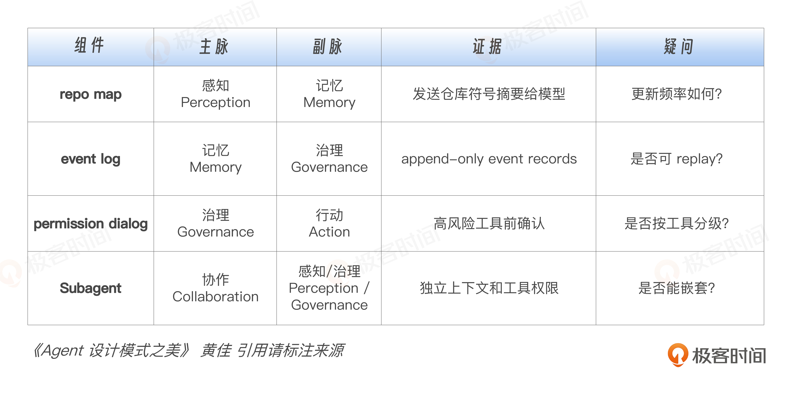
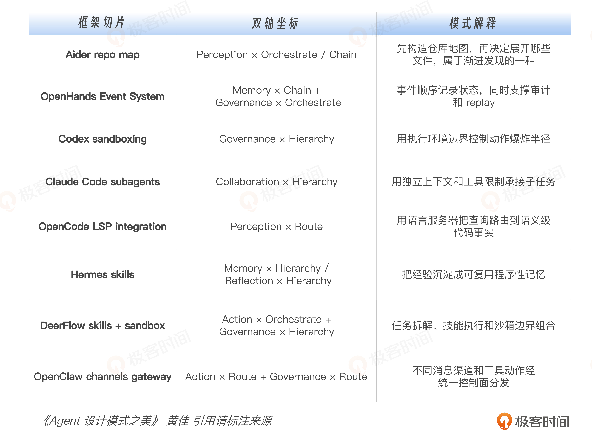
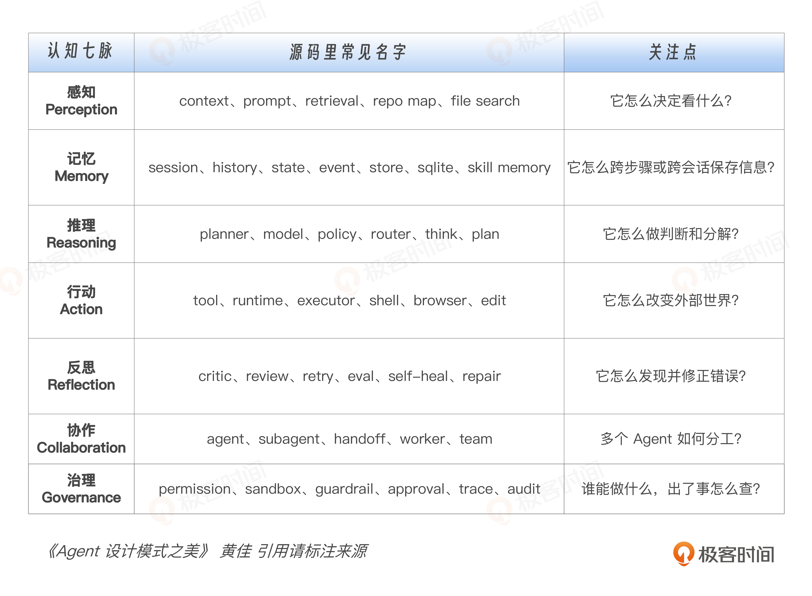

# 04｜逆向五步法（上）：工业级 Agent 框架源码如何解码

**作者**：黄佳

---

## 一句话脉络

带着"认知功能×执行拓扑"的预期框架去源码里验证——不是信马由缰，是按图索骥。

---

## 逆向工程五步法



| 步骤 | 目标 |
|---|---|
| Detect | 找主循环，抓住系统的脊柱 |
| Classify | 用七脉给组件归类 |
| Filter | 主动丢掉 70% 噪声 |
| Map | 落到双轴矩阵 |
| Verify | 每个判断都要能回到源码 |

---

## 为什么需要逆向五步法

读 Agent 框架源码容易掉的三个坑：

1. **README 幻觉** — 知道它"能做什么"，不知道"为什么这样做"、主循环在哪、状态怎么传
2. **关键词漫游** — grep 出来几百个文件，每个看两眼，脑子里只剩碎片
3. **从入口一路钻到底** — 70% 代码是配置、日志、类型定义、序列化、UI glue，钻进支路就出不来了

**核心原则：先知道一个 Agent Harness 理论上应该长什么样，再去源码里验证它实际什么样。**

---

## Agent Harness 的五个理论地基

任何一个工业级 Agent Harness 必然有：

1. **主循环** — 接收输入→装配上下文→调用模型→处理工具结果→决定下一步
2. **上下文管理** — 否则 token window 失控，模型不知道该记住什么、丢掉什么
3. **工具注册和调度** — 行动空间必须有边界
4. **状态或事件记录** — 长任务可恢复，出问题可回放和审计
5. **治理边界** — 权限、沙箱、确认、日志、策略

---

## Step 1：Detect — 先找主循环

主循环同时碰到三件事：**messages + model call + tool dispatch**。

搜索关键词：
```
rg "tool_call|function_call|tool_use|ToolCall|Action|Observation" .
rg "while|loop|step|run|turn|conversation|session" .
rg "messages|context|history|state" .
```

顺着两个方向交叉定位：
- **入口方向**：用户输入、session、conversation、turn
- **模型方向**：messages、model、completion、response、tool call

**产出物**：一张不超过 10 个框的粗图。



```
User Input → Session → Context Builder → LLM → Tool Dispatcher
                                              ↑              ↓
                                        Event Log ← Observation ← Runtime / Sandbox
```

---

## Step 2：Classify — 把组件归到七脉

找到主循环后，用七脉对号入座。不要只看组件名字，要看它**真正在系统里做什么**。

| 组件 | 第一判断 | 副脉 |
|---|---|---|
| Aider repo map | Perception（决定哪些代码进入上下文） | Memory（压缩后的持续认识） |
| OpenHands Event System | Memory（事件账本，可追加可回放） | Governance（过程可追踪可审计） |
| Claude Code Subagent | Collaboration（任务分给子 Agent） | Perception（子 Agent 上下文隔离） |

一个组件可以跨多脉。第一遍先找一个主脉，旁边标注副脉即可。

---

## Step 3：Filter — 主动丢掉 70% 噪声

**判断标准：这个文件会不会改变 Agent 的决策、上下文、状态、行动或权限？**

如果不是，先标成 boilerplate，暂时放一边。

第一轮不需要读：
- CLI 参数解析
- UI 布局
- 错误文案
- telemetry 上报适配
- schema 类型定义
- provider SDK 包装
- serialization / deserialization
- 测试 fixture
- 平台兼容性分支

各框架第一轮过滤建议：

| 框架 | 优先看 | 暂时跳过 |
|---|---|---|
| Claude Code | 工具注册、执行、权限、context 装配 | UI |
| Codex CLI | core、protocol、sandboxing、exec policy | 每个 crate |
| Aider | base_coder.py、repomap.py、repo.py | prompt variant |
| OpenCode | session、llm agent、permission、lsp | UI/TUI（只看触发会话和权限） |
| OpenClaw | gateway、channels contract、workspace、memory-host-sdk | skills 文档 |
| Hermes Agent | run_agent.py、hermes_state.py、memory_setup、skills_hub | 每个 CLI 命令 |
| DeerFlow | agent router、skill router、memory router、sandbox tests | 集成测试 |
| OpenHands | event service、sandbox service、conversation service、runtime README | 前端和集成模板 |

---

## Step 4：Map — 落到双轴矩阵



**Map 不能变成贴标签。** 不是写"这是 Memory"，而是逼自己说清楚：
- 它解决哪个认知功能？
- 采用哪种执行拓扑？
- 失败模式是什么？

**实例：OpenHands EventLog**

不是只说"它是 EventLog"，而是说清楚三个工程判断：
1. 解决 Memory 问题 → 系统状态来自一串事件，不再散落在对象内存里
2. 也解决 Governance 问题 → 事件可以审计、可以回放
3. 采用 Chain / append-only 拓扑 → 错误不会被悄悄覆盖，但日志会膨胀，replay 成本需要管理

**产出物**：一张热力图。

| 框架 | 偏好 |
|---|---|
| Aider | 专注代码上下文、编辑和提交 |
| OpenHands | 重沙箱、事件和运行时 |
| Hermes | 重记忆、技能和用户模型 |
| DeerFlow | 重协作、路由和执行环境 |

---

## Step 5：Verify — 每个判断都要能回到源码

**没有源码/测试/官方文档支撑的架构解读，只是讲故事。能回到证据的解读，才是工程论证。**

证据三层级（强度递减）：
1. **源码** — 最强证据
2. **测试** — 测试比实现更清楚暴露设计边界
3. **官方文档** — 确认产品语义和公开承诺

---

## 思考题

1. 选一个熟悉的 Agent 框架，先写出预期它应该具备的五个地基，再去源码里验证。
2. 拿 Claude Code / Aider / OpenHands / Hermes 任意一个，画一张不超过 10 个框的主循环图。
3. 找一个具体组件，归到七脉，再落到双轴矩阵，说明为什么主要属于这个格子。

---

## 关键对话总结

### 1. 读 Agent 框架源码的三个坑

| 坑 | 表现 |
|---|---|
| README 幻觉 | 知道"能做什么"，不知道"为什么这样做"、主循环在哪、状态怎么传 |
| 关键词漫游 | grep 几百个文件，每个看两眼，脑子里只剩碎片 |
| 从入口一路钻到底 | 70% 代码是配置、日志、类型定义，钻进支路出不来 |

### 2. 核心原则

> **先知道一个 Agent Harness 理论上应该长什么样，再去源码里验证它实际什么样。**——不是从零开始读，是带着双轴框架的预期去对号入座。

任何一个工业级 Agent Harness 必然有五个地基：

1. **主循环** — 接收输入→装配上下文→调模型→处理工具结果→决定下一步
2. **上下文管理** — 否则 token window 失控
3. **工具注册和调度** — 行动空间必须有边界
4. **状态或事件记录** — 长任务可恢复
5. **治理边界** — 权限、沙箱、确认、日志

### 3. Filter：最具实战价值的一步

**判断标准：这个文件会不会改变 Agent 的决策、上下文、状态、行动或权限？**

第一轮不需要读的东西：
- CLI 参数解析、UI 布局、错误文案
- telemetry 上报适配、schema 类型定义
- provider SDK 包装、serialization / deserialization
- 测试 fixture、平台兼容性分支

大部分人读源码慢，不是读得慢，是**舍不得丢**。

### 4. 实战分析：Aider 的三个关键设计

用五步法的框架对 Aider 进行快速分析：

| Aider 组件 | 主脉 | 理由 | 辅脉 |
|---|---|---|---|
| repo map | 感知（决定什么信息进入上下文） | 把代码库压缩成结构化摘要，解决上下文过大问题 | 语义压缩（第 08 讲展开） |
| 编辑 + git commit | 行动 × 链式 | 解析 diff → 改文件 → commit，顺序执行，错误会级联 |
| 只读/可写文件 | 治理（信任预算） | 限制了模型的行动空间，确保不能改不该改的文件 |

**repo map 的辅脉值得注意**：它不只是在做感知，同时在做**语义压缩**——把整个代码库的结构、调用链、最近修改按优先级排好，让模型"瞥一眼就知道整体"。一个工业级组件经常横跨多个脉，但第一遍分析时先找一个主脉就够了。

### 5. 一句话带走

> **逆向五步法的核心不是记住每一步叫什么，是培养读源码的纪律：先有预期 → 归到双轴坐标 → 该丢就丢（70% 代码不值得第一轮读）。每个判断都能回到源码——没有源码/测试/官方文档支撑的架构解读，只是讲故事。**