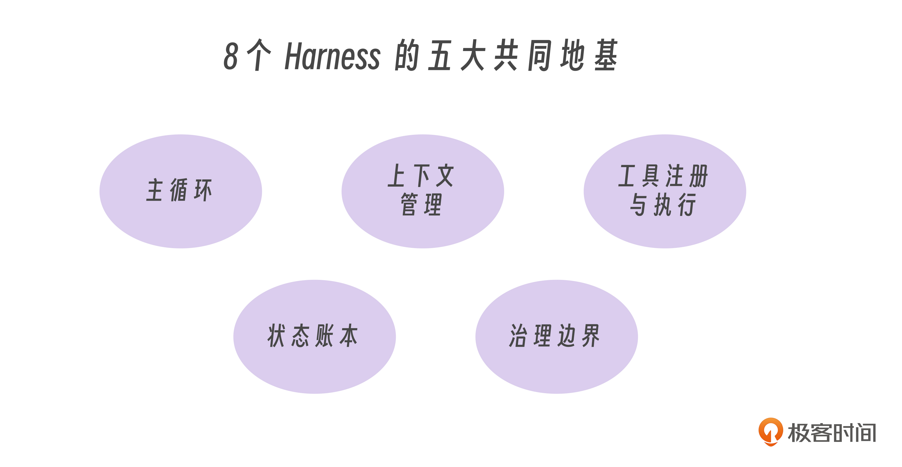
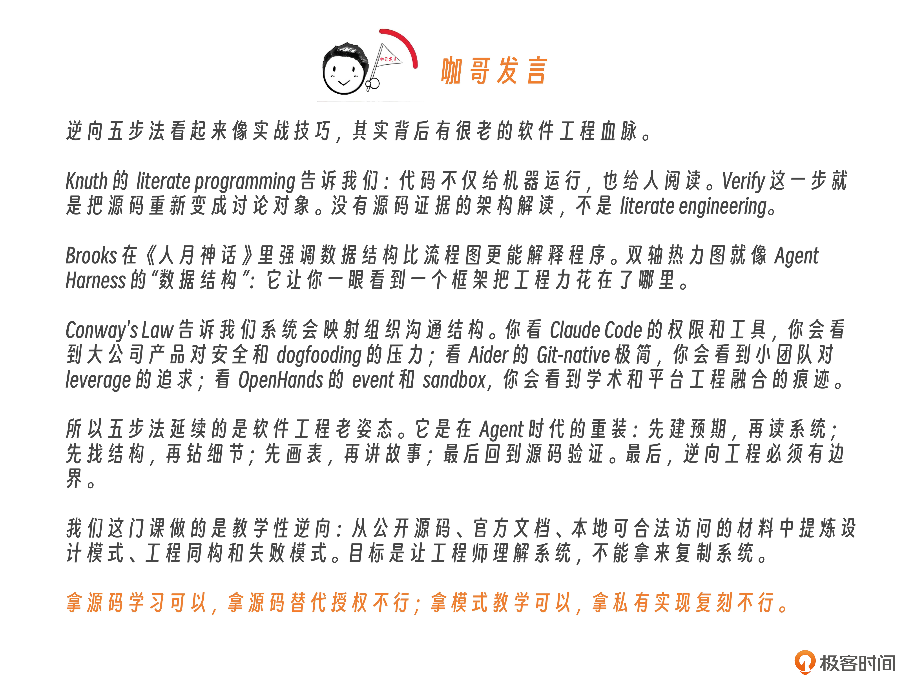

# 05｜逆向五步法（下）：8 个 Harness 产品拆成工程地图

**作者**：黄佳

---

## 一句话脉络

8 个框架代表 8 种工程性格——没有万能架构，都是根据场景做取舍。

---

## 8 个框架的四问读法

每个框架只问四个问题：
1. 它主要解决什么问题？
2. 它抓住了什么工程关键点？
3. 放到 2026 年，最值得观察的新变化是什么？
4. 用五步法读它，第一步应该从哪里下手？

---

## 8 个框架速览

### Claude Code：Harness 比模型更重要

**工程性格**：开发者工具型 Agent 的标杆

**核心启示**：聪明只是入场券，能不能长期嵌进真实开发流程，靠的是周围这套 Harness 是否稳。

**五步法切入点**：工具注册、高风险权限流程、子 Agent 隔离、工具结果如何回流

**双轴强项**：Action×Route、Governance×Route、Collaboration×Hierarchy、Perception×Chain

**2026 趋势**：代码 Agent 不会只停在 CLI，会进入 IDE、远程开发环境、CI、团队规范和企业开发流程。入口越多，权限、上下文和工具协议越重要。

---

### Codex CLI：协议层让 Agent 跨 surface

**工程性格**：把 Agent 能力做成可复用的运行核心，不同入口共用

**核心启示**：Agent runtime 正在从"应用里的一个功能"变成平台级协议。

**五步法切入点**：
1. 通信规则——用户输入、模型回复、工具调用、执行结果如何被组织成统一消息
2. 执行边界——哪些动作允许、哪些要限制、哪些放进隔离环境

**模块拆分**：大脑（想）、语言（传消息）、护栏（限制风险）、入口（接用户）、执行器（真正干活）

**双轴强项**：Governance×Hierarchy、Action×Route、Memory×Chain、Collaboration×Route

---

### Aider：Git 是最小可靠账本

**工程性格**：Git-native workflow 的克制践行者

**核心启示**：一个好的 Agent Harness 不一定大，但必须抓住关键不变量。对代码修改来说，Git 就是那个不变量。

**两个关键点**：
- **Git-native 账本**：编辑、diff、commit、回退——Agent 改了什么，能不能回退，责任边界留在 Git 里
- **Repo map**：先给模型一张压缩地图（仓库结构），再决定看哪些文件——感知功能的工业化表达

**双轴强项**：Perception×Orchestrate/Chain、Action×Chain、Governance×Chain、Reflection×Loop

---

### OpenCode：把语言服务器接进 Agent 感知

**工程性格**：多 client、多 provider、LSP 为一等公民

**核心启示**：代码 Agent 的感知不应该只靠文本搜索（grep 告诉你字符串在哪里，LSP 告诉你符号真正指向哪里）。编译器、类型系统、语言服务器本来就有现成的感知器官。

**五步法切入点**：session、Agent、internal/lsp、permission

**双轴强项**：Perception×Route、Action×Route、Governance×Route、Collaboration×Route

---

### OpenClaw：个人助手的核心是控制面

**工程性格**：个人日常系统的统一控制面

**核心问题**：多 channel 背后是同一用户吗？某 channel 的记忆能带到另一个 channel 吗？手机上语音命令能触发桌面文件操作吗？

**Gateway 思路**：不同渠道的输入输出必须统一进入控制面，否则每接一个平台都会把 Agent 主循环污染一次

**双轴强项**：Action×Route、Memory×Route、Governance×Route、Collaboration×Parallel

**2026 趋势**：个人 AI 助手竞争点从"回复更像人"转向统一控制面。

---

### Hermes：会成长的 Agent，靠的是程序性记忆

**工程性格**：个人 Agent 长期成长路线

**核心设计**：三层记忆
- **Working memory**：解决当下上下文
- **Search memory**：解决历史可检索
- **Procedural Skills**：把反复任务封装成可调用程序性资产

**核心启示**：长期价值来自把经验压缩成技能，把技能变成下一次行动的起点。

**双轴强项**：Memory×Hierarchy、Reflection×Hierarchy、Action×Route、Governance×Chain

**2026 趋势**：Agent 的"记忆"从向量检索往程序性资产演进。只记住事实不够，还要记住做法；失败要能转成下一版 skill。

---

### DeerFlow：多 Agent 的重点是边界

**工程性格**：Multi-agent harness，核心是多 Agent 边界管理

**核心误解**：multi-agent 的难点不是"有好几个 Agent"，而是**派出去以后怎么收回来**。Lead Agent 拆任务只是开始；Sub-Agent 执行、sandbox 隔离、结果聚合、memory 更新、失败重试才是工程核心。

**五步法切入点**：测试文件（test_subagent_*、test_memory_*、test_*sandbox*）直接暴露框架边界意识

**双轴强项**：Collaboration×Hierarchy、Action×Orchestrate、Governance×Hierarchy、Memory×Route

---

### OpenHands：事件流是软件 Agent 的黑匣子

**工程性格**：重度依赖沙箱的软件智能体（sandbox-heavy）

**核心设计**：
- **Event System**：把 Agent 行动、观察、状态变化变成 append-only log，承担 replay、debug、审计、恢复和前端同步的共同骨架
- **Sandbox provider 可替换**：Docker、Process、Remote——开发时可以快，生产时可以隔离

**双轴强项**：Memory×Chain、Governance×Orchestrate、Action×Hierarchy、Collaboration×Parallel

**核心启示**：软件 Agent 一旦能执行代码，就必须有黑匣子。事件日志和沙箱已经接近基础生命维持系统。

---

## 三种工程性格

| 类型 | 框架 | 最重的认知功能 |
|---|---|---|
| 开发者工具型 | Claude Code、Codex CLI、Aider、OpenCode | Perception、Action、Governance |
| 个人助手型 | OpenClaw、Hermes | Memory、Action、Governance |
| 重执行/多 Agent 型 | DeerFlow、OpenHands | Collaboration、Action、Governance、Observability |

---

## 5 个共同地基（选型必问）

| 地基 | 说明 |
|---|---|
| 主循环 | 用户输入→模型调用→工具结果→状态更新，没有主循环只是一次 LLM call |
| 上下文管理 | 有限 context 里放什么——Claude Code 靠上下文装配、Aider 靠 repo map、OpenCode 靠 LSP |
| 工具注册与执行 | 把模型意图翻译成可控外部动作——schema、权限、失败处理 |
| 状态账本 | Aider 用 Git、OpenHands 用 Event System、Hermes 用 memory/state——没有账本，长任务不可恢复 |
| 治理边界 | Permission、sandbox、approval、tool restriction、audit log——穿过工具、状态、协作和执行环境的横切机制 |

**选型必问**：这 5 个地基有没有显式机制，还是靠 prompt 硬撑？

---

## 思考题

1. 选一个最熟的框架，先写预期有的 5 个地基，再去源码里验证。
2. 拿 Aider / OpenHands / Hermes 任意一个，画主循环图，不超过 10 个框。
3. 选一个框架的一个组件，归到七脉和双轴矩阵，说明为什么是这个格子。
4. 问你的团队：Agent 项目有没有状态账本？失败后如何 replay？
5. 跑一遍 Detect / Classify / Filter / Map / Verify，产出文档，看能不能被同事复用。

---

## 关键对话总结

### 1. 三个工程性格

8 个框架可归为三类，你的生成应用 Agent 属于**开发者工具型**（生成代码，目标用户是开发者）：

| 类型 | 框架 | 最重的认知功能 |
|---|---|---|
| 开发者工具型 | Claude Code、Codex CLI、Aider、OpenCode | Perception、Action、Governance |
| 个人助手型 | OpenClaw、Hermes | Memory、Action、Governance |
| 重执行/多 Agent 型 | DeerFlow、OpenHands | Collaboration、Action、Governance、Observability |

### 2. 五个共同地基——你的系统诊断

选型必问：**这 5 个地基有没有显式机制，还是靠 prompt 硬撑？**

| 地基 | 你的现状 | 诊断 |
|---|---|---|
| 主循环 | 接收需求→拆任务→生成代码→输出 | ✅ 有，但没显式设计为主循环 |
| 上下文管理 | 只做了输入 prompt，"中间状态怎么维护、多轮后哪些信息会丢掉"没考虑 | ⚠️ 需要思考多轮间的信息保留策略 |
| 工具注册与执行 | 生成代码、写文件，有明确的动作集 | ✅ 到位 |
| 状态账本 | 知道"当前在哪个阶段"，但缺少完整操作日志 | ⚠️ 不可回退、不可恢复、不可审计 |
| 治理边界 | 限定生成目录，限制模型能碰的物理范围 | ✅ 到位 |

### 3. 上下文管理和状态账本的区别——最容易混淆的两个概念

| | 上下文管理 | 状态账本 |
|---|---|---|
| 解决什么 | token 窗口里放什么、丢什么 | 任务历史怎么存、怎么回放 |
| 你的理解 | "输入的 prompt"（偏窄） | "当前在哪个阶段"（偏浅） |
| 更深一层 | 生成文件 A 时上下文有文件 B 的信息，生成完文件 A 轮到文件 B 时，A 的细节还要不要留着？不留的话 B 依赖 A 的哪些信息？ | 不只是"当前指针"，还要有：出问题能回到上一步（可回退）、中断了能恢复（可恢复）、每一步能审计（可追溯） |

### 4. 一句话带走

> **选型必问：框架的 5 个共同地基（主循环、上下文管理、工具注册执行、状态账本、治理边界）是显式机制，还是靠 prompt 硬撑？给自己系统做也一样——先诊断在哪几个地基上是空的。**