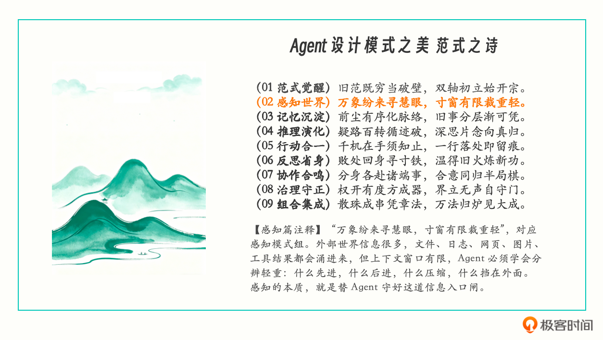
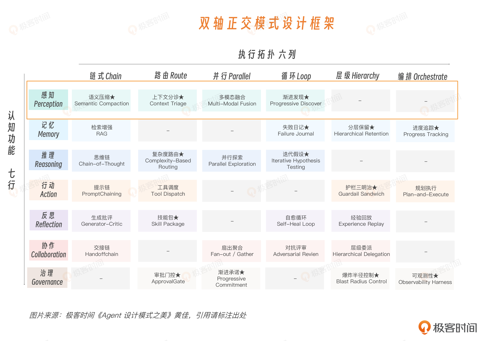
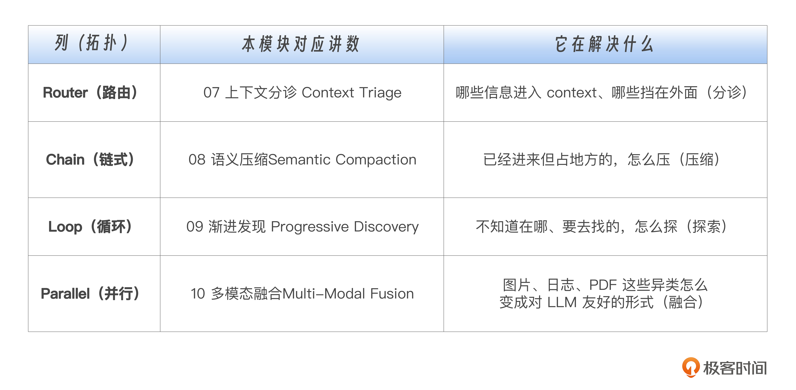

# 06｜感知模块导论：如何优雅设计 Agent 感知层？

**作者**：黄佳

---

## 一句话脉络

感知不是预处理，是核心架构问题——它决定了 Agent 后面所有推理的可靠材料是什么。

---

## 感知 vs 记忆：为什么要拆成两个模式组？



两者都是 Context Engineering 的一部分，但关注点不同：

- **感知**：回答"什么信息有资格进入上下文"——信息怎么选、怎么进来、优先级是什么
- **记忆**：回答"信息进来之后怎么保留"——跨时间的状态、历史、经验

感知是**入口闸**，记忆是**存储层**。感知决定谁能进门，记忆决定进门之后谁能留下来。

---

## 感知的本质：注意力预算管理

传统软件的输入是 schema 严格定义的；Agent 的输入是自由文本 prompt。每一个进入 prompt 的 token 都在花预算：attention 预算、KV cache 空间、API 计费。

**感知工程解决的三个架构化问题：**

1. 什么信息有资格进入上下文？
2. 什么信息应该被压缩、排序或丢弃？
3. 什么信息必须在模型推理前就被结构化出来？

---

## 感知是 PRA 循环的入口闸



```
Perception → Reasoning → Action
```

- 感知把外部世界压缩成模型能处理的上下文
- 推理只能加工已经进入上下文的材料，不能凭空补回没看见的事实
- **"Agent 不知道 X"的真相，往往是"X 明明存在，但没有进入它的视野"**

---

## 长上下文的陷阱

Liu 等人在 TACL 2024 的论文《Lost in the Middle》发现：模型使用长上下文时，对开头和结尾的信息更敏感，中间位置的关键信息更容易被忽略。

**窗口变长不会自动解决问题**，只是把"没检索到"变成了"检索到了但没用上"。

---

## 感知工程 vs 传统工程（同源）

| 传统工程 | Agent 感知 |
|---|---|
| 数据库查询优化（WHERE/JOIN/LIMIT 在数据库层筛数据） | 上下文分诊（在进入 prompt 前判断什么信息值得进来） |
| 虚拟内存（热数据放 RAM，冷数据放磁盘） | 上下文分层（P0 直接进，P2 压缩进，P3 等需要再取） |
| CDN 缓存（热门内容靠近用户） | 感知优先级（高频关键信息离模型更近） |
| 编辑工作（替读者筛选哪些证据该进文章） | 替模型筛选信息 |

**感知工程不是新瓶装新酒，本质上是在 LLM 这个新载体上重新实现数据库、操作系统、缓存系统早就积累过的经验。**

---

## 感知模式组：选 → 压 → 探 → 融



| 模式 | 解决的问题 |
|---|---|
| 上下文分诊（Context Triage） | 哪些信息应该进来，什么该挡在外面 |
| 语义压缩（Semantic Compaction） | 信息进来之后怎么变短，但不丢关键证据 |
| 渐进发现（Progressive Discovery） | 一开始不知道信息在哪，Agent 怎么逐步找 |
| 多模态融合（Multi-Modal Fusion） | 图片、表格、PDF、SQL、日志这些异类信息怎么进入上下文 |

---

## 四个工业争论

1. **RAG 还是 Agentic Search？** — 提前建索引检索，还是让 Agent 自己搜索、读文件、沿着线索深入？
2. **窗口越大越好吗？** — 长窗口不等于可以不筛选，塞进去之后模型能不能稳定用好才是问题。
3. **多模态内容保留为图，还是转成文本？** — 核心信号在空间关系里，还是在文字内容里？
4. **分诊靠人写，还是算法自动？** — 规则驱动、算法判断，还是 schema/权限强约束？

---

## Perception Trace：Agent 的行车记录仪

**普通日志**：只能看到最终回答，不知道 Agent 当时看到了什么、没看到什么

**Perception Trace**：记录模型在开始推理之前经历了什么
- 读了哪些文件
- 检索到了哪些内容
- 选中了哪些片段
- 丢弃了哪些材料
- 压缩了哪些历史
- 调用了哪些发现动作
- 关键证据最终落在上下文什么位置

**实例**：

```
用户问：订单为什么不能退款？
最终答案错

普通日志：answer = "该订单已超过退款期限"
Perception Trace：
  检索命中：47 条
  进入 context：6 条
  被丢弃：41 条
  关键证据：refund_policy_v3.md → 排序到第 38 位 → 未进入 context
  实际进入：refund_policy_v1.md（已过期版本）
```

**根因暴露**：不是模型的问题，是分诊规则让过期政策排到了第 38 位，没进 context。

---

## 核心判断

> **感知不是预处理，是核心架构问题。它和数据建模、API 设计、容量规划是一个量级的事情。**

你把它当配菜，Agent 就会在看似聪明的输出里不断漏信号。
你把它当主菜，系统才有机会跑得稳、跑得准、跑得便宜。

---

## 思考题

1. 当前 Agent 的系统提示词有多少 token？有多少是"为了让 Agent 知道更多"塞进去的？砍掉 50%，关键任务表现会变好还是变差？

2. 找一个最近失败或结果不稳定的 Agent 任务，复盘 Perception Trace：

```
任务是什么：
Agent 最后错在哪里：
正确答案依赖的关键证据是什么：
这个证据原本在哪里：
它有没有进入上下文：
如果进了，出现在上下文什么位置：
如果没进，是检索没命中、分诊丢掉了，还是压缩时压没了：
下一版你会怎么改感知 pipeline：
```

3. 同一个任务、不同长度 context（30K / 100K / 200K），看成功率怎么变化。

---

## 关键对话总结

### 1. 感知 vs 记忆：最容易混的一对

| | 感知 | 记忆 |
|---|---|---|
| 角色 | 入口闸 | 存储层 |
| 回答 | 什么信息有资格进入上下文 | 信息进来之后怎么保留 |
| 类比 | 安检口决定谁能上飞机 | 行李架决定东西放哪、放多久 |

### 2. 感知不是预处理

感知和数据建模、API 设计、容量规划是一个量级的事情：

> 你把它当配菜，Agent 就会在看似聪明的输出里不断漏信号。
> 你把它当主菜，系统才有机会跑得稳、跑得准、跑得便宜。

### 3. 感知工程 × 传统工程是对应的

| 传统工程 | Agent 感知 |
|---|---|
| 数据库查询优化（WHERE/JOIN/LIMIT 在数据库层筛数据） | 上下文分诊（进入 prompt 前判断什么信息值得进来） |
| 虚拟内存（热数据放 RAM，冷数据放磁盘） | 上下文分层（P0 直接进，P2 压缩进，P3 等需要再取） |
| CDN 缓存（热门内容靠近用户） | 感知优先级（高频关键信息离模型更近） |

**感知工程不是新东西，本质上是在 LLM 上重新实现数据库、操作系统、缓存系统早就积累过的经验。**

### 4. PRA 循环

```
Perception → Reasoning → Action
```

推理只能加工已经进入上下文的材料，不能凭空补回没看见的事实。**"Agent 不知道 X"的真相，往往是"X 明明存在，但没有进入它的视野"。**

### 5. Perception Trace：比普通日志多一层

普通日志：`answer = "订单已超过退款期限"`——只知道错了，不知道为什么错。

Perception Trace：
```
检索命中：47 条
进入 context：6 条
被丢弃：41 条
关键证据：refund_policy_v3.md → 排序到第 38 位 → 未进入 context
实际进入：refund_policy_v1.md（已过期版本）
```

根因暴露：不是模型错了，是**分诊规则让过期政策排到了第 38 位，没进 context。**

### 6. 感知模式组四讲预告

| 模式 | 解决什么问题 |
|---|---|
| 上下文分诊（第 07 讲） | 哪些信息应该进来，什么该挡在外面 |
| 语义压缩（第 08 讲） | 信息进来之后怎么变短，但不丢关键证据 |
| 渐进发现（第 09 讲） | 一开始不知道信息在哪，Agent 怎么逐步找 |
| 多模态融合（第 10 讲） | 图片、表格、PDF、SQL、日志这些异类信息怎么进入上下文 |

### 7. 一句话带走

> **感知不是预处理，是核心架构问题。它决定了 Agent 后面所有推理的可靠材料是什么——"Agent 不知道 X"的真相，往往是"X 明明存在，但没有进入它的视野"。**