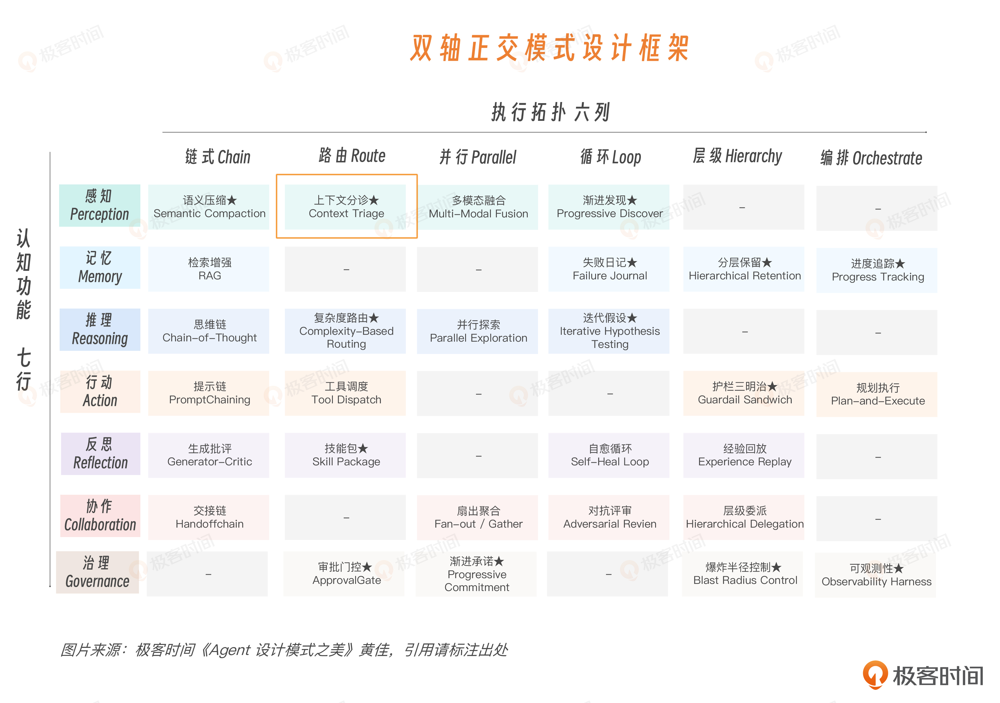
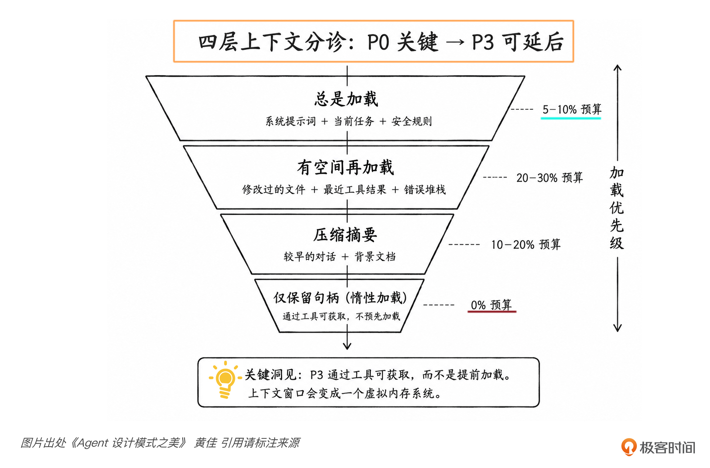
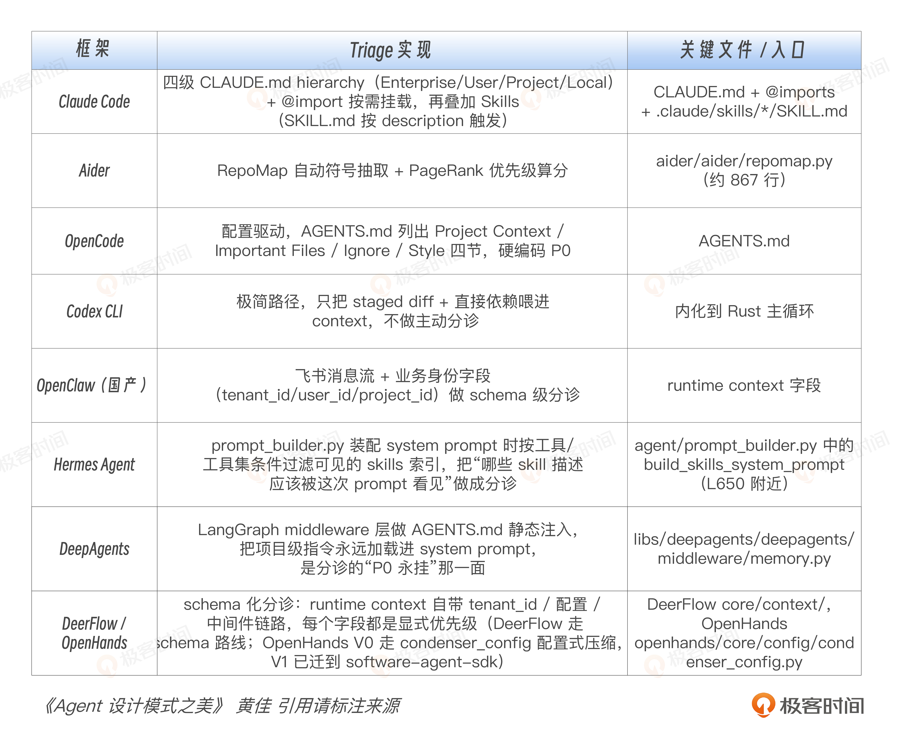
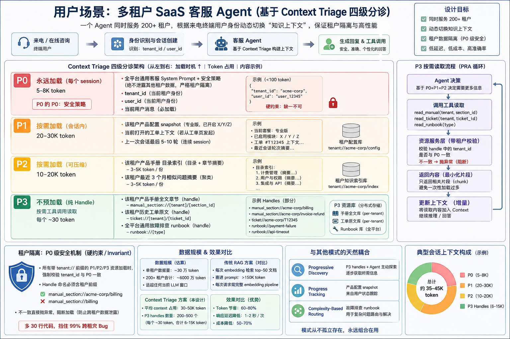

# 07｜上下文分诊：如何科学分流处置不同信息

**作者**：黄佳

---

## 一句话脉络

上下文分诊 = 感知 × 路由 = 把信息按优先级分层，决定谁进 context、谁等门外、谁挂 handle。

---

## 核心定义

上下文分诊（Context Triage）落在双轴矩阵的 **感知 × 路由** 交点：

- **认知功能**：感知 — 决定 Agent 看见什么
- **执行拓扑**：路由 — 按优先级把不同信息分发到不同处理路径



---

## 四级分诊体系

| 级别 | 内容 | 处理方式 | 目标 |
|---|---|---|---|
| **P0** | 下一步推理**不能缺**的证据（错误堆栈、失败测试、当前需求） | 直接进 context，必须看到 | 保证模型下一步稳定用上 |
| **P1** | 当前任务高度相关的材料（相关代码片段、当前生效规则） | 原文片段进 context，优先使用 | 补充 P0 的背景 |
| **P2** | 有价值但不需要原文全部进入的内容（历史对话、背景文档） | **压缩成摘要**后进入 | 提供背景坐标，不抢主舞台 |
| **P3** | 可能有用但当前不值得占用窗口的内容（全量代码仓库、全量日志） | 只挂 **handle**，不预加载 | 保留可追溯性，按需展开 |



---

## 分诊的本质

不是"删材料"，而是**控制信息和模型之间的距离**：

- P0：贴到模型眼前
- P1：进入 context，优先使用
- P2：压缩进入，提供背景
- P3：留在工具后面，按需展开

**三个核心问题**：
1. 这条信息在下一步推理里有多急？
2. 它应该以原文、摘要，还是 handle 的形式出现？
3. 它离模型应该有多近？

---

## P2 压缩示例

**不要这样塞**：
> 过去 15 轮对话全文 + 3 个完整日志文件

**争取这样做**：
```
历史摘要：
- 用户目标：修复登录超时问题
- 已确认：问题只在移动端出现
- 已排除：数据库连接正常
- 关键线索：session refresh 在 401 后没有重试
- 原始日志 handle：log://payment-auth/2026-05-27/trace-8812
```

P2 压缩时要保留三类东西：**结论 + 证据（关键字段/行号/时间点）+ 索引（原始材料在哪，怎么取回）**

---

## P3 Handle 示例

```
repo://src/auth/*
log://payment/last_24h
doc://refund-policy/archive
table://orders/schema
file://design/login-flow.pdf
```

Handle 的意思是：**我知道它存在，也知道怎么取，但我现在不展开。**

---

## 分诊实例：修复登录失败 bug

**候选材料**：用户 bug 描述、错误堆栈、失败测试、最近修改的 auth.py、session.py、整个代码仓库、三周 git 历史、所有登录相关 issue、历史聊天记录、监控日志

**分诊结果**：

| 级别 | 材料 |
|---|---|
| P0 | 用户 bug 描述、错误堆栈、失败测试 → 直接进 context |
| P1 | auth.py 相关函数、session.py 相关函数、最近 diff → 原文片段进 context |
| P2 | 历史聊天记录、旧 issue、日志趋势 → 压缩成摘要进 context |
| P3 | 整个代码仓库、完整 git 历史、全量日志 → 只挂 handle，需要时再查 |

---

## 三种分诊来源

| 来源 | 代表案例 | 适用场景 |
|---|---|---|
| **人知道什么重要** | Claude Code CLAUDE.md 层级规则 | 长期项目、固定团队、业务语义强 |
| **代码结构显示什么重要** | Aider RepoMap 自动生成代码地图 | 陌生仓库、代码结构清晰、快速启动 |
| **系统 schema 强制什么必须存在** | DeerFlow runtime schema / middleware | 企业级、多租户、高风险、长任务 |

---

## CLAUDE.md 常驻规则原则

- 超过 200 行就要问：哪些内容该拆出去？
- `@import` 不等于省 token，被 import 的文件仍会在启动时展开
- 常驻规则 = 每次任务都值得让模型看到的高信号信息
- 不是大号文档夹



---

## Aider RepoMap vs Claude Code CLAUDE.md

| | Claude Code | Aider RepoMap |
|---|---|---|
| 优先级来源 | 人告诉 Agent 什么重要 | 算法从代码结构推断什么重要 |
| 优势 | 业务语义强 | 零人工启动，陌生仓库也能快速上手 |
| 弱点 | 人工成本高 | 算法能看见结构重要性，不一定看见业务重要性 |

**生产常见做法：混用**
- CLAUDE.md / AGENTS.md：提供人工 P0 锚点
- RepoMap：提供自动 P1/P2 代码背景
- 搜索/grep/follow imports：补充动态发现路径

---

## 多租户场景的 P0 硬约束

```python
@dataclass
class RuntimeContext:
    tenant_id: str    # 必须 P0 硬约束
    user_id: str      # 后续所有检索的过滤前提
    project_id: str
    session_id: str
```

- `tenant_id` 必须是 P0 硬约束，任何 P1/P2/P3 资源加载前都要校验
- P3 handle 要带租户前缀：`manual_section://acme/billing` 比 `manual_section://billing` 安全



---

## 分诊可观测性三指标

| 指标 | 说明 | 异常信号 |
|---|---|---|
| `budget_usage` | 用了多少上下文预算 | p95/p99 的 dropped_count 突然升高 |
| `p0_dropped_count` / `p1_dropped_count` | 关键层丢失 | P0 被丢 = 系统 bug；P1 经常被丢 = 预算太紧或规则错 |
| `p3_hit_rate` | P3 handle 实际读取率 | 长期过低 = 挂了太多没用 handle；长期过高 = 本该放 P2 的被降到了 P3 |

---

## Context Triage 核心代码骨架

```python
class Priority(IntEnum):
    CRITICAL = 4    # P0
    IMPORTANT = 3   # P1
    SUPPORTING = 2  # P2
    DEFERRABLE = 1  # P3

class ContextItem:
    name: str
    content: str
    priority: Priority
    token_estimate: int = 0
    is_error: bool = False  # 错误堆栈强制保护，永不丢

class ContextTriage:
    def triage(self, items):
        # 排序：优先级 > 错误加分 > 内容长度
        # P3 永远不预加载
        # 错误堆栈超预算也强制进
        ...
```

---

## 什么时候不需要这个模式

- 任务材料非常小，边界清楚，全部加起来不超过几十 K token
- 全塞进去可能反而更便宜、更简单

**什么时候必须用**：
- 接入文件系统、知识库、日志平台
- 任务会连续跑超过几轮
- 从那一刻起，问题变成"怎么守住上下文入口"

---

## 思考题

1. CLAUDE.md 已经写到 800 行，怎么清理？
   - 必须保留的内容：
   - 应该降级到 `.claude/rules/*.md` 的内容：
   - 应该挪到文档库作为 P3 handle 的内容：
   - 应该直接删除的内容：

2. 500MB 服务日志怎么处理？
   - 策略 A：bash/SQL/grep 预过滤再增量喂给 Agent
   - 策略 B：sub-agent 分片处理，只把摘要回传主 Agent
   - 策略 C：切成 P3 handles，按时间段/服务名/错误类型按需读取
   - 你的方案是什么？

3. 多租户客服 Agent 怎么设计 P0/P1/P2/P3？

4. 上下文分诊可能失效的场景有哪些？防护手段是什么？

---

## 关键对话总结

### 1. 实战：生成应用 Agent 的 P0/P1/P2/P3 分诊

对"生成一个任务管理系统"的场景进行上下文分诊：

| 级别 | 你的初排 | 校正后 | 理由 |
|---|---|---|---|
| **P0** | 需求描述 | 需求描述 ✅ | 当前任务核心指令 |
| **P1** | 之前的决策记录 | **项目模板结构、已生成的相关文件、之前决策记录** | Agent 每一步都要参考 |
| **P2** | 项目模板结构 | 完整项目结构索引、设计规范 | 压缩摘要提供背景 |
| **P3** | 数据库 schema、已生成文件、第三方 API 文档 | 数据库 schema、第三方 API 文档、全量 git 历史 | 需要时再取 |

### 2. 最常见的分诊错误：把"当前依赖"放进了 P3

你最初把**已生成的文件内容**放在了 P3（只挂 handle）。这意味着 Agent 生成文件 B 时不知道文件 A 暴露了什么接口——**这是生成应用成功率低的直接原因之一。**

**已生成的文件不是"档案材料"（P3），而是下一步的"参考材料"（P1）。** 生成 Service 层时，对应的 Model 文件应该是 P1 原文进入。

### 3. 核心教训

> **P3 的意思是"我知道它存在，但现在不展开"——不是"我知道它存在，但我不需要用"。不要把当前步骤的依赖信息放到 P3。**