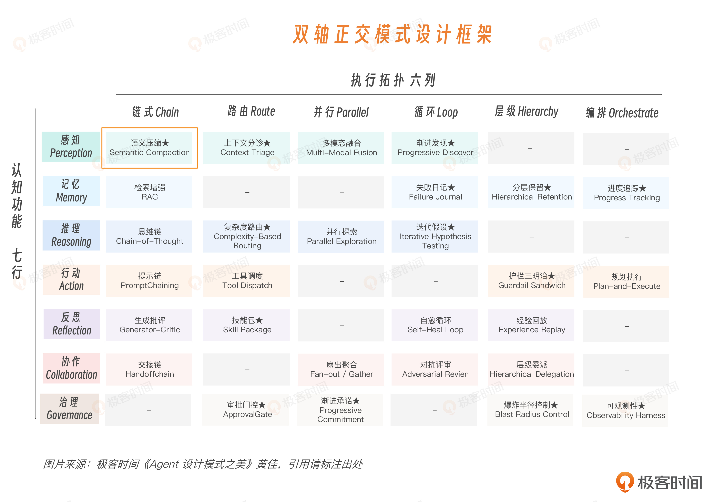
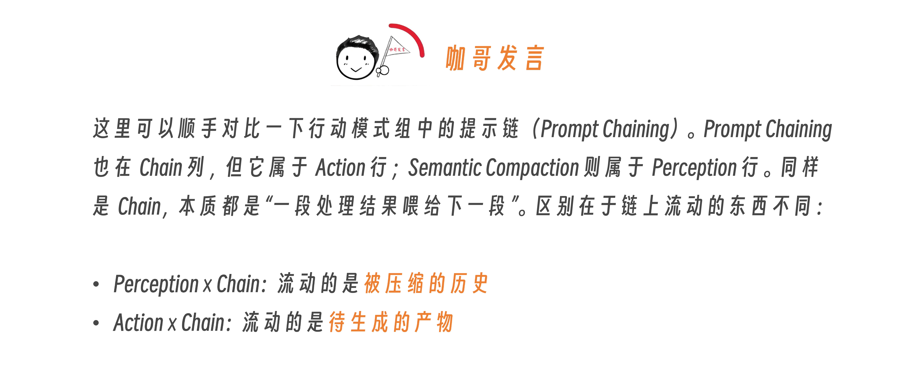
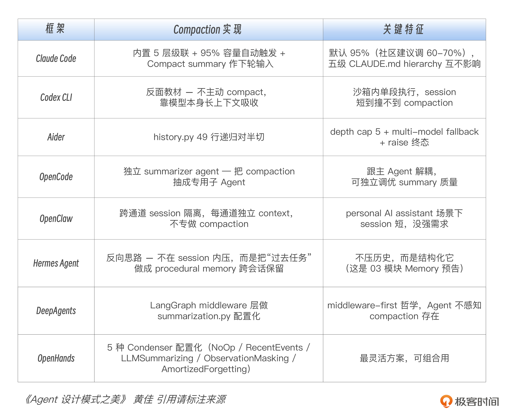

# 08｜语义压缩：让 200K 装下 1M 的日志

**作者**：黄佳

---

## 一句话脉络

上下文分诊解决"什么进来"，语义压缩解决"进来之后怎么不压坏"。两者都是感知模块的核心模式。

---

## 感知 × 链式：语义压缩在双轴图谱的位置



- **认知功能**：感知 — 压缩后留下的内容，决定 Agent 下一轮还能看见什么
- **执行拓扑**：链 — 压缩不是一步完成，而是逐级往下压

---

## 核心问题

**上下文分诊**（上一讲）：候选信息太多时，先决定什么进 Context，什么留在外面，什么只挂 handle。

**语义压缩**（本讲）：信息进来之后，如何在历史膨胀时不压坏关键证据。

坏的压缩会把关键证据压没。更坏的压缩会让 Agent 忘记哪些方案已经失败，然后在同一个坑里反复试错。

---

## 语义压缩的本质

特德·姜（《降临》作者）有过一个"模糊图像"类比：暗房里反复翻拍照片，第一次主体还在，第二次边缘开始糊，第三次细节就永久丢了。

多层压缩同理。压缩次数越多，语义漂移风险越大。

**最稳的策略**：少压、分层压、保留证据、保留回退路径。

---

## 三层压缩链

| 层级 | 处理内容 | 粒度 |
|---|---|---|
| **Level 1** | 清理冗长 tool output：日志全文、API 返回、查询结果 | 替换成占位符 |
| **Level 2** | 合并进 Anchor：意图、已做改动、已做决策、已排除方案、下一步 | 增量合并 |
| **Level 3** | 极限压缩 | 退场信号（触发时考虑交接/开新 session） |

---

## 什么时候该用语义压缩？

- 会话超过 20-30 轮
- context 占用超过 60%-70%
- tool 结果大量堆积
- Agent 开始重复问、重复查、重复试

---

## 错误信息不能按普通文本压缩

短错误栈 → 原文保留
长错误栈 → 保留：异常类型、关键数字、文件路径、行号、首尾段 + 原始 handle

**已失败方案** → 进入 anchor 的 `excluded_approaches`

---

## 三个工程切片



### 切片一：Claude Code — 自动压缩

- 上下文接近上限时自动触发
- 优点：开箱即用
- 缺点：等到窗口满了再压，可能 Agent 最后一段注意力已经变差
- 工程启发：**短任务可以晚压，长会话、高风险任务应该早压（60%-70%）**

### 切片二：Factory — 锚定式迭代摘要

普通摘要的退化：`摘要 → 摘要的摘要 → 摘要的摘要的摘要`（越来越模糊）

Anchor 的稳定：`摘要0 → 摘要1 → 摘要2`（始终清晰）

**Anchor 必须保住五类信息**：

| 字段 | 说明 |
|---|---|
| Intent | 用户要什么 |
| Changes made | 已经改了什么、调用了什么 |
| Decisions taken | 已经做了哪些判断 |
| **excluded_approaches** | 已经排除的方案（最容易被忽略） |
| Next steps | 下一步做什么 |

> 很多 Agent 在长 session 里反复试错，不是因为不会推理，而是因为忘了哪些路已经走不通。

### 切片三：OpenHands — 可配置压缩器（Condenser）

不同 Agent 的历史不应该用同一种方式压缩。

**ObservationMasking**：Agent 历史里有两类信息：
- **Action**：Agent 做过什么（读文件、调接口、执行命令）
- **Observation**：外部世界返回了什么（日志全文、API 响应、测试输出）

ObservationMasking 把早期 Observation 替换成占位符，但**保留 Action**。

如果 token 主要花在日志、SQL 查询、API 响应、测试输出上，而后续推理更依赖"做过哪些动作、得出哪些结论"，ObservationMasking 比通用 LLM summarization 更稳。

---

## 三条工程原则（综合三个切片）

1. **自动**：必须自动化，否则长 session 迟早撞墙（Claude Code）
2. **演化**：不要每次重写历史，维护持续演化的 anchor（Factory）
3. **分治**：根据 Action、Observation、Error、Decision 的不同性质分层处理（OpenHands）

---

## 8 框架横切：Compaction 没有标准答案

| 要点 | 内容 |
|---|---|
| Compaction 是取舍 | Claude Code 简单，OpenHands 灵活，Aider 透明，OpenCode 解耦，没有最优解 |
| 不压也是一种选择 | 只适合短任务 |
| Compaction ≠ Memory | Compaction 管当前 session 怎么续命；Memory 管跨 session 经验怎么沉淀 |

**选型必问**：我的 Agent 会话有多长？工具输出有多大？错误密度有多高？翻车成本有多大？

---

## 工业级骨架：三个核心对象



### Turn — 一轮对话

```python
@dataclass
class Turn:
    role: str
    content: str
    tokens: int
    is_error: bool = False  # 错误堆栈、失败测试、异常日志必须保留
```

### Anchor — 压缩后的工作记忆

```python
@dataclass
class CompactionAnchor:
    intent: str = ""
    changes_made: list[str] = field(default_factory=list)
    decisions_taken: list[str] = field(default_factory=list)
    excluded_approaches: list[str] = field(default_factory=list)  # 最关键
    next_steps: list[str] = field(default_factory=list)
```

### CompactionEvent — 压缩事件日志

```python
@dataclass
class CompactionEvent:
    level: int
    tokens_before: int
    tokens_after: int
    error_traces_preserved: int  # 必须与真实错误数对齐
```

---

## 业务场景：长会话客服 Agent

客服 Agent 处理复杂工单：跨 2-4 小时、50-150 轮对话，中间夹杂用户描述、工具调用、日志返回、诊断结果和升级交接。

### 三层业务策略

| 阶段 | 策略 |
|---|---|
| **前期** | 不压。前 10-20 轮信息收集和假设建立，原始细节最重要 |
| **中期** | 轻压。清理冗长 tool 输出，保留错误堆栈、最近对话和关键决策 |
| **后期** | 沉淀。旧历史合并进 anchor；进入 Level 3 → 准备交接 |

### 客服场景必须补全的三个能力

1. **按业务识别错误**：timeout、5xx、Traceback（客服）；AML flag、insufficient funds（金融）；abnormal vitals（医疗）
2. **按风险调整触发阈值**：P1/金融/医疗 → 50%-55% 就压；内容生成/短代码 → 65%-70%
3. **导出交接上下文（handoff summary）**

---

## Compaction 可观测性：三个核心指标

| 指标 | 说明 | 健康区间 |
|---|---|---|
| `level_3_trigger_rate` | L3 事件占比 | 越低越好 |
| `avg_compression_ratio` | after / before | 0.30-0.50 |
| `error_traces_preserved_per_event` | 每次压缩保留的错误堆栈数 | 必须与真实错误数对齐 |

- 低于 0.20：过度压缩，关键信息被丢概率高
- 高于 0.60：没压够，下次很快又要压
- 零保留：错误识别 patterns 漏了，Agent 会重复踩同一个 bug

---

## 思考题

1. 当前 Agent 的 session 最长跑了多少轮？最后一次压缩发生在什么时候？那次压缩之后，Agent 的表现有没有变差？
2. 如果让你给 OpenHands 的 ObservationMasking 设计一个"保留 Action 但遮蔽 Observation"的 prompt 模板，你会怎么写？

---

## 关键对话总结

### 1. 上下文分诊 vs 语义压缩

| | 分诊（第 07 讲） | 压缩（第 08 讲） |
|---|---|---|
| 时机 | 信息进门之前 | 信息进门之后 |
| 回答 | 什么信息有资格进来 | 历史膨胀了怎么压 |
| 拓扑 | 感知 × 路由 | 感知 × 链式 |

### 2. 三层压缩链

| 层级 | 触发条件 | 处理方式 |
|---|---|---|
| L1 | 上下文占用 60-70% | 清理冗长 tool output → 替换成占位符 |
| L2 | 不够了 | 合并进 Anchor（意图/改动/决策/已排除方案/下一步） |
| L3 | 窗口实在撑不住 | 考虑交接或开新 session |

### 3. Anchor 模式：最有价值的工程模式

普通摘要的退化：`摘要 → 摘要的摘要 → 摘要的摘要的摘要`（越压越糊）

Anchor 的做法：维护一个**永不退化**的结构化摘要，每次增量更新。

```python
class CompactionAnchor:
    intent: str                    # 用户要什么
    changes_made: list[str]        # 已经改了什么
    decisions_taken: list[str]     # 已经做了哪些判断
    excluded_approaches: list[str] # 已经排除了哪些方案 ← 最关键
    next_steps: list[str]          # 下一步做什么
```

### 4. 最容易忽略但最关键的字段：excluded_approaches

很多 Agent 在长 session 里反复试错，不是因为不会推理，而是因为**忘了哪些路已经走不通**。

这个字段直接可以应用到你的生成应用：Agent 试过一个生成方向发现不行（比如"用 Vue 2 写这个组件有问题"），记录下来，后续步骤不会在同一条死路再走一遍。

### 5. 三条工程原则

1. **自动**：必须自动化，否则长 session 迟早撞墙
2. **演化**：不要每次重写历史，维护持续演化的 anchor
3. **分治**：Action、Observation、Error、Decision 分层处理

### 6. 一句话带走

> **语义压缩的核心不是"压得多狠"，而是"压了之后关键证据还在不在"。中间方案（Anchor）比两端方案（全量历史 vs 暴力截断）更适合大部分 Agent 系统。**
