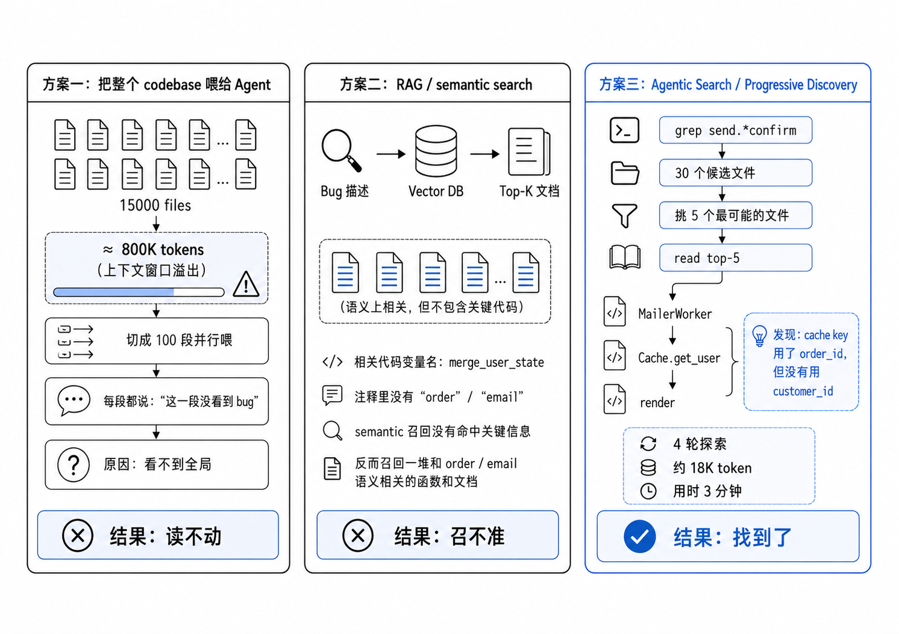
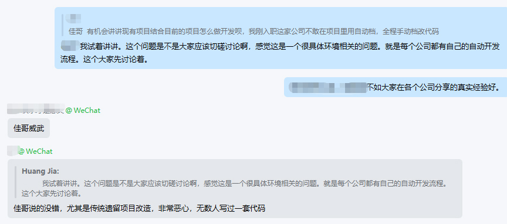
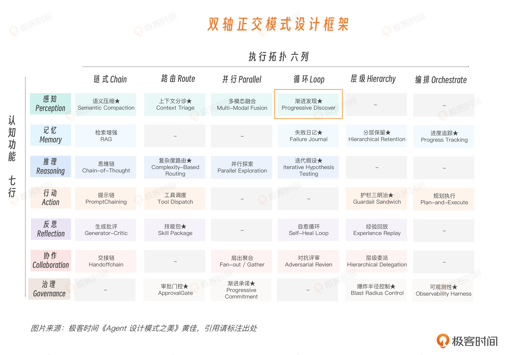
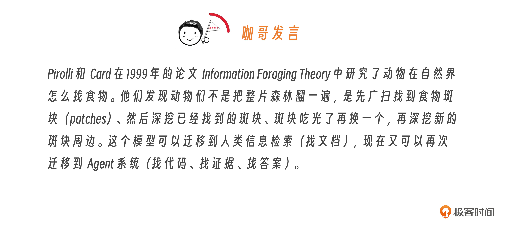
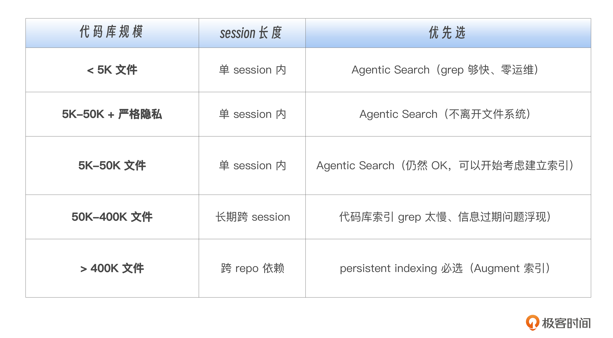
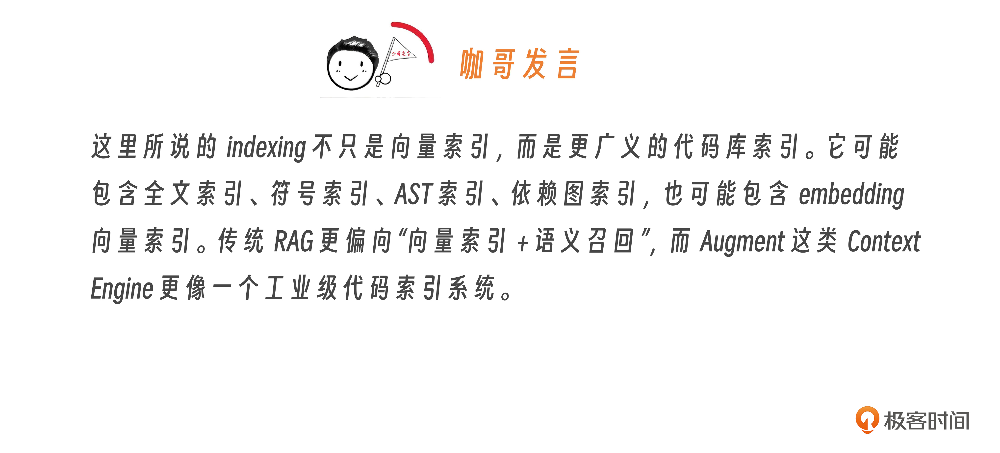
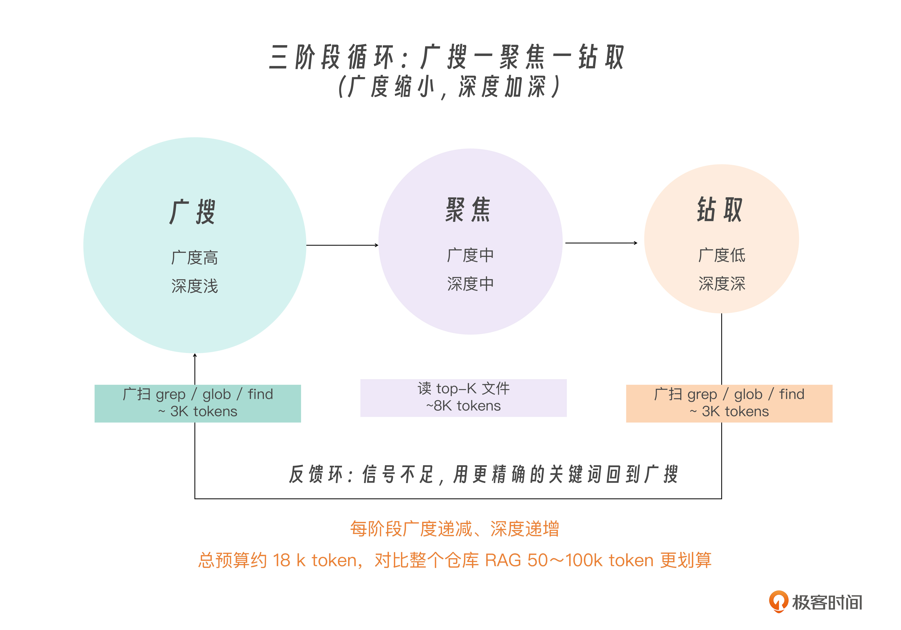
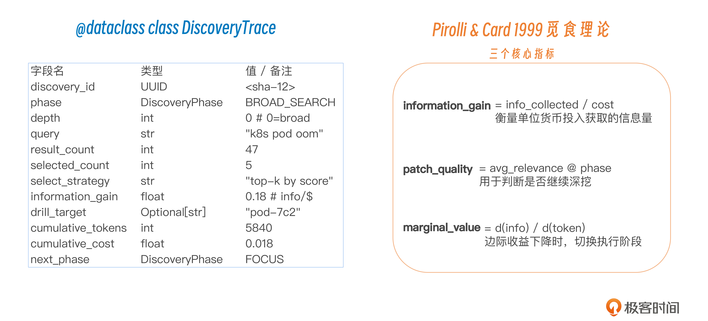
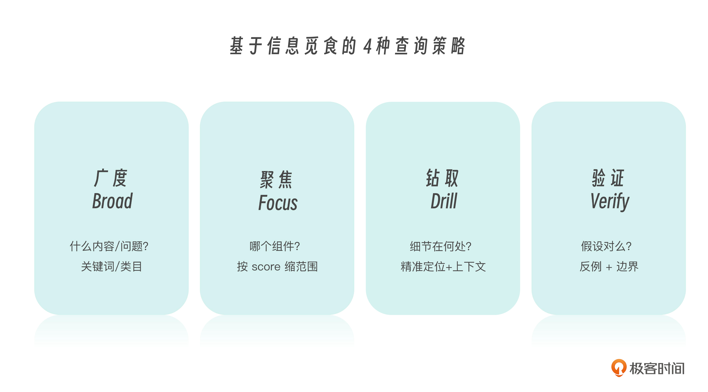

# 09｜渐进发现：信息的觅食循环

**作者**：黄佳

---

## 一句话脉络

当 Agent 不知道信息在哪（陌生代码库 / 合同 / 事故日志），通过**广扫 → 聚焦 → 深挖**三阶段循环，自己把路探出来。

---

## 感知 × 循环：渐进发现在双轴图谱的位置



- **认知功能**：感知 — 决定 Agent 看到什么
- **执行拓扑**：循环 — 迭代式，不是单次完成

前两讲的区别：
- 上下文分诊 → **Router** 单点路由
- 语义压缩 → **Chain** 三层级联
- 渐进发现 → **Loop** 迭代循环

---

## 开篇案例：15000 文件的遗留代码库 bug



订单确认邮件偶尔混入其他客户的条目。团队面对 15000 文件、文档稀疏、作者离职。

| 方案 | 结果 |
|---|---|
| 全量喂给 Agent | 800K token，超窗口，切 100 段并行每段都说"没看到 bug" |
| RAG + 向量数据库 | top-K 语义召回：变量名 `merge_user_state` 语义不命中，bug 相关代码没被召回 |
| grep + read + follow imports | 4 轮探索，约 18K token，3 分钟，bug 找到 |

**关键洞察**：这个 bug 跟语义没关系，跟代码结构有关系。只有 grep + read + follow imports 能顺着真实调用链追踪。

---

## 核心辩论：Agentic Search vs RAG

**2025-2026 年工业界最激烈的战场之一**

### Claude Code 的判断：Agentic Search 更好

Boris Cherny（Claude Code 创始人）原话：
> Early versions used RAG + local vector db, but we found pretty quickly that agentic search generally works better. It is also simpler, and doesn't have the same issues around security, privacy, staleness, and reliability.

Internal benchmarks：agentic search 大幅优于 RAG。

**RAG 的问题**（多了一层"影子仓库"）：

| 问题 | 说明 |
|---|---|
| Security | 代码嵌入向量库后多一层暴露面 |
| Privacy | 私有部署的额外数据治理问题 |
| Staleness | 索引必须持续更新，否则 Agent 看的是旧代码 |
| Reliability | embedding 模型、top-K、阈值任一抖动，结果就变 |

**Agentic Search 的优势**（链路更短）：

```
当前任务 → grep / search / read file / follow imports → 读真实文件
```

少了"影子仓库"，安全、隐私、过期、可靠问题都少。

> 代码库不同于普通文档库。bug 藏在变量名、调用链、缓存 key、配置文件、测试路径这些**结构关系**里。RAG 看语义相似，grep + read + follow imports 看代码结构。

### Augment Code 的补充：超大代码库需要持久化索引



Claude Code 说"generally works better"，generally 意味着不是绝对。

- 400K+ 文件的代码库，每次现场 grep 变分钟级延迟
- Augment 的 Context Engine：45 秒增量更新、跨 repo 依赖追踪、MCP 暴露给 Claude Code 和 Cursor
- **持久化索引是把探索成本提前支付掉**，用实时增量换取交互速度

### 选型判断

| 场景 | 推荐方案 |
|---|---|
| 中小型代码库、bug 定位、调用链追踪 | Agentic Search（grep + read）|
| 超大代码库、跨 repo、强依赖追踪 | 持久化索引 |
| 灰色地带 | 混合，但必须定义清楚冲突时谁优先 |

---

## 三阶段循环：广扫 → 聚焦 → 深挖



### Forage（广扫）

- 用 `grep / glob / find` 低成本工具扫陌生空间
- 目标：拿到 30-50 个候选
- 只看文件名、路径、匹配行、周边上下文，**不读完整文件**
- 代价：几千 token 级别

### Focus（聚焦）

- 从候选里挑 5-10 个最可能的文件**完整读**
- 建立局部理解：谁调用谁，关键函数在哪，哪个文件在主路径上

### Deepen（深挖）

- 沿着 Focus 阶段发现的可疑链继续追
- 读被调用函数、配置文件、测试用例、历史 commit
- **不能再铺开，只追一两条最有信号的链**
- 追到 Cache.get_user，发现 cache key 缺少 customer_id → bug 找到

### 验证（Verify）

- 用反例和边界条件验证有没有找错
- 形成闭环：广扫铺开 → 收窄聚焦 → 深追线索 → 验证 → 循环或停止

---

## 信息觅食理论：三个判断指标



来自 Pirolli & Card 1999 年《信息觅食理论》：

| 指标 | 含义 | 对应阶段 |
|---|---|---|
| **information_gain** | 单位成本拿到多少信息 | Forage |
| **patch_quality** | 当前信息区域值不值得继续挖 | Focus |
| **marginal_value** | 继续深挖的边际收益 | Deepen |

### 工程纪律

1. **给 Agent atomic tools**：`grep`、`glob`、`read` 分开，不要封装成 `search_codebase()`
2. **循环设上限**：`max_cycles = 3`，三轮找不到就交给人
3. **记录 trace**：每轮关键词、召回候选数、读了哪些文件、追到哪里

---

## DiscoveryTrace：探索过程的行车记录仪



```
phase = BROAD_SEARCH
query = "k8s pod oom"
result_count = 47
selected_count = 5
next_phase = FOCUS
```

Agent 每走一步探索都留下 trace：
- 这一轮处在什么阶段
- 搜了什么 query
- 拿到多少候选、选中了几个
- 为什么选
- 花了多少 token
- 下一步准备进入哪个阶段

---

## 8 框架横切



三个核心判断：

1. **Agentic Search 已是 Coding Agent 的主流共识** — 代码关键信息藏在结构关系里，不在语义相似度里
2. **持久化索引是 Agentic Search 的规模化补丁** — 中小型现场探索，超大代码库需要提前建图
3. **深挖时不要污染主 Agent 上下文** — 用 Sub-Agent 负责广扫和初筛，主 Agent 只拿压缩后的发现和证据链

**Cursor 的混合路线**：能现场探索时现场探索，必须提前建图时用索引——未来多数 Coding Agent 的折中形态。

---

## 工业级骨架



### 三层实现

| 层级 | 核心问题 |
|---|---|
| **最小骨架** | 三阶段怎么组织代码 |
| **业务装配** | 放到真实业务加什么字段 |
| **生产观测** | 上线后怎么判断系统是否健康 |

### 最小骨架：五个核心对象

```python
class Phase: FORAGE | FOCUS | DEEPEN

class Candidate:
    path: str
    snippet: str
    score: float
    reason: str

class DiscoveryEvent:    # 一次探索动作
    query, result_count, selected_count, tokens, duration

class DiscoverySession:  # 一次完整探索
    task, cycles, final_files, success, total_tokens

class ProgressiveDiscoverer:  # 执行器
    # 组合 grep + read + scorer，跑三阶段循环
```

### 运维事故响应 Agent 的业务装配

```python
class IncidentContext:
    incident_id: str
    severity: P0/P1/P2
    alert_metric: latency_p99 | error_rate | memory
    affected_service: str
    timestamp_iso: str
    sla_minutes_remaining: int
```

**keyword 推导**：

| alert_metric | 起始关键词 |
|---|---|
| latency_p99 | timeout, slow query, circuit breaker, connection pool |
| error_rate | Exception, 5xx, FAILED |
| memory | OOM, memory leak, GC |

**空间裁剪**：运维日志 10GB 不可能全量 grep → 先按时间窗口裁剪（告警前后 15 分钟）

### 三个生产观测指标



| 指标 | 健康区间 | 异常信号 |
|---|---|---|
| `cycles_to_success_p50` | 接近 1 | 涨到 2-3 → keyword 推导变差 |
| `forage_to_focus_ratio` | 0.3-0.5 | 太高→关键词太宽；太低→关键词太窄 |
| `zero_signal_rate` | < 5% | 突然升高 → grep 权限错、scorer 坏了、索引过时 |

---

## 四个常见卡点

| 坑 | 表现 | 解法 |
|---|---|---|
| **Forage 关键词太宽** | grep 返回 5000 个候选，token 爆 | 用轻量模型把用户描述翻译成 5-8 个精确关键词 |
| **Focus 挑错文件** | 测试文件排生产文件前面 | scorer 加业务权重：生产 > 测试，核心目录 > 边缘目录 |
| **Deepen 追进死胡同** | 一路追到第三方库源码 | 设边界：不追第三方库、不追超过 2 跳的依赖 |
| **Discovery 和 RAG 撞车** | 两边结果不一致，Agent 不知信谁 | 先定主路径，冲突时明确谁优先 |

---

## 总结

渐进发现的本质是**会找路的 Agent**——像信息觅食者一样：
- 不把整片森林翻一遍（不暴力全量读）
- 不闭着眼乱走（不靠猜文件名撞运气）
- 用结构化探索与未知互动（grep 广扫 → 精读聚焦 → 链式深追）
- 追求"足够强的证据"，信号够用就停（Herbert Simon 的 satisficing）

**设计探索 Agent 的关键**：
- **广扫的广度**：atomic tools，精确关键词
- **聚焦的判断**：patch quality，scorer 业务权重
- **深挖的克制**：satisficing，max_cycles 纪律

> Discovery 是**侦探**。给 Agent 原子工具，给它好的 keyword 推导，给它 satisficing 的纪律，比把整个代码库一股脑塞给它更重要。

---

## 思考题

1. 观察你 Agent 的 keyword 推导逻辑：故意给一个泛化任务（"看看代码哪里有问题"）vs 精确任务（"看看 LoginController 的 timeout 处理"），对比两次的 token 消耗和信息获取质量。

2. 你的团队代码库规模 + commit 频率：用 Agentic Search、persistent indexing、还是混合？Discovery 触发条件怎么设？

3. 设计一个 **Discovery + Memory 协同**场景：这次 bug 解决后，把 final_files + 关键证据沉淀到 procedural memory；下次类似任务进来，memory 命中和未命中分别走什么路径？

---

## 关键对话总结

### 1. Agentic Search vs RAG：2025-2026 最激烈的战场之一

| | RAG | Agentic Search |
|---|---|---|
| 怎么找 | 语义相似度匹配 | grep + read + follow imports 结构追踪 |
| 找到什么 | 语义相近的片段 | 真实的调用链和代码结构 |
| 适合什么 | 文档库、知识库 | 代码库 bug 定位、事故响应 |
| 问题 | 影子仓库多一层暴露面、索引需持续更新、embedding 抖动影响结果 | 超大代码库现场探索变慢 |

**案例**：15000 文件的遗留代码库，`merge_user_state` 变量名语义不命中（RAG 搜不到），Agentic Search 4 轮探索 + 18K token + 3 分钟找到 bug。

### 2. 渐进发现不是通用的——你的生成应用不需要它

| 场景 | 信息空间 | 适用模式 |
|---|---|---|
| 你的生成应用（模板 + 任务分解） | **确定**——Agent 知道要生成什么、模板在哪 | 上下文分诊 + 语义压缩就够了 |
| 陌生代码库 debug、事故响应、合同审阅 | **不确定**——Agent 不知道信息在哪 | 渐进发现 |

### 3. 三阶段循环

```
Forage（广扫）→ Focus（聚焦）→ Deepen（深挖）
```

| 阶段 | 工具 | 代价 | 产出 |
|---|---|---|---|
| Forage | grep/glob，只看路径和匹配行 | 几千 token | 30-50 个候选 |
| Focus | 完整读 5-10 个文件 | 中等 | 局部调用链理解 |
| Deepen | 沿 1-2 条可疑链继续追 | 可控 | bug / root cause |

### 4. 三个工程纪律

1. **给 Agent atomic tools**：`grep`、`glob`、`read` 分开，不要封装成 `search_codebase()`
2. **循环设上限**：`max_cycles = 3`，三轮找不到就交给人
3. **记录 trace**：每轮关键词、召回候选数、读了哪些文件、追到哪里

### 5. 一句话带走

> **Discovery 是侦探。给 Agent 原子工具，给它好的 keyword 推导，给它 satisficing 的纪律（信号够用就停），比把整个代码库一股脑塞给它更重要。**
