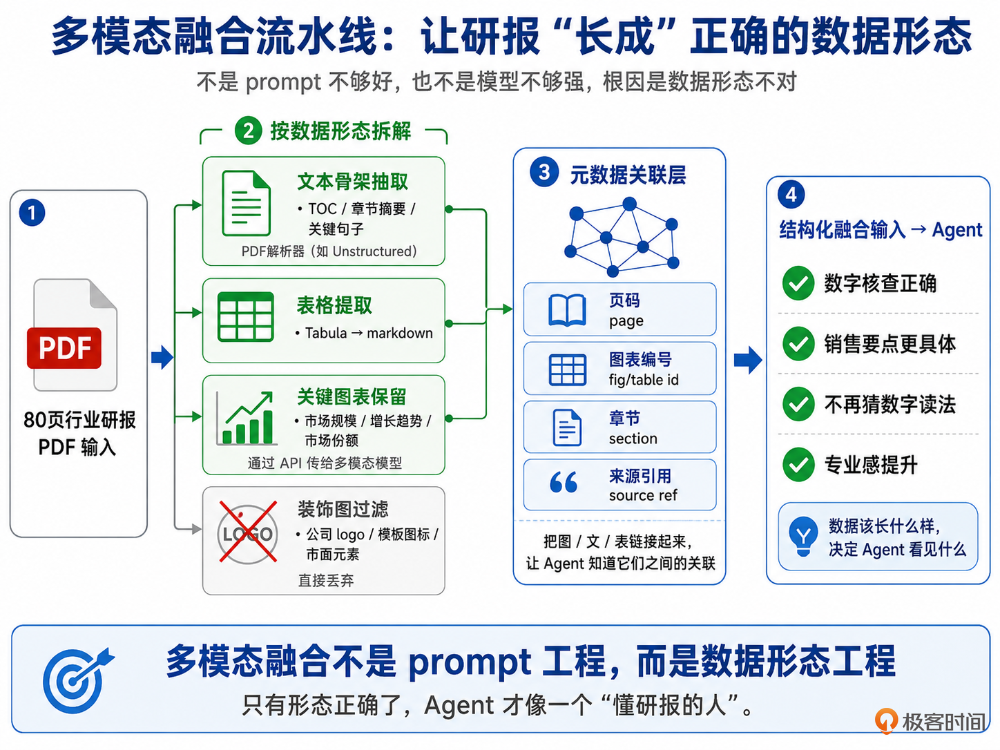
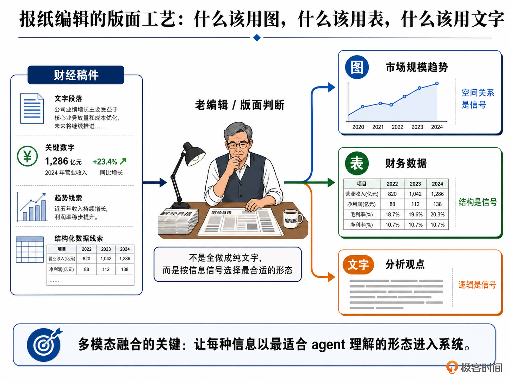

# 10｜多模态融合：日志、SQL 和 PDF 一起进 Agent

**作者**：黄佳

---

## 一句话脉络

感知模块最后一讲：不同形态的数据（文本、表格、图片、PDF、日志、音频）进入 Agent 前，先要变成最适合模型消化的形态——这就是**多模态融合（Multi-Modal Fusion）**。

---

## 感知 × 并行：多模态融合在双轴图谱的位置



- **认知功能**：感知 — 决定 Agent 最终看到什么
- **执行拓扑**：并行 — 多种异构数据源同时进入，每种走最适合自己的处理路径

**和前三个感知模式的本质区别**：

| 模式 | 解决的问题 |
|---|---|
| 上下文分诊 | 哪些 token 进来 |
| 语义压缩 | 进来以后怎么压 |
| 渐进发现 | 不知道在哪的信息怎么找 |
| **多模态融合** | **数据在进入 Agent 之前，应该先变成什么形态** |

形态一开始就错了，后面如何分诊、压缩、探索，都是在错误材料上继续消耗。

---

## 核心决策卡：图保留还是转文本？

**判断标准**：这份材料的价值，藏在**布局**里，还是**文字和结构**里？

- 价值在布局、箭头、位置关系里 → **保留为图**
- 价值在文字、数字、表格结构里 → **转 Markdown / Mermaid / CSV / JSON**

| 输入类型 | 推荐处理 | 原因 |
|---|---|---|
| 架构图 / 流程图 | 能转 Mermaid 就转 Mermaid | 几十 token vs 几百 KB XML，空间关系 Mermaid 表达清楚 |
| 表格 / 电子表格 | 默认转 Markdown | 核心价值在行列字段，不在截图 |
| 跨页表、多层表头、合并单元格 | 保留为图 | 转 Markdown 会丢结构 |
| 图表 / 热力图 | 保留图 + 数字抽成 CSV/JSON | 趋势看图，精确数字要靠结构化数据算 |
| 密集文字截图 | 压到合适尺寸直接交 vision | OCR 太长还有格式噪声 |

---

## Claude Vision API 的 Token 数学

图片 token 估算公式：

```
tokens = width × height / 750
```

一张 1024×1024 图 ≈ 1400 token ≈ 1.5 倍同长度中文文本。

**直觉反差**：图片并没有想象中那么贵。一张完整架构图如果强行转文字要 800-1200 字，保留为图反而更划算。

**PDF 的问题**：30 页文本密集型 PDF ≈ 5-6 万 token。80 页研报暴力喂入轻松超 15 万 token。

**提示词缓存**（prompt caching）：同一份文件被多次问答时，把可复用内容放进 cache，可能直接改变 Agent 的经济模型。

---

## 日志处理的正确姿势

**错误做法**：长日志直接进主上下文

**正确流水线**：

```
bash_filter（预过滤）→ log_subagent（提炼结构化摘要）→ structured summary → 主 Agent
```

bash_filter 压缩比健康区间：**0.01-0.05**（500MB 日志压到 5-25MB）

---

## Lazy Import 原则

音频、vision、PDF 解析等依赖，**不要在 module 顶层 import**，要延迟到函数内部。80% 用户用不到，但写在 import 顶层的库会导致 Agent 在 Docker/CI/SSH 环境里启动就崩。

---

## 金融研报分析 Agent 流水线



### 三步走

**步骤一：融合层分发**

| 类型 | 处理方式 | Token 估算 |
|---|---|---|
| PDF 主体 | TOC + 关键页（3页 × 2K） | ~6K |
| 关键图表（5张） | 保留为图 | ~7K |
| 表格（12张） | 转 Markdown | ~2.4K |
| 装饰图 | 直接丢弃 | 0 |

**总产出约 16K vs 暴力全喂 90K**

**步骤二：三任务并行**

- 摘要任务：800 字核心论点
- 数字核查：每条数字结论必须带 page/chart 引用
- 销售要点：5-7 条受众定制话术

**关键图表识别规则**（行业知识，不是普通配置）：

```python
pattern_keywords = ["市场规模", "市占率", "增长趋势", "营收", "利润率",
    "毛利率", "ROE", "渗透率", "用户数", "ARPU", "估值", "PE", "PB", "PS"]
```

**步骤三：结果合并 + FusionTrace**

FusionTrace 记录：保留了多少张关键图、几张表转了 Markdown、几张装饰图丢弃、总消耗多少 token。质量审查有依据。

---

## 三个可观测指标

| 指标 | 健康区间 | 异常信号 |
|---|---|---|
| `token_distribution_by_modality` | text 40-60% / image 10-30% / table 10-20% | image 突然 60% → 该转的图没转 |
| `fusion_processing_p99_ms` | < 5 秒 | 飙到 30 秒 → PDF 抽取或 OCR 卡住 |
| `bash_filter_compression_ratio` | 0.01-0.05 | > 0.1 → 过滤太松；< 0.005 → 过滤太狠丢信号 |

---

## 三类多模态事故

1. **看错图**：5800 亿报成 5800 万 — 图表帮助定位趋势，精确数字要落到结构化数据
2. **图片账单爆炸**：Agent loop 每轮重复打包同一张图 — 用缩略图 + 提示缓存
3. **Sub-Agent 关键发现丢失**：每次传整段上下文没预算上限 — 关键结论进状态存储，上下文只传指针

---

## 感知模块收束

四个感知模式的顺序很重要：

```
多模态融合（最前）→ 上下文分诊 → 语义压缩 → 渐进发现（最后）
```

形态一开始就错了，后面全是徒劳。

> 感知模块管的是：**当前会话内 Agent 看见什么**。会话结束，这些上下文全部回收。下一模块进入记忆：怎么把这次学到的东西跨会话留下来。

---

## 关键对话总结

### 1. 核心决策卡：图保留还是转文本？

**判断标准**：价值的载体是**布局**，还是**文字和结构**？

| 输入类型 | 推荐处理 | 原因 |
|---|---|---|
| 架构图 / 流程图 | 能转 Mermaid 就转 Mermaid | 几十 token vs 几百 KB XML，空间关系 Mermaid 表达清楚 |
| 表格 / 电子表格 | 默认转 Markdown | 核心价值在行列字段，不在截图 |
| 跨页表、多层表头、合并单元格 | 保留为图 | 转 Markdown 会丢结构 |
| 图表 / 热力图 | 保留图 + 数字抽成 CSV/JSON | 趋势看图，精确数字要靠结构化数据算 |
| 密集文字截图 | 压到合适尺寸直接交 vision | OCR 太长还有格式噪声 |

### 2. Token 直觉反差

一张 1024×1024 图 ≈ 1400 token ≈ 1.5 倍同长度中文文本。

**图片并没有想象中那么贵**——一张完整架构图如果强行转文字要 800-1200 字，保留为图反而更划算。

### 3. 日志处理流水线（对你最实用）

```
bash_filter（预过滤）→ log_subagent（提炼结构化摘要）→ 主 Agent
```

bash_filter 压缩比健康区间：**0.01-0.05**（500MB 日志压到 5-25MB）

这条流水线对你的生成应用同样适用：如果 Agent 需要参考已有日志/error 输出才能做好决策，先用脚本过滤噪声，再让子 Agent 提炼摘要，最后主 Agent 只拿到精华。

### 4. 感知模式组完整收束

```
多模态融合（最前）→ 上下文分诊 → 语义压缩 → 渐进发现（最后）
```

| 模式 | 解决的问题 | 拓扑 |
|---|---|---|
| 多模态融合 | 数据进 Agent 前先变成最适合的形态 | 并行 |
| 上下文分诊 | 哪些 token 进来 | 路由 |
| 语义压缩 | 进来以后怎么压 | 链式 |
| 渐进发现 | 不知道在哪的信息怎么找 | 循环 |

**形态一开始就错了，后面全是徒劳。**

### 5. 一句话带走

> **感知模块管的是当前会话内 Agent 看见什么。形态决定一切——图片转文本可能丢布局，表格塞 markdown 可能丢结构。核心判断永远只有一个：这份材料的价值，藏在布局里，还是藏在文字和结构里？**
