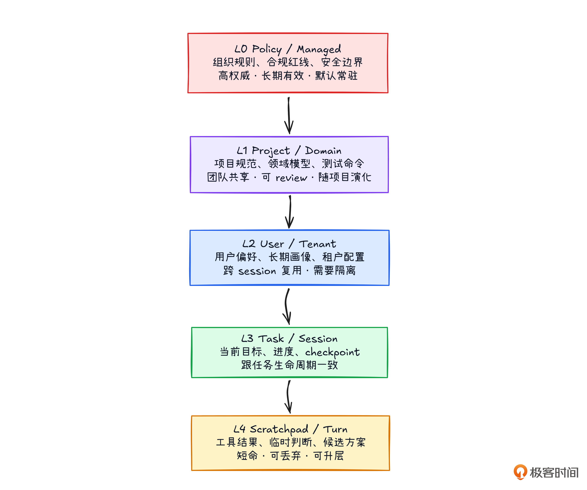
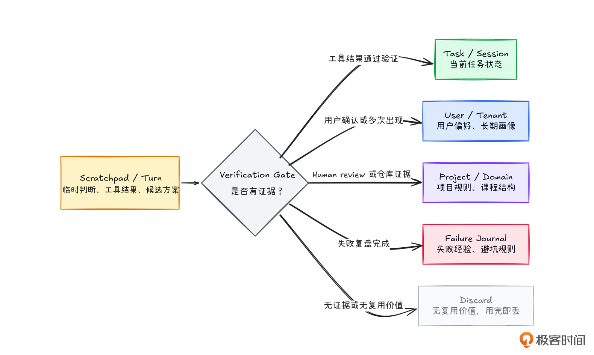
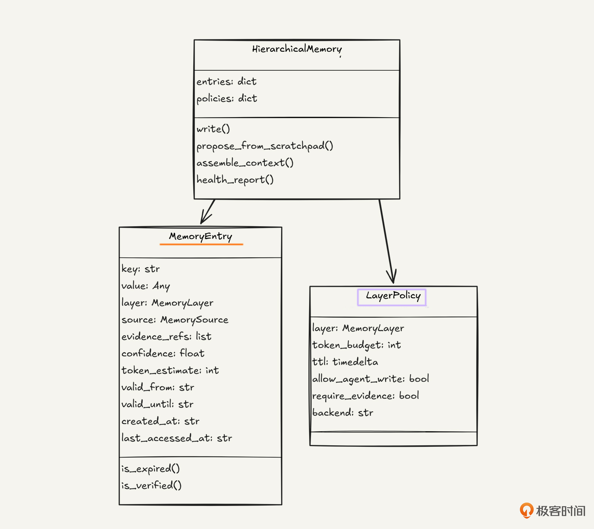

# 12｜分层保留：给 Agent 的记忆建一套货架

**作者**：黄佳

---

## 一句话脉络

记忆模式组第一讲：架。货架怎么搭、每层放什么、怎么决定谁常驻 context、谁换出到外存。

---

## 记忆 × 层级：分层保留在双轴图谱的位置


- **记忆**：处理跨轮、跨会话、跨任务的信息怎么留下来
- **层级**：信息有天然的从属关系和覆盖关系

**最关键的词不是"多层"，而是"各有命运"**。

---

## 五个坐标（分层设计的第一步）

分层不是问"到底分三层还是五层"，而是先想清楚**五个坐标**：

| 坐标 | 回答的问题 |
|---|---|
| **作用域** | 这条记忆属于组织、项目、用户、任务、会话，还是当前一轮？ |
| **生命周期** | 它应该活几分钟、一个 session、一个项目周期，还是长期有效？ |
| **权威来源** | 是人写的、工具返回的、框架生成的，还是模型推断出来的？ |
| **证据** | 来自测试结果、代码路径、用户确认，还是模型的一次猜测？ |
| **Token 预算** | 它应该常驻 context，还是只在需要时被工具取回？ |

---

## 实用的五层货架



### 第一层：策略 / 管理层（Policy / Managed）

**放**：组织级规则、合规红线、安全边界

"生产数据库不能直接写"、"客户数据不能发送到未授权服务"、"涉及权限和账单的变更必须先生成计划再等待人工确认"

- **不能被用户一句话覆盖**，也不能被当前 session 里的临时需求覆盖
- Agent **不能直接写**，只能提议

### 第二层：项目 / 领域层（Project / Domain）

**放**：项目规范、领域模型、代码架构、业务流程

- 开发者 Agent → CLAUDE.md、AGENTS.md、README、测试命令、目录说明
- 课程 Agent → 课程大纲、章节目标、作业结构

**最好贴近项目本身**：人也要看，要能进仓库、能 review、能 diff、能回滚

### 第三层：用户 / 租户层（User / Tenant）

**放**：用户偏好、租户配置、长期个性化上下文

- 用户喜欢中文还是英文？学生已经掌握哪些知识点？
- **长期用户记忆应该像数据库资产**，不是聊天日记

> "小李大概会一点装饰器"这种句子人能懂，系统很难维护。半年后同一概念有十种写法，检索、统计、迁移都会乱。

### 第四层：任务 / 会话层（Task / Session）

**放**：当前目标、里程碑、状态、checkpoint、进度追踪

- 回答"这一轮任务推进到哪了，已经做了什么，下一步是什么，哪些方案被排除"

**和用户层的区别**："学生今天学装饰器时卡住了" ≠ "这个学生长期学得慢"

### 第五层：草稿纸 / 轮次层（Scratchpad / Turn）

**放**：当前一轮工具结果、中间判断、候选方案、临时变量

- **它是工作台，不是档案馆**
- 任务收束后，决定哪些扔掉、哪些写任务层、哪些进用户层、哪些进失败日记

---

## 覆盖关系比层数更重要

| 层级 | 可覆盖 | 不能被覆盖 |
|---|---|---|
| 策略层 | — | 一切 |
| 项目层 | 通用默认值 | 策略层 |
| 用户层 | 表达方式、个性化偏好 | 项目层硬性规则 |
| 任务层 | 当前优先级 | 用户/项目长期事实 |
| 草稿纸层 | — | 提出候选，不能直接污染长期记忆 |

### 升层机制

草稿纸内容先进入**候选**，任务层状态是**当前事实**，用户和项目层需要**更强证据**才能写入。

```python
{
  "candidate_update": {
    "layer_from": "session",
    "layer_to": "user",
    "field": "mastery.decorator",
    "old_value": 0.3,
    "new_value": 0.6,
    "evidence": ["用户正确完成 decorator_exercise_2", "用户能解释 wrapper 返回函数"],
    "confidence": 0.78,
    "requires_review": False
  }
}
```

---

## 写入路由：先放工作台，再决定升层

```
推理过程中 → scratchpad（草稿纸）
    ↓ 任务收束或验证通过
记忆路由器（Memory Router）决定：
    → 通过验证的工具结果 → 任务/会话层
    → 有测试证据的被排除方案 → 进度追踪或失败日记
    → 用户明确偏好 + 多次出现或确认 → 用户层
    → 有人类 review 或仓库证据的项目约定 → 项目层
    → 风险教训 + 完成复盘 → 失败日记或经验记录
```

---

## 最小代码骨架



### 五层的 token 预算和 TTL

| 层级 | Token 预算 | TTL | Agent 写入 | 需要证据 |
|---|---|---|---|---|
| **Policy** | 1200 | 永久 | ❌ | ✅ |
| **Project** | 3000 | 永久 | ❌ | ✅ |
| **User** | 1500 | 永久 | ✅ | ✅ |
| **Task** | 5000 | 7 天 | ✅ | ✅ |
| **Scratchpad** | 2500 | 2 小时 | ✅ | ❌ |

### 关键设计点

1. **SCRATCHPAD 是正式层**：有 TTL、有预算、有升层规则
2. **POLICY 和 PROJECT** 默认不允许 Agent 直接写
3. **require_evidence**：长期记忆不能只靠"我觉得"
4. **assemble_context()**：按层组装，不是简单按时间排序

---

## 编程教练 Agent 的四层落地



```json
{
  "user_layer": {
    "student_profile": {
      "python_experience_months": 6,
      "teaching_preference": "example_first",
      "learning_goal": "3 个月内做出一个个人项目"
    },
    "mastery": [
      {"topic_id": "list", "score": 0.9},
      {"topic_id": "decorator", "score": 0.4, "common_mistakes": ["忘记写 @", "分不清 wrapper 和 inner"]}
    ]
  },
  "project_layer": {
    "course": "Python 进阶 · 装饰器与上下文管理器",
    "chapter_goal": "理解 decorator、closure、context manager 的关系"
  },
  "session_layer": {
    "session_goal": "理解 contextmanager 装饰器",
    "covered_topics": ["@contextmanager 基本用法", "__enter__ / __exit__ 协议"],
    "emotion_state": "confused"
  },
  "scratchpad_layer": {
    "current_user_code": "with open('a.txt') as f:\n    data = f.read()",
    "tool_result": "syntax_check_passed",
    "temporary_hypothesis": "学生理解 with 语法，但不理解 contextmanager 的 yield 分界"
  }
}
```

---

## 三个工程落地要点

### 存哪里

| 层级 | 适合的存储 |
|---|---|
| Policy / Project | 配置中心 / 只读文件 / Git 仓库 |
| User | Profile store / 关系数据库 |
| Task / Session | Checkpoint store |
| Scratchpad / Turn | Runtime state |

### 何时读

分层存储如果最后又**全量读取**，只是把仓库分区了，出门时还是把整个仓库背在身上。

### 何时写

- **高风险场景**（金融、医疗、权限审批）：关键状态**实时写回**
- **普通 Agent**：定时写回 + session 结束兜底

---

## 长期记忆的 schema 纪律

不要只写：
```json
{"learning_pace": "slow"}
```

至少要带：
```json
{
  "learning_pace": {
    "value": "slow",
    "source": "agent_inference",
    "confidence": 0.68,
    "evidence": "连续两次在 decorator 练习中请求基础解释",
    "set_at": "2026-06-15",
    "scope": "current_course",
    "schema_version": "2026-06-01"
  }
}
```

---

## 分层的三个原则

1. **按作用域、生命周期和可信度分层**。公司级、项目级、用户级、任务级、草稿纸级记忆不应该混在一起。

2. **每层有独立的工程命运**：backend、TTL、token 预算、schema、加载规则、写入规则、覆盖规则、淘汰规则。

3. **长期层结构化，临时层可丢弃**。项目层和用户层像资产一样管理，任务层像状态一样恢复，草稿纸层像草稿纸一样用完即走。

---

## 四个常见问题

| 坑 | 表现 | 解法 |
|---|---|---|
| **全量历史对话塞 prompt** | 旧信息太多、权重没有分层 | 任务/会话层只保留状态，scratchpad 用完即丢 |
| **自由文本长期记忆** | 同一件事十种说法，检索不稳定 | 高频字段 schema 化 |
| **Scratchpad 直通长期记忆** | 猜测、临时解释、未验证观察原样保存 | 验证、蒸馏、加证据后再升层 |
| **没有降权机制** | 记忆永远有效，用户偏好变了还当对 | 带版本、来源、证据、失效条件 |

---

## 关键对话总结

### 1. 分层不是问"分几层"，是问五个坐标

| 坐标 | 回答的问题 |
|---|---|
| 作用域 | 这条记忆属于谁？（组织/项目/用户/任务/会话） |
| 生命周期 | 它该活多久？（几分钟/一个 session/永久） |
| 权威来源 | 谁写的？（人/工具/框架/模型推断） |
| 证据强度 | 来自什么？（测试结果/代码路径/用户确认/一次猜测） |
| Token 预算 | 常驻 context 还是按需取回？ |

### 2. 五层货架 + 覆盖关系

| 层级 | 放什么 | 不能被覆盖 |
|---|---|---|
| 策略层 | 组织级规则、合规红线 | 一切 |
| 项目层 | CLAUDE.md、项目规范 | 策略层 |
| 用户层 | 用户偏好、租户配置 | 项目层硬性规则 |
| 任务层 | 当前目标、里程碑、状态 | 用户/项目长期事实 |
| 草稿纸层 | 当前工具结果、中间判断 | 不能直接污染长期记忆 |

最关键的词不是"多层"，而是**"各有命运"**——每层有独立的 TTL、token 预算、写入规则和证据要求。

### 3. 写入路由：先放工作台，再决定升层

```
推理过程中 → scratchpad（草稿纸）
    ↓ 任务收束或验证通过
记忆路由器决定：
→ 已验证的工具结果 → 任务/会话层
→ 有证据的被排除方案 → 失败日记
→ 用户确认的偏好 → 用户层
→ 有人 review 的约定 → 项目层
→ 风险教训 → 失败日记
```

**草稿纸层不是"临时放放"**——它是正式的候选层，有 TTL（2 小时）、有预算（2500 token）、有升层规则。用完即丢、有证据才升层。

### 4. 实战：你的生成应用的信息分层

| 你的信息 | 放哪层 |
|---|---|
| 项目模板、代码架构 | **项目层** |
| 已生成的文件内容、当前任务状态 | **任务层** |
| "这里用 Vue 2 不行"这类临时判断 | **草稿纸层**，等验证通过再升层 |
| 生成的代码文件输出目录 | **任务层**，不需要升到用户/项目层 |

### 5. 一句话带走

> **分层的三个原则：按作用域、生命周期和可信度分层；每层有独立的工程命运（backend、TTL、token 预算、写入规则）；长期层结构化、临时层可丢弃。草稿纸是正式层，用完即丢，升层需证据。**
