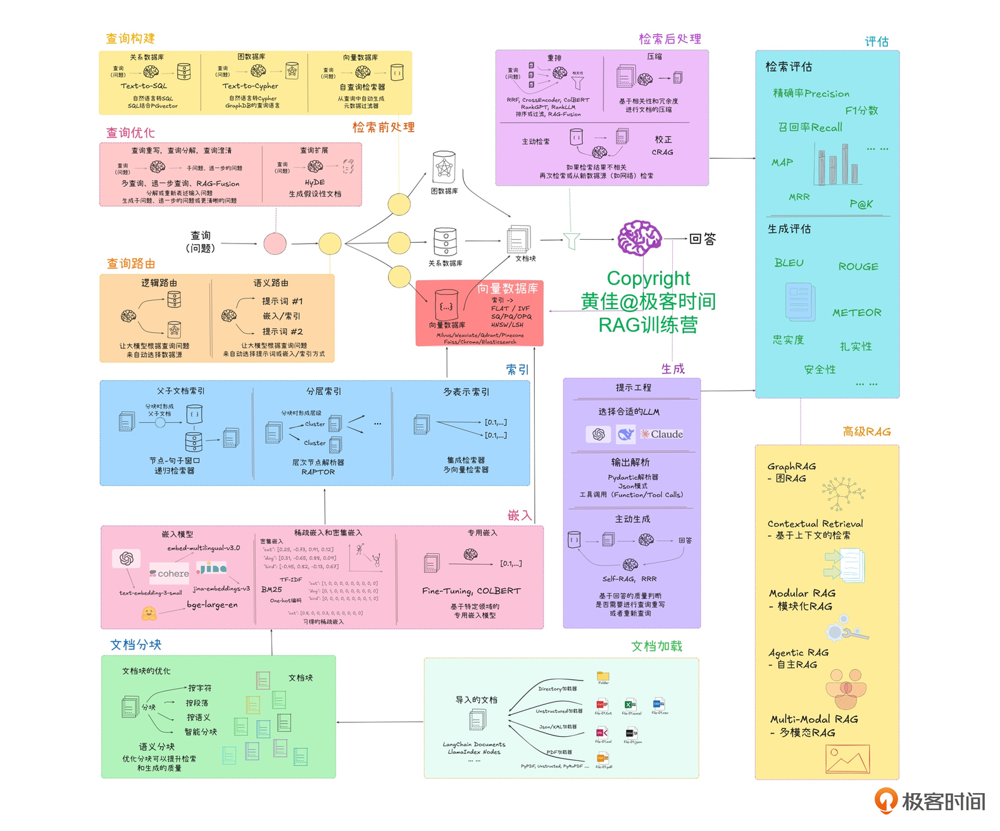

# 13｜检索增强：Agent 的知识库和证据链

**作者**：黄佳

---

## 一句话脉络

记忆模式组第二讲：取。货架搭好以后，从外部大库里**按当前任务约束取回可用、可信、可追溯的证据**——这就是 RAG 在 Agent 时代的重新定位。

---

## RAG 为什么算记忆，不算感知

只看最后一步，RAG 确实参与感知（把召回答复进 context）。

但 RAG 的写入侧才是关键：知识源登记、文档解析、切块、向量化、索引版本、权限范围——这些属于**记忆**的写入侧，不是感知。

> 感知问的是：这一次推理前，哪些材料进入 context。
> 记忆问的是：这些长期知识怎样保存、索引、更新、过期、回滚。

---

## RAG 在双轴图谱的演进

原始 Naive RAG = **链式**（Chain）：
```
文档进库 → 解析切块 → 建索引 → 召回 → 重排 → 注入上下文 → 生成
```

加了回路的 RAG = **循环**（Loop）：
```
检索 → 评估文档 → 改写查询 → 再检索（Self-RAG / CRAG）
```

---

## 从"相关文档"到"可用证据"

**信息检索**的目标是"找到相关文档"——默认屏幕前有一个人自己判断哪条能用。

**Agent 里的 RAG** 目标是"可用证据"：当前任务、当前租户、当前时间点、当前权限范围下真正适用且可引用的证据。

> 相关性是给人看的排序，证据是给机器用的依据。

---

## 企业 SaaS 场景：薪酬核验

用户说："帮我看一下上海市场部 6 月薪资快照里的异常。咖哥缺 2 天考勤，小冰奖金比上月多 40%，小雪社保基数变了。哪些可以自动通过，哪些要人审？"

这里有两类完全不同的信息：

| 类型 | 说明 | RAG 适合处理？ |
|---|---|---|
| **机械状态** | 员工 id、薪资批次 id、考勤记录 id — 必须按位精确，带 provenance | ❌ 工具返回 + SessionState |
| **业务证据** | 考勤扣款口径、奖金审批阈值、社保基数调整生效规则 | ✅ RAG |

---

## RAG 是知识供应链

RAG 失败通常不是"一个点坏了"，而是几个环节叠在一起：

- 知识源没治理好（文档过期、互相矛盾、没有 owner）
- 切块切坏（条款、表格、代码注释被硬切开）
- metadata 太薄（只存 doc_id + text，但真实业务需要 effective_date、product_version、region、permission_scope）
- 召回只看语义相似（embedding 漏掉产品代码、合同编号、错误码等精确线索）
- 答案没有引用链（出错后分不清问题出在哪）

---

## 企业 RAG 落地顺序



**正确的落地顺序**：

1. 先收集真实问题和正确证据，填证据表
2. 给知识源补 owner、版本、生效日期、权限
3. 定义 chunk schema、citation schema、index manifest
4. 建 candidate index，用 golden questions 做回归
5. 通过后切 alias / current pointer
6. 接入答案引用、RetrievalTrace、索引版本监控

> 先填证据表比一开始就建索引更重要。RAG 项目最容易变成"把企业知识的混乱自动化"。

---

## 索引的六步建设

### 第一步：知识源登记

每份文档至少要有：`doc_id`、`source_uri`、`owner`、`permission_scope`、`effective_from`、`effective_to`、`source_hash`、`document_status`

### 第二步：可复现的切块

```python
chunk_id = hash(
    doc_id + parser_version + chunker_version +
    str(chunk_index) + text_hash
)
```

### 第三步：Ingestion Manifest

记录一版索引的全部构建参数：`corpus_version`、`parser_version`、`chunker_version`、`embedding_model`、`collection`、`source_count`、`chunk_count`、`golden_set_passed`

### 第四步：候选索引 + 灰度发布

先生成候选索引（`payroll_rag_20260614_candidate`），用 **golden questions** 做回归测试，通过后再切生产。

### 第五步：别名 / 线上指针做蓝绿切换

应用侧始终访问稳定别名（`payroll_rag_current`），底层 collection 可以动态切换。

### 第六步：删除、退休、备份、回滚

被替换的薪酬规则、废止的审批口径，必须用 `status`、`effective_to`、`permission_scope` 严格过滤，不让它参与召回。

---

## 工程切片

### 切片一：Anthropic Contextual Retrieval

问题：chunk 一旦脱离来源语境，召回结果撑不起可追溯的结论。

解决：每个 chunk 前面加一段短上下文，再一起 embedding：

```
[Context] 这是 ACME 重疾险 2022 版条款中"重大疾病保险金"一节。本节说明等待期后的赔付条件...
[Chunk] 本责任在等待期后生效。
```

效果：top-20 chunk 检索失败率从 5.7% 降到 1.9%（相对降低 67%）。

### 切片二：LlamaIndex 的文档工程前置

PDF 的表格被 OCR 读乱、页眉页脚混进正文、双栏论文阅读顺序错——这些问题进入索引后，后面再怎么换向量库都难救回来。

**建议**：先抽 50 条真实用户问题，看原始文档进入系统后的形态，而不是急着调 top-K。

### 切片三：执行型 Agent 中的 RAG 边界

| 组件 | 职责 |
|---|---|
| **RAG** | 查政策、查规则、查历史口径，提供可引用证据 |
| **SessionState** | 管员工、批次、金额、账号、审批单号等机械真值 |
| **Orchestrator** | 根据证据和状态编排下一步 |
| **Verification Gate** | 高风险动作前做一致性检查和人审 |

---

## 证据契约（Evidence Contract）

一条可用的证据至少要有四件套：

| 字段 | 说明 |
|---|---|
| **source** | 原始文档、系统、表、API、文件路径 |
| **version** | 文档版本、索引版本、生效时间、废止时间 |
| **scope** | 适用地区、租户、角色、产品、流程阶段、权限 |
| **citation** | 页码、章节、条款号、chunk_id、source_hash、index_version |

### 证据请求的正确格式

```python
{
  "semantic_query": "奖金增长异常 自动通过 人审 审批阈值",
  "filters": {
    "tenant_id": "acme",
    "region": "上海",
    "payroll_month": "2026-06",
    "employee_group": "市场部",
    "rule_status": "active",
    "permission_scope": "payroll_operator"
  },
  "required_citation": ["rule_id", "effective_from", "source_owner", "section", "index_version"]
}
```

---

## RetrievalTrace：检索的行车记录仪

一次错误回答，可能错在四个完全不同的方面：

| 错误表现 | 问题在哪 |
|---|---|
| 没召回到正确证据 | 召回问题（query、索引、过滤） |
| 召回到了但被重排压下去 | 重排问题 |
| 召回到了但材料是过期版本 | 知识源问题 |
| 材料没问题，模型却没采纳 | 推理或规划问题 |

**没有 RetrievalTrace，这四种错误靠日志也排查不出来。**

---

## RAG 知识检索技术选型卡

| 场景 | 推荐方案 |
|---|---|
| 代码结构探索 | Agentic Search（grep + read） |
| 语义记忆取回 | RAG（带 evidence contract） |
| 结构化状态读取 | 直接查业务系统（batch_id 现在什么状态？） |
| 长期知识策展 | LLM Wiki（编译一次、持续更新） |
| 跨会话用户状态演化 | 记忆框架（Mem0 / Zep / Letta） |

> RAG 和记忆框架是两类不同机制，互补但不要混用，更不要在一个系统里同时上两套。

---

## 关键对话总结

### 1. RAG 算记忆不是感知

只看最后一步，RAG 确实参与感知（把召回答复进 context）。但 RAG 的大部分工作在**写入侧**——知识源登记、解析、切块、索引版本管理。这些属于记忆的范畴。

| | 感知 | 记忆 |
|---|---|---|
| 问题 | 这一次推理前，哪些材料进 context | 长期知识怎么保存、索引、更新、过期、回滚 |
| RAG 角色 | 结果注入（最外层） | 索引建设（核心工作） |

### 2. 机械状态 vs 业务证据——RAG 什么时候不该用

| 类型 | 说明 | 处理方式 |
|---|---|---|
| **机械状态** | 员工 id、薪资批次 id、考勤记录 id、数据库 schema、项目模板 | ❌ **不能走 RAG**——必须工具返回 + SessionState 精确绑定 |
| **业务证据** | 考勤扣款口径、奖金审批阈值、社保基数调整规则 | ✅ **走 RAG**——提供可引用证据 |

**对你生成应用的启发**：数据库 schema 定义、项目模板这些是"机械状态"，应该直接从文件/配置读，不走 RAG。

### 3. 从"相关文档"到"可用证据"

> 相关性是给人看的排序，证据是给机器用的依据。

一条可用的证据至少要有四件套：

| 字段 | 说明 |
|---|---|
| source | 原始文档、系统、表、API、文件路径 |
| version | 文档版本、索引版本、生效时间、废止时间 |
| scope | 适用地区、租户、角色、产品 |
| citation | 页码、章节、条款号、chunk_id、source_hash |

### 4. RAG 落地顺序（最实用）

1. **先收集真实问题和正确证据，填证据表** ← 第一步不是建索引
2. 给知识源补 owner、版本、生效日期、权限
3. 定义 chunk schema、citation schema、index manifest
4. 建 candidate index，用 golden questions 做回归
5. 通过后切 alias / current pointer
6. 接入答案引用、RetrievalTrace、索引版本监控

> RAG 项目最容易变成"把企业知识的混乱自动化"。**先填证据表比一开始就建索引更重要。**

### 5. 一句话带走

> **RAG 的写入侧才是关键。知识源治理、metadata、证据契约（source/version/scope/citation）决定 RAG 质量，不是换 embedding 模型能解决的。机械状态不走 RAG，业务证据才走 RAG。**
