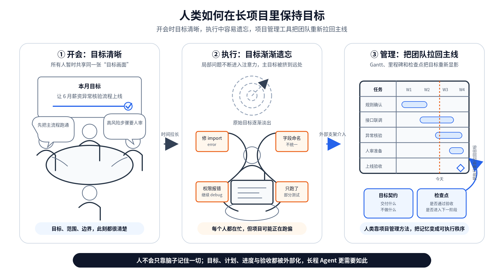
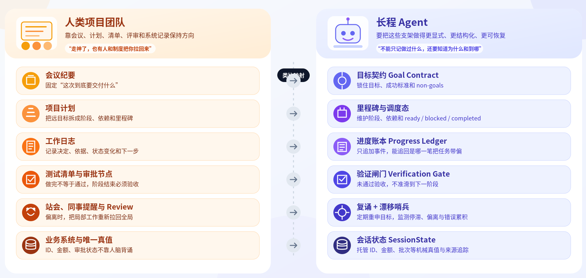

# 14｜进度追踪：长任务中别让 Agent 走丢

**作者**：黄佳

---

## 一句话脉络

记忆模式组第三讲：录。长任务跑到一半，Agent 怎么记住自己已经做了什么、为什么这么做、下一步该怎么接——防止目标和判断在时间里漂移。

---

## 记忆 × 编排：进度追踪在双轴图谱的位置



- **记忆**：保存执行轨迹（原始目标、当前里程碑、已完成步骤、关键决策、阻塞点、验证结果、下一步动作）
- **编排**：进度状态是横切在所有步骤之上的协调者，不只是链式传递结果

---

## 人类团队的防跑偏装置

人做长项目不是只靠脑子，有一整套**外部化支架**：

- **会议纪要**：把原始目标重新固定下来
- **项目计划**：把长目标拆成阶段
- **任务清单**：告诉还有哪些事没做
- **测试清单 / 审批节点**：拦住没验收的高风险动作
- **同事提醒**：不断把局部工作拉回到全局目标上

> **人靠外部化支架把长项目稳稳推进下去。Agent 也需要对应的外部支架，而且要更显式、更结构化、更可恢复。**

---

## 长任务五种迷失

| 迷失类型 | 表现 |
|---|---|
| **目标漂移** | 从"完成 auth.py 重构"变成"把这个 import error 修干净" |
| **状态漂移** | Agent 以为环境是 A，真实环境已经是 B |
| **错误放大** | 第一步误判 schema 字段，后面查询验证文档都顺着这个误判长出来 |
| **细节过载** | 围着一个 Warning Message 把预算耗完 |
| **完成幻觉** | todo 都打勾了当成目标达成 |

---

## 三平面分治：把"迷失"拆成三件事



| 平面 | 职责 | 核心概念 |
|---|---|---|
| **SessionWorkspace（调度态）** | 任务 DAG，ready / blocked / completed | 任务依赖和执行顺序 |
| **SessionNarrative（叙事态）** | 锚、账、集 | 目标、进展、当前工作集 |
| **SessionState（机械态）** | API 入参的可审计真值（带 Provenance） | 精确参数，程序维护 |

---

## 叙事态：锚、账、集

### 锚（GoalContract）

把目标冻结成一份**可引用的契约**：

```python
goal_id: payroll-run-shanghai-sales-202606
user_goal: 为上海市场部准备2026年6月薪资批次...
success_criteria:
  - 员工范围为上海市场部6月在职员工
  - 复用5月规则，记录本月差异
  - 异常核验后提交人审
non_goals:
  - 不修改员工主数据
  - 不改规则模板
  - 不直接发起银行付款
constraints:
  - 金额、账号、员工id只从工具返回和SessionState读取
  - 发现规则缺口时暂停并请求人审
```

**non_goals 是防止细节过载的一道护栏**：Agent 看到薪资项名称不统一，可能花十几轮做完整薪资科目治理，而当前任务只是生成可审核快照。

### 账（ProgressLedger）

**记账不是记流水账**。每条至少记四样：

| 字段 | 说明 |
|---|---|
| **event** | 发生了什么 |
| **decision** | 为什么这么做 |
| **reason** | 根据什么判断 |
| **state_delta** | 状态发生了什么变化 |

```python
event: 创建2026年6月上海市场部薪资组
decision: 复用5月薪资规则模板
reason: 用户要求"按上月规则"，本月规则变更未确认
evidence_refs:
  - tool:create_payroll_group#20260612-1005
  - policy/payroll-rule-2026-05.md
state_delta:
  write: [STATE.payroll_group_id]
  scope: company:acme/org:shanghai-sales/month:2026-06
next_action: 生成薪资批次，绑定STATE.payroll_group_id
```

### 集（WorkingCollection）

从账里**再蒸馏、裁剪**出当前这一步最相关的一小包材料，和锚一起注入模型。

```
每一轮注入都带着锚 → Agent 不会忘原始目标
每轮只给当前子任务要的材料 → Agent 不会被全部历史淹没
```

---

## 机械态：别让 LLM 拼接真值

员工 id、薪资批次 id、银行账号、税号、金额——这些值要放进 **SessionState**，由程序维护，每个值都带 **Provenance**。

```python
key: payroll_batch_id
scope: company:acme/org:shanghai-sales/month:2026-06
provider: create_payroll_batch
runtime_layer: plan_exec.M3.step1
value_ref: STATE.payroll_batch_id
trust: tool_output
```

**LLM 可以说"下一步提交6月薪资批次"，但真正传给 API 的 payroll_batch_id，由程序按坐标从 SessionState 读取。**

---

## 三平面闭环

```
叙事态提出动作意图
    ↓
调度态确认动作 ready
    ↓
编排器解析状态引用
    ↓
机械态提供精确参数
    ↓
工具执行
    ↓
机械态写入新真值
    ↓
叙事账本追加事件
    ↓
验证闸门对账
    ↓
调度态推进到下一步
```

---

## 三个调度收敛器

### 1. 复诵（Recitation）

Manus 的做法：每隔固定步数或每个里程碑结束，把**全局计划反复推回上下文尾部**，降低目标漂移。

### 2. 漂移哨兵（Drift Watchdog）

定期问："你现在做的事，还跟原目标有关吗？"

| 信号 | 分级处理 |
|---|---|
| 相关度下降 | 触发复诵 |
| 里程碑停滞 | 要求缩小范围 |
| 证据变差 | 禁止汇报完成 |
| 错误压力上升 | 暂停进入诊断 |

### 3. 验证闸门（Verification Gate）

每个里程碑的验收条件落成具体检查：快照人数等于员工范围吗，金额波动在可解释范围内吗，异常项都标出了吗，关键 id 都有 Provenance 吗。

**不通过 → 置成 needs_rework，回到对应里程碑，不许进入下一阶段。**

---

## LongHorizonTaskState Schema

完整长程任务状态容器，包含：

| 组件 | 说明 |
|---|---|
| **GoalContract** | 锚：冻结原始目标、成功标准、非目标、约束 |
| **Milestone[]** | 把远目标拆成可验收的近目标 |
| **ProgressEvent[]** | 只追加的进度账本 |
| **working_collection** | 每一步投影给模型的集 |
| **MechanicalValue[]** | 机械参数及其 Provenance |
| **DriftSignal** | 漂移哨兵的当前判断 |
| **resume_packet()** | 断点恢复包 |
| **recitation_prompt()** | 复诵提示生成 |

---

## 断了怎么接上：进度追踪的恢复

| 组件 | 存哪里 |
|---|---|
| 锚和长期目标 | store 或项目文件 |
| 任务 DAG 和里程碑 | checkpointer |
| 账本 | append-only 日志 |
| 机械状态 | SessionState |
| 恢复包 | resume_packet |

LangGraph checkpointer：按 thread_id 存状态快照，传入同一个 thread_id 就能从最后一个检查点重建、从中断处续跑，甚至 **time travel** 回任意一步。

Temporal 的 durable execution：每一步 journaling，崩溃后可以精确续跑——本质是 **预写日志 WAL** 在 Agent 工作流里的现代版。

---

## 薪酬 SaaS 场景的完整方案

把那个 auth.py 事故的根因用进来：

1. **目标先冻结成 Goal Contract**：`non_goals` 里写"不直接发起银行付款和税局申报"
2. **机械 id 全部存 SessionState**：LLM 不在自然语言里处理 id 和金额
3. **每个里程碑配一道验证闸门**：快照人数、金额边界、异常清单、数据溯源、付款 blocked 状态全部检查通过才进入下一阶段
4. **Agent 围着命名规范打转**：复诵插进来"当前里程碑是生成快照，不做完整薪资科目治理"
5. **断点靠 resume_packet 恢复**：不是去翻聊天记录

---

## 关键对话总结

### 1. 长任务五种迷失

| 迷失类型 | 表现 |
|---|---|
| **目标漂移** | 从"完成 auth.py 重构"变成"把这个 import error 修干净" |
| **状态漂移** | Agent 以为环境是 A，真实环境已经是 B |
| **错误放大** | 第一步误判 schema 字段，后面查询验证文档都顺着误判长出来 |
| **细节过载** | 围着一个 Warning Message 把预算耗完 |
| **完成幻觉** | todo 都打勾了当成目标达成 |

### 2. 三平面分治——最有价值的设计

| 平面 | 职责 | 谁维护 |
|---|---|---|
| **SessionWorkspace（调度态）** | 任务 DAG，谁 ready、谁 blocked | 编排器 |
| **SessionNarrative（叙事态）** | 锚、账、集——目标、理由、上下文 | LLM + 系统 |
| **SessionState（机械态）** | 精确参数（id、金额、路径），带 Provenance | **程序维护**，不给 LLM 拼接 |

**核心纪律**：LLM 可以说"下一步生成 Service 层"，但具体的文件命名、目录路径、导入语句——由程序从上下文里精确读取，不靠 LLM 拼接。

### 3. 叙事态的"锚、账、集"

| 组件 | 角色 | 对你的生成应用的意义 |
|---|---|---|
| **锚（GoalContract）** | 冻结目标，尤其写 non_goals | Agent 想花十几轮改 UI 组件时——`non_goals: 不做过分 UI 调整` 就能拦住 |
| **账（ProgressLedger）** | 每步记：发生了什么、为什么、根据什么、状态变化 | 出问题时知道是"做错了"还是"理解错了" |
| **集（WorkingCollection）** | 从账里裁剪出当前最相关的材料 | 每轮不背全部历史，只带当前需要的 |

### 4. 三个调度收敛器

| 机制 | 做法 |
|---|---|
| **复诵** | 每隔固定步数把全局计划推回上下文，降低目标漂移 |
| **漂移哨兵** | 定期问：你现在做的事，还跟原目标有关吗？ |
| **验证闸门** | 每个里程碑配检查点，不通过不许进下一阶段 |

### 5. 一句话带走

> **三平面分治的核心不是"分层"，而是"不让 LLM 拼接真值"——叙事态提意图、机械态管精确参数、调度态管执行顺序。机械态由程序维护，每个值带 Provenance（谁产生的、什么时候、从哪来的）。**
