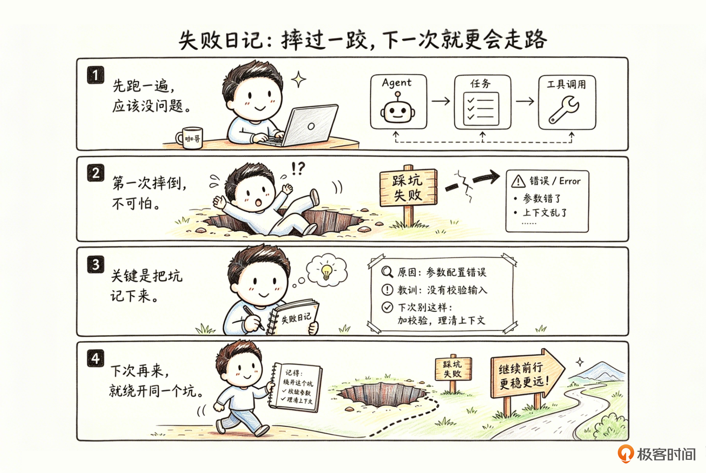
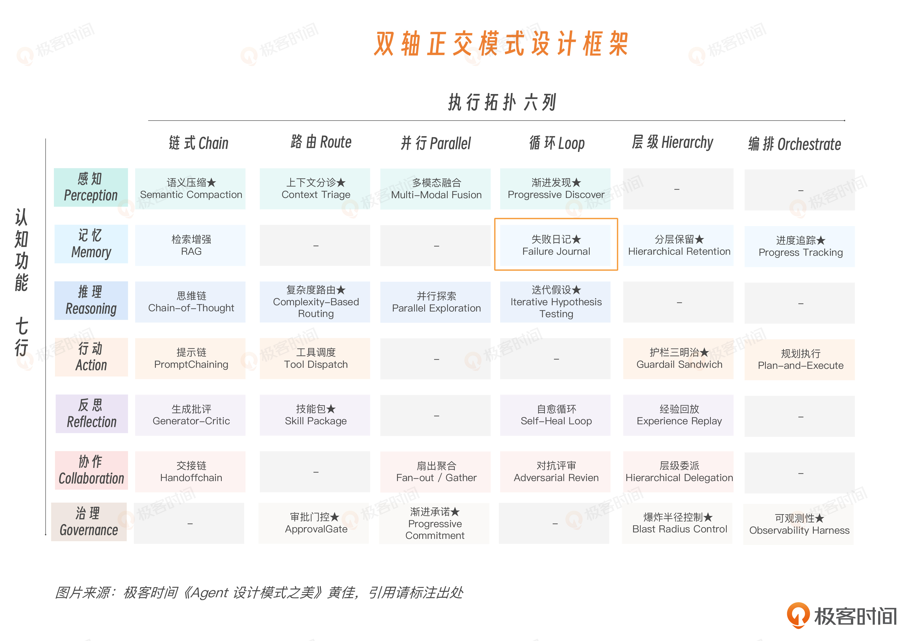
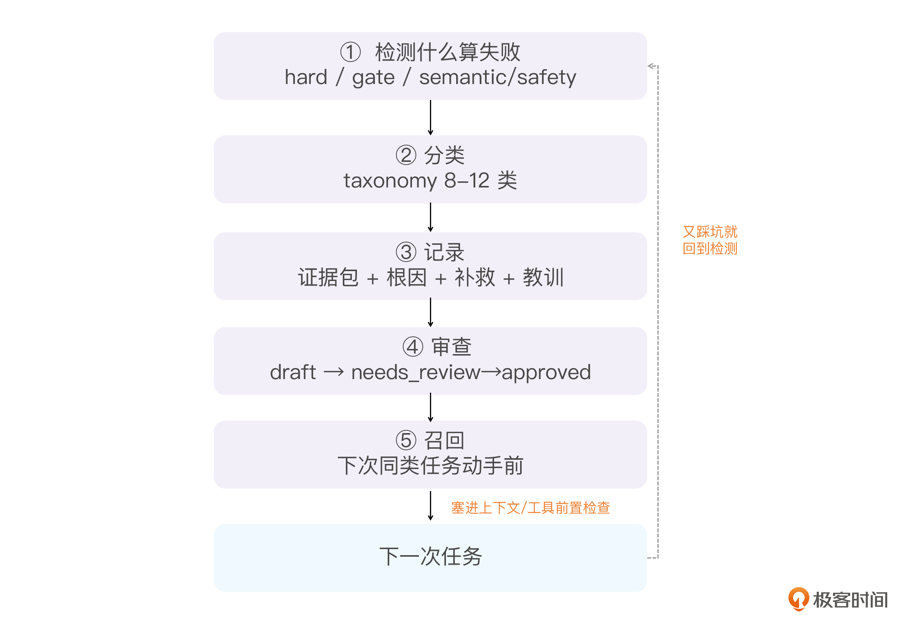

# 15｜失败日记：让 Agent 把摔过的跤变成本事

**作者**：黄佳

---

## 一句话脉络

记忆模式组第四讲：省。失败日记解决的不是"这次失败怎么办"，而是"下次遇到相似情形怎么不再掉进同一个坑"——把一次事故蒸馏成可跨任务召回的工程经验。

---

## 记忆 × 编排：失败日记在双轴图谱的位置



失败日记落在**记忆行、循环列**：

- **记忆**：保存跨任务经验，生命周期长于一次 session
- **循环**：形成闭环——失败发生 → 检测与分类 → 记录证据和根因 → 审查并批准 → 相似任务主动召回 → 改变下一次行动 → 观察是否再次失败

---

## 失败日记不是错误日志

普通错误日志回答的是："系统刚才哪里报错了？"

失败日记回答的是："**以后遇到某种情形时，Agent 应该提前改变什么行为？**"

| 机制 | 主要服务谁 | 记录什么 | 是否自动影响下次任务 |
|------|-----------|---------|-------------------|
| Retry | 当前执行器 | 错误码、重试次数 | 通常不会 |
| 错误日志 | 运维和工程师 | 堆栈、请求、环境 | 通常不会 |
| Postmortem | 团队 | 影响、根因、改进行动 | 靠人阅读 |
| 进度追踪 | 当前 Agent | 目标、里程碑、任务状态 | 服务当前任务恢复 |
| **失败日记** | **下一次 Agent** | **失败模式、根因、教训、召回条件** | **主动进入** |

失败日记必须完成一次从**错误事实**到**可行动经验**的蒸馏。

---

## 薪酬任务场景里的失败日记

沿用上一讲的薪酬 SaaS 场景：Agent 正在为客户 A 处理 6 月薪资结算。

**发生了什么：**

1. 工具已返回正确的 `payroll_group_id`，并写入了 SessionState
2. 但生成薪资快照时，上下文里残留了客户 B 的薪资组说明
3. 模型在自然语言里复述了那个旧 id
4. 某个工具封装允许从文本里提取参数
5. 结果：客户 A 的 **30 名员工被错误写进了客户 B 的薪酬组**

**验证闸门兜住了它**——系统发现员工归属与当前租户不一致，`payroll_group_id` 的租户范围也和当前任务不匹配，终止了后续动作，没有进入付款环节。

**进度追踪**会做三件事：把当前里程碑标记为 `needs_rework`，废弃错误快照，重新绑定正确的机械状态。

但如果事情到这里就结束，下个月同样的任务来了，Agent **仍然可能再犯一次**。

失败日记要把这次事故蒸馏成一条可以跨任务召回的教训：

> 凡是跨租户的 `payroll_*_id`，都不能从自然语言摘要中提取。工具调用前，必须从 SessionState 按 key + tenant scope 绑定，并校验该 id 属于当前客户、部门和月份。

到了 7 月结算，Agent 准备再次调用 `create_payroll_batch` 时，系统会先召回这条失败经验：

> 本次任务属于 `payroll_run`，调用 `create_payroll_batch` 前发现：这类任务以前错在"从自然语言里取 id，且没有校验租户归属"。本次必须从 SessionState 确定性绑定。

**6 月的一次事故，就这样变成了 7 月的一道护栏。** 这就是失败日记的意义——把失败保存下来，并让过去的失败正向影响下一次行动。

---

## 失败日记的 6 层结构

一条失败经验有两种形态：

- **失败事实层（L2）**：保存"这次到底发生了什么"——工具输出、失败节点、状态快照、验证报告、受影响对象、修复操作
- **经验教训层（L3）**：保存"下次到底应该注意什么"——可复用的根因、教训、禁止动作和召回条件

日常召回时，只把 L3 的短经验卡送进上下文。需要复盘、审计或重新判断时，再沿着 `evidence_refs` 回到 L2 查看原始事实。这和操作系统的工作集思想相似：热经验进入当前上下文，冷细节按需换入。

一条完整的失败日记需要明确以下六层：

| 层 | 解决的问题 |
|----|----------|
| 失败边界 Failure Boundary | 这件事到底算不算值得沉淀的失败 |
| 失败分类 Failure Taxonomy | 它属于哪一种可重复的失败模式 |
| 证据包 Evidence Bundle | 当时到底发生了什么 |
| 根因与补救 Root Cause & Repair | 为什么会错，系统应该怎样改 |
| 召回触发器 Recall Trigger | 下次什么时候应该想起它 |
| 留存与审查 Retention & Review | 谁确认它可信，应该保留多久 |

---

## 失败边界：不是只有崩溃才算失败

只记录错误本身，会漏掉 Agent 最值得记住的失败。有些任务没有报错信息，甚至顺利生成了最终结果，但它完成的是**错误目标**、使用了**错误对象**，或者**绕过了本应存在的人审**。

四种失败边界：

- **hard_failure**：任务无法继续——工具崩溃、权限拒绝、上下文溢出
- **gate_failure**：验证闸门没有通过——人数不符、金额异常、证据不足
- **semantic_failure**：表面完成，但完成的不是原始目标——目标漂移、口径错误
- **safety_failure**：触碰租户、权限、环境或人工审批边界

反过来，也不要把每一次小抖动都写进失败日记。偶发网络重试、一次无影响的格式修正，如果没有复发价值，只需要留在普通日志里。**要不要进入失败日记，主要看它是否值得 Agent 改变下一次任务的行为。**

---

## 失败分类：为了召回，不是为了做百科全书

微软 AI Red Team 对 Agent 系统失败模式分类时强调：目标、上下文、工具、权限、插件与多 Agent 信任关系都可能成为失败来源。

| 类别 | 说明 |
|------|------|
| tool_failure | 工具失败 |
| retrieval_failure | 检索漏召回、误召回或索引滞后 |
| planning_failure | 计划缺失、顺序错误、漏掉验收 |
| goal_drift | 偏离原始目标或 non-goals |
| context_contamination | 旧上下文或外部内容污染推理 |
| mechanical_state_mismatch | id、金额、账号、批次号绑定错误 |
| boundary_leak | 租户、环境、组织或权限边界泄漏 |
| hitl_bypass | 本应人审的动作被绕过 |
| policy_violation | 违反业务、安全或合规策略 |
| unknown | 根因未确认，等待人审 |

类别是下一次任务召回正确经验的主要依据。

---

## 证据包：给失败那一刻拍一张三平面快照

"Agent 用错了 `payroll_group_id`" 不是一份完整的失败记录。还要知道：

- 失败发生在哪个节点？
- 当时 Agent 以为自己在做什么？
- 正确的机械参数来自哪里？
- 哪个工具封装接受了错误值？
- 哪条验证规则抓住了它？

这正好延续了上一讲的三平面：

- **SessionWorkspace**：哪一个任务节点失败，当前状态和重试次数是什么
- **SessionNarrative**：Agent 当时的目标、工作集和关键判断是什么
- **SessionState**：机械值从哪个工具来、属于哪个 scope、被谁消费
- **Raw Observation**：工具输出、验证报告、错误堆栈或人工审查记录

只保留原始错误本身，保存的是**症状**。把三平面和原始观察一起保留，才能形成可诊断的**证据包**。



---

## 根因与补救：不要写"模型太粗心"

失败日记要包含根因分析和补救措施，结构如下：

| 字段 | 说明 |
|------|------|
| symptom | 表面发生了什么 |
| root_cause | 为什么会发生 |
| repair | 这次怎样修复 |
| lesson | 下次应该改变什么行为 |

**无效根因**：`LLM 产生了幻觉。`

**有效根因**：`payroll_group_id` 同时存在于自然语言摘要和 SessionState，工具封装没有限制参数来源，也没有校验租户 scope，导致旧摘要中的 id 覆盖了确定性状态绑定。

"模型幻觉"无法指导工程改进。后一个根因则能落到**具体动作**：禁止从自然语言抽取机械参数、增加 scope 校验、补充回归测试。好的根因能够让工程师和 Agent 都知道该从哪里入手进行修改。

---

## 召回触发器：写得再好，不召回也等于没写

失败日记最容易缺的，是召回条件。失败日记写得再认真，如果下一次任务却不会被 Agent 自动看到，结果变成"人类有空才翻"的文档库。

每条日记都要写清 `recall_when`，标明它服务哪个 task_family、哪些工具、哪些机械参数、哪个失败类别、什么风险级别：

```yaml
recall_when:
  task_family:
    - payroll_run
  tools:
    - create_payroll_batch
    - create_payroll_snapshot
  mechanical_keys:
    - payroll_group_id
    - payroll_batch_id
  categories:
    - boundary_leak
    - mechanical_state_mismatch
```

对于参数串错、租户泄漏这类失败，也要记录 `task_family + tool_name + mechanical_keys` 这种结构化的键值。

---

## 留存与审查：失败日记不能变成垃圾桶

Agent 可以自动生成失败日记初稿，但不能让它写完以后直接进入召回库。通过四种状态，人类和 Agent 一起生成它，维护它：

| 状态 | 说明 |
|------|------|
| draft | Agent 自动生成，尚未确认 |
| needs_review | 根因不确定或风险较高，需要人审 |
| approved | 已经确认，可以进入召回 |
| archived | 已过期、长期无价值，或者对应问题已经被系统机制彻底消除 |

**只有 `approved` 的失败日记才能进入下一次任务。**

留存也可以分热、温、冷三档：
- **热**：最近的失败保留完整 trace，便于诊断
- **温**：一段时间以后保留压缩后的失败条目和证据引用
- **冷**：长期只保留高严重度、高复现率、真正被召回过的经验

跨租户泄漏、人审绕过、机械状态串错等高风险类别，不应该按普通策略自动淘汰。它们还应该进入**回归测试集**。一次修复过的 bug，最好的归宿不只是写进失败日记，还要变成一条永久测试。

---

## 完整失败日记示例

以上面的串租户失败案例为例，完整失败日记如下：

```yaml
failure_id: fj-payroll-20260612-001
task_family: payroll_run
boundary: safety_failure
category: boundary_leak
severity: high
status: approved

symptom: >
  薪资组中 30 名员工的租户归属与当前任务不一致。
  payroll_group_id 指向客户 B，当前任务属于客户 A。

root_cause: >
  create_payroll_batch 的工具封装允许从自然语言摘要中提取
  payroll_group_id；上下文残留的客户 B 旧说明覆盖了
  SessionState 中客户 A 的确定性状态值。
  工具调用前也没有校验 tenant scope。

evidence_refs:
  - workspace:M3/create_payroll_batch
  - narrative:ledger/event-028
  - state:payroll_group_id@tenant-A/org-shanghai/month-2026-06
  - gate:tenant_scope_mismatch
  - tool:create_payroll_batch#20260612-1421

repair:
  - 废弃错误薪资组，将 30 名员工恢复到客户 A
  - 禁止工具封装从自然语言中解析 payroll_group_id
  - payroll_*_id 只允许从 SessionState 绑定
  - 写入前强制校验 tenant / org / month
  - 增加 cross_tenant_scope_mismatch 回归测试

lesson:
  - 跨租户机械参数必须从 SessionState 确定性绑定
  - 机械 id 不得通过摘要、聊天历史或账本正文传递
  - 任何写操作前都要验证 id 的 tenant scope

do_not:
  - 不从自然语言摘要复制 payroll_*_id
  - scope 未通过校验时，不调用写入型薪酬工具

recall_when:
  task_family:
    - payroll_run
  tools:
    - create_payroll_batch
    - create_payroll_snapshot
  mechanical_keys:
    - payroll_group_id
    - payroll_batch_id
```

这条记录里没有一句"模型不够细心"，而是细致记录了：哪一个状态平面混了，哪个工具入口放宽了参数来源，哪道闸门发现了错误，以及下一次工具调用前应该出现什么提醒。

---

## 把"记录、审查、召回"这条链跑通

具体的召回点一般有三个：

1. **新任务启动时**：召回同 task_family 的高风险失败
2. **任务规划时**：召回同场景的经验教训
3. **高风险工具调用前**：按工具名和机械参数召回

对执行型 Agent，工具调用前那一刻往往最有价值，因为真正的副作用就发生在那里。这时候召回一张短短的"危险卡"，好过在上下文里面塞十条长日志。

把这套召回放到下个月的流程：
- 7 月结算启动，又是跨租户写入薪资组的同类场景
- 新任务启动召回点先命中 task_family
- 规划时再命中场景
- 等 Agent 走到 `create_payroll_batch` 前那一刻，按工具名加 `payroll_group_id` 把这条经验顶到最前

Agent 还没动手，先读到一句"跨租户 id 写入前校验归属"。**6 月这一跤，就这样变成了 7 月的拦截。**

---

## 代码实现

```python
from dataclasses import dataclass, field
from enum import Enum

class Boundary(str, Enum):             # 先判断什么算失败
    HARD = "hard_failure"
    GATE = "gate_failure"
    SEMANTIC = "semantic_failure"
    SAFETY = "safety_failure"

class Status(str, Enum):
    DRAFT = "draft"
    NEEDS_REVIEW = "needs_review"
    APPROVED = "approved"
    ARCHIVED = "archived"

@dataclass
class EvidenceBundle:                  # 证据包：三平面的失败快照 + 原始观测
    workspace_refs: list[str] = field(default_factory=list)
    narrative_refs: list[str] = field(default_factory=list)
    state_refs: list[str] = field(default_factory=list)
    observation_refs: list[str] = field(default_factory=list)

@dataclass
class RecallTrigger:                   # 结构化召回键，比纯 embedding 可靠
    task_families: list[str] = field(default_factory=list)
    tools: list[str] = field(default_factory=list)
    mechanical_keys: list[str] = field(default_factory=list)
    categories: list[str] = field(default_factory=list)

@dataclass
class FailureEntry:                    # 单条失败记录
    failure_id: str
    task_family: str
    boundary: Boundary
    category: str
    severity: str
    status: Status
    symptom: str
    root_cause: str
    repair: list[str]
    lesson: list[str]
    do_not: list[str]
    evidence: EvidenceBundle
    recall: RecallTrigger
    recalled_count: int = 0

    def is_recallable(self) -> bool:
        return self.status == Status.APPROVED   # 只有审查过的才能召回

class FailureTrace:                    # 贯穿追踪面：Memory Trace 在失败日记里的样子
    def __init__(self) -> None:
        self.entries: list[FailureEntry] = []

    def recall_before_tool(self, task_family: str, tool: str,
                           keys: list[str], top_k: int = 3) -> list[FailureEntry]:
        scored = []
        for e in self.entries:
            if not e.is_recallable():
                continue
            score = 0
            if task_family in e.recall.task_families:
                score += 3
            if tool in e.recall.tools:
                score += 3
            score += len(set(keys) & set(e.recall.mechanical_keys))
            if score > 0:
                scored.append((score, e))
        scored.sort(key=lambda x: x[0], reverse=True)
        hits = [e for _, e in scored[:top_k]]
        for e in hits:
            e.recalled_count += 1
        return hits
```

**两个重点：**

1. symptom、root_cause、repair、lesson、do_not 和召回条件**分开存**，系统才能检索、统计
2. **只有审查通过的失败才能召回**

`Boundary` 先判断什么算失败，`EvidenceBundle` 把证据按三平面分开存：`workspace_refs`（哪一步失败）、`narrative_refs`（当时以为在做什么）、`state_refs`（机械参数从哪来）、`observation_refs`（原始 tool output / gate 报告）。

**结构化召回键往往比纯 embedding 更可靠。** 很多事故来自同一个业务动作、同一批机械参数、同一个工具入口，语义相似反而不是主线索。

---

## 失败日记本身也是攻击面

失败日记是长期记忆库，长期记忆库就是**攻击面**。

未来的 Agent 攻击不只是提示词注入，还会有**记忆注入、记忆投毒、记忆篡改**。失败日记正好是这类攻击最理想的落点。

如果有人往里写一条假教训，比如伪装成"跨租户写入这步可以跳过校验"，下次召回就被污染，Agent 反而会被这条假经验领着去犯错。

**MemoryGraft** 把恶意流程伪装成"合法的、已验证过的最佳实践"，藏在普通文档里被 Agent 摄入，下次遇到相似任务，Agent 无需任何显式触发，就会检索、信任、照搬。

为什么这么危险？因为记忆投毒和一次性提示词注入很不一样——**它是持久的**。恶意内容一旦写进记忆库，在会话重启、上下文重置之后继续存活，几周后被一个语义相似的任务悄悄触发。

**OWASP 的 Agentic 安全倡议把记忆投毒列为十五类威胁里的头号关注点。**



**两端都要治理：**

- **写入端**：带来源，做来源标记、人审和会话隔离，一条失败日记从哪来、谁审过、属于哪个租户，都要可查
- **召回端**：召回回来的历史经验是"边界提醒"，不是"绝对真值"。Agent 看到一条历史教训，应该把它当成一个**需要再核对的提示**，而不是一条不容置疑的指令

---

## 失败日记的衡量指标

| 指标 | 说明 |
|------|------|
| 重复失败率 | 过去已记录的失败模式，又发生了多少次 |
| 召回有效率 | 召回的经验中，有多少真正改变了计划或工具参数 |
| 漏召回率 | 发生重复失败时，对应日记是否存在，却没有被召回 |
| 误提醒率 | 召回了多少与当前任务无关的失败经验 |

**最核心的指标仍然是重复失败率。** 如果 `mechanical_state_mismatch` 一个月从十二次下降到三次，这套系统在积累经验。如果日记越写越多，但同类错误数量丝毫不降，问题通常出在召回点、分类、根因或教训写法上。

---

## 咖哥发言：离线训练是第二阶段

除了在线召回之外，还可以进一步把失败轨迹重新标注和打包，转化成**离线训练数据**。

不过，未经审查的失败直接拿去训练，可能把错误根因、过度概括的教训和错误边界一起内化进模型。

**推荐顺序：先跑通记录、审查、召回和注入。** 等失败日记里积累了足够多经过确认的高质量条目，再评估是否把它们变成训练数据。

---

## 总结

一架飞机发生事故，调查的目的不是只修好这一架飞机，也不是简单责怪某个飞行员。真正的目标，是读出黑匣子，把事故拆成可以命名、复现和改进的失败模式，再把改进传播到整支机队。

**失败日记就是 Agent 机队的黑匣子。**

- 错误日志服务一次维修。黑匣子服务下一次飞行。
- 一个串租户事故，在失败日记中可不再只是一条失败记录，而成为每一次跨租户薪酬写入之前都会出现的护栏。

**记的时候**：分清失败边界、失败分类、证据包、根因补救、召回触发器和留存审查。不要把失败写成一段故事，更不要用"模型太粗心"这种无法行动的根因。

**用的时候**：在下一次同类任务的关键入口主动召回，尤其是高风险工具调用前。结构化任务族、工具名和机械状态键，通常比纯语义相似更可靠。

**管的时候**：要有审批状态、分档留存和来源追踪。只有经过确认的失败经验才能进入召回；召回到的经验也只能作为风险提醒，不能替代当前事实和规则。

**从哪里开始落地：**

1. 挑一条高重复、高损失的任务族（薪资结算、报销审批、合同审阅、生产发布）
2. 把 Verification Gate 产生的 `gate_failure` 和 `safety_failure` 自动转成失败日记草稿（证据最完整）
3. 设计 8~12 个失败类别，以及 `draft—needs_review—approved—archived` 审查状态机
4. 只加几个召回入口：任务规划时和高风险工具调用前
5. 盯住重复失败率，形成可运行的经验闭环

---

## 记忆模式组小结

到这里，记忆模式组的四个模式就讲完了：

| 模式 | 解决的问题 |
|------|----------|
| 分层保留 | 架——给记忆建货架 |
| RAG | 取——从外部大库里取回证据 |
| 进度追踪 | 录——把长任务记成能对账、能续跑的账 |
| 失败日记 | 省——把一次摔跤变成下一次任务的护栏 |

一次任务，从搭货架、取证据、记进度，到记教训，走完了记忆的完整生命周期。

程序性记忆（把成功流程固化成可复用技能包），留到后面的反思模式组继续展开。

---

## 思考题

1. 最近一次 Agent 重复犯错是什么？它是没有被记录，还是记录了却没有在下一次任务里自动召回？
2. 挑一条失败记录看一看。它的根因是"模型幻觉、用户没说清"这种甩锅式解释，还是已经落到了具体的状态平面、工具入口和系统改进动作？
3. 你的失败经验在什么时刻出现？任务开始、任务规划，还是高风险工具调用前？它出现的位置，真的来得及改变行动吗？
4. 如果有人向失败日记里写入一条伪装成最佳实践的恶意经验，你的来源追踪、审查机制和租户隔离能不能挡住？

---

## 关键对话总结

### 1. 失败日记 vs 错误日志

| | 错误日志 | 失败日记 |
|---|---|---|
| 回答 | 系统刚才哪里报错了 | 以后遇到类似情形 Agent 该改变什么行为 |
| 服务谁 | 运维和工程师 | **下一次 Agent** |
| 影响 | 通常不会自动影响下次 | **主动进入**下一次任务 |

失败日记必须完成一次从**错误事实**到**可行动经验**的蒸馏。

### 2. 失败不是成本，是投资

你的生成应用如果有失败日记机制，迭代逻辑变成：

```
第一次：生成 → 失败 → 记录教训
第二次：召回教训 → 规避 → 生成 → 发现新坑 → 再记录
第三次：两条教训 → 再规避 → 再生成 → ...
```

时间越长成功率越高，因为走过的坑全被标记了。

### 3. 你的生成应用最容易出现的失败边界

不是崩溃（hard_failure），而是 **semantic_failure**——代码生成了、文件写了、看着像那么回事，但它完成的功能根本不是你想要的那个。

### 4. 安全警告：失败日记本身就是攻击面

记忆投毒是 OWASP 列出的 Agentic 安全十五类威胁里的**头号关注点**。如果有人往里写一条"跨租户写入这步可以跳过校验"——下次召回就被污染。

**两端都要治理：**
- **写入端**：带来源标记、人审、会话隔离
- **召回端**：历史经验是"边界提醒"，不是"绝对真值"

### 5. 一句话带走

> **失败日记不是错误日志。错误日志服务一次维修，失败日记服务下一次飞行。一次失败，变成下一次同类任务关键入口出现的护栏。每次失败不是成本，是投资。**

---

## 参考资料

- Shinn et al. *Reflexion: Language Agents with Verbal Reinforcement Learning*. NeurIPS 2023, arXiv:2303.11366
- Toyota Production System / Five Whys（大野耐一，TPS）
- US DoD. *MIL-P-1629: Procedures for Performing a Failure Mode, Effects and Criticality Analysis*. 1949
- Betsy Beyer et al. *Site Reliability Engineering*（Ch.15 Postmortem Culture）. Google / O'Reilly, 2016
- John Allspaw. *Blameless PostMortems and a Just Culture*. Etsy, 2012
- Manus (Yichao Ji). *Context Engineering for AI Agents: Lessons from Building Manus*. 2025-07-18
- Letta. *Recovery-Bench*. 2025-08
- Liu et al. *Contextual Experience Replay*. ACL 2025, arXiv:2506.06698
- *AgentHER: Hindsight Experience Replay for LLM Agent Trajectory Relabeling*. arXiv:2603.21357, 2026-03
- *Rethinking Continual Experience Internalization for Self-Evolving LLM Agents*. arXiv:2606.04703, 2026-06
- Microsoft AI Red Team. *Updating the Taxonomy of Failure Modes in Agentic AI Systems (v2.0)*. 2026-06-04
- Chen et al. *AgentPoison: Red-teaming LLM Agents via Poisoning Memory or Knowledge Bases*. NeurIPS 2024, arXiv:2407.12784
- *MemoryGraft*. arXiv:2512.16962, 2025-12
- OWASP Agentic Security Initiative. *Agentic AI — Threats and Mitigations*（Memory Poisoning = T1）. 2025
