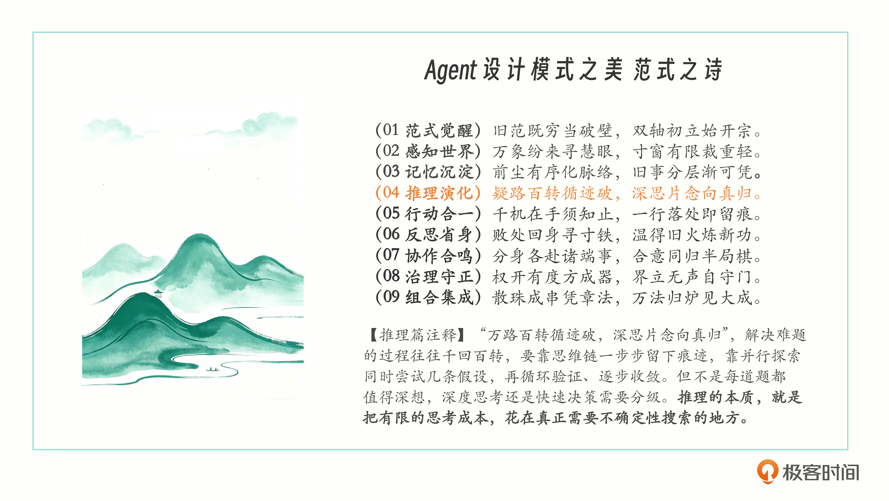
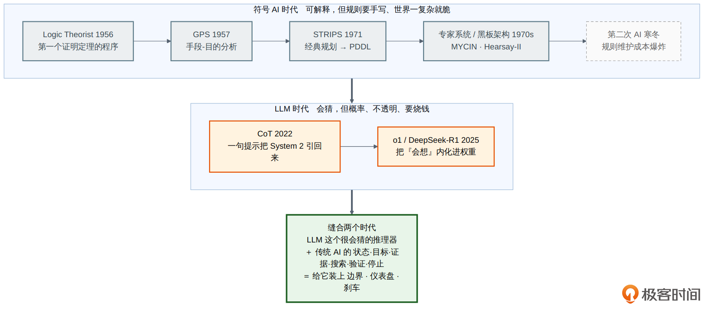
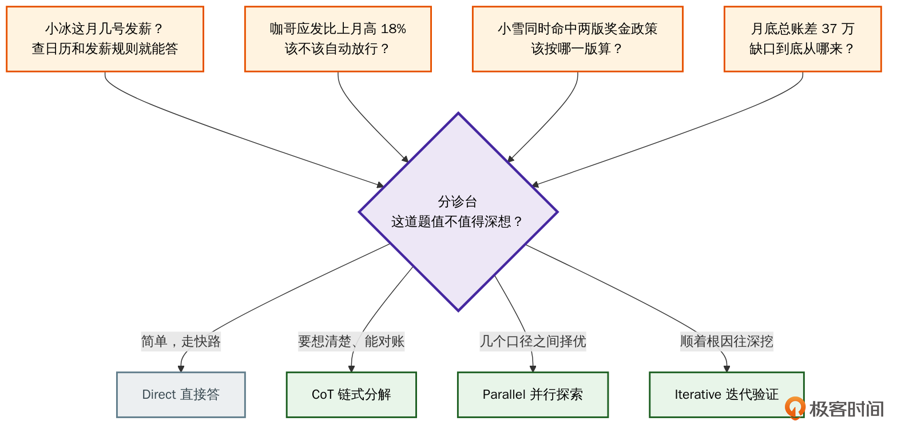
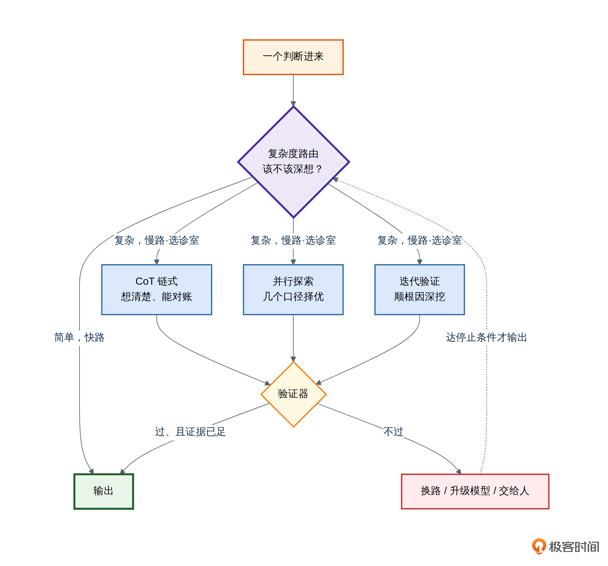

# 16｜推理模块导论：让 Agent 想得清楚，也想得起来

**作者**：黄佳

---

## 一句话脉络

感知让 Agent 看见此刻，记忆让 Agent 留住过去，推理要做的则是：**面对眼前的信息和过去的经验，接下来该相信什么、该选择什么、该做什么。**

---

## 推理模式的来龙去脉



### 三段论到 LLM

人类的推理从生存经验开始（乌云→下雨），亚里士多德整理成三段论，计算机时代变成规则系统（专家系统）。传统推理核心是"规则清楚、过程可解释"——输入相同、规则相同、输出就相同。

LLM 不同，它靠概率生成，把大量模式压进权重。同一个输入重复执行可能走出不同的中间路径。所以，**给 LLM 多写几条业务规则，并不能自动得到一个可靠的推理系统。**

### 三种推理不要混为一谈

1. **模型的内部推理** — 发生在模型内部，可能很长，可能不暴露
2. **系统组织的外部慎思** — 提出假设、查询工具、比较证据
3. **工程师审计的决策记录** — 看过什么证据、执行了什么动作、为何升级

> 不能把一段看起来有条理的自然语言直接当成模型真实计算过程的证明。Anthropic 发现模型生成的 CoT 并不总是忠实披露实际影响答案的信息。

### 核心判断

> **LLM 给了我们一个很会猜的推理器，Harness 工程系统要做的，是给这个推理器装上边界、仪表盘和刹车系统。**

---

## 推理不等于把思维链写得更长

从 2022 年的 CoT（`Let's think step by step`），到 2026 年的推理模型（o1、DeepSeek-R1），推理被两股力量改写：

1. **训练进了模型** — 强化学习让模型自己涌现出长链推理和自我验证
2. **产品化了运行时资源** — `reasoning_effort`、`adaptive thinking` 把"想多深"变成了可调参数

**核心问题变了**：从"怎么让 Agent 多想几步"变成 **"让 Agent 来判断如何推理"**——该深想吗？沿一条路到底还是同时试几条？什么时候证据够了该停？推不出来什么时候升级到人？

> 推理从模型的一种能力，进化成了一种需要被分配、约束、验证以及停止的计算资源。

---

## 薪酬场景：四种推理策略

6 月的薪酬结算中出现了 4 个具体问题，需要四种不同的推理策略：

| 问题 | 推理模式 | 说明 |
|---|---|---|
| 小冰几号发薪？ | **直接回答** | 查日历和发薪规则就能答，不值得长推理 |
| 咖哥应发高 18%，该不该放行？ | **链式分解** | 拆开工资组成，核对审批、奖金、生效时间 |
| 小雪命中两版奖金政策，按哪版？ | **并行探索** | 多个口径都说得通，并行比较，验证器择优 |
| 月底总账差 37 万，缺口从哪来？ | **迭代验证** | 提假设→查数据→排除→缩小范围→继续 |

这四种推理策略构成了本模块的核心。

---

## 思考快与慢和推理契约

### System 1 & System 2

| | System 1（快） | System 2（慢） |
|---|---|---|
| 速度 | 快、自动、低耗 | 慢、刻意、高耗 |
| 适合 | 熟悉、直接的问题 | 多步计算、证据比较、复杂决策 |
| 方式 | 直接生成、小模型、规则 | 结构化分解、并行搜索、反复验证 |

### 推理契约（Reasoning Contract）

设计生产系统推理模块的五个问题：

| 问题 | 说明 |
|---|---|
| 是否启动深入思考？ | 这个请求直接回答是否已经足够？ |
| 采用哪种推理拓扑？ | 链式、并行还是循环调查？ |
| 投入多少预算？ | 最多用多少 token、时间、模型调用、工具调用？ |
| 由什么验证？ | 单元测试、业务规则、外部数据、人审还是另一个模型？ |
| 什么时候停止？ | 达到什么证据标准后输出？什么情况后升级或放弃？ |

### 计算预算

```python
@dataclass
class ReasoningBudget:
    max_thinking_tokens: int = 8000     # 内部思考 token 上限
    max_latency_ms: int = 12000        # 端到端延迟上限
    max_model_calls: int = 4           # 模型调用次数上限
    max_tool_calls: int = 8            # 工具调用次数上限
    max_parallel_paths: int = 3        # 并行路径数上限
```

> 当答案已经稳定之后，就别再继续消耗推理所用的 Token。

---

## 四种推理模式



| 模式 | 拓扑 | 解决的问题 |
|---|---|---|
| **CoT（思维链）** | 链式 | 把复杂判断拆解成一条可检查的链 |
| **复杂度路由** | 路由 | 按难度分流，在直接回答和深想之间做权衡 |
| **并行探索** | 并行 | 多个路径同时走，再让验证器比较择优 |
| **迭代假设验证** | 循环 | 信息不足时逐步逼近，提假设→查数据→更新 |

### 复杂度路由的四个信号



复杂度路由是分诊台，按四个信号分流：

1. **任务意图** — 这种问题以前是怎么处理的？
2. **证据状态** — 关键证据是否完整、是否为最新版本？有矛盾吗？
3. **机械状态** — 涉及的关键 id 是否带 scope、有 provenance？
4. **动作风险** — 这个判断的后果是什么？可逆吗？

### 三种深度推理模式的关系



```
复杂度路由（分诊台）
  → CoT（链式分解）
  → 并行探索（多路径择优）
  → 迭代假设验证（逐步深挖）
```

四个模式组成一条控制链：**先路由再推理，推理之后要验证，验证不通过就换路，达到停止条件才输出。**

---

## 推理追踪（Reasoning Trace）

推理系统要有自己的仪表盘。没有它，推理系统就是个黑盒。

**核心原则**：记录外部可核验的决策事件，不记录模型脑内独白。

```python
@dataclass
class ReasoningStep:
    step_id: int
    hypothesis: str              # 要验证的命题
    evidence_refs: list[str]    # 引用了哪些可追踪证据
    action: str                  # 查库 / 运行代码 / 调 API
    observation: str             # 外部环境返回了什么
    decision: str                # 根据证据做出的局部决定
    confidence: float = 0.0
    model_calls: int = 0
    tool_calls: int = 0
    thinking_tokens: int = 0
    latency_ms: int = 0

@dataclass
class ReasoningTrace:
    task_id: str
    mode: ReasoningMode
    route_reason: str                 # 为什么分到这个 mode
    budget: ReasoningBudget
    steps: list[ReasoningStep]
    final_decision: str = ""
    validator: str = ""               # 由什么验证器放行
    validation_passed: bool = False
    stop_reason: str = ""             # 为什么停
    escalated_from: str = ""          # 从哪个更轻的 mode 升级而来
```

保存的内容：模式选择的原因、预算、每一步验证的命题、证据、是否中途升级、由什么验证器放行、为什么停止。

---

## 推理健康度指标

| 指标 | 说明 |
|---|---|
| **验证通过率** | 最终结论通过业务规则/测试/执行结果/人工复核的比例 |
| **首次路由命中率** | 第一次选的推理模式是否足够解决问题 |
| **单位验证成功成本** | 获得一个通过验证的正确结果的成本和延迟 |
| **推理漂移率** | 长任务中目标、约束、已验证事实是否被逐渐遗忘或改写 |

四个指标按任务类型分桶（客服分类、代码修复、财务审批、研究调查），各自建立基线和 SLO。

---

## 总结

> 推理工程的核心不是让 Agent 想得最多，而是让它用最少的充分计算，得到可验证的正确决定。

四种模式对应四种经济学选择：

| 模式 | 用 | 换取 |
|---|---|---|
| CoT | 一定 token | 问题分解和中间产物 |
| 复杂度路由 | 轻量判断 | 整体成本和延迟下降 |
| 并行探索 | 更多计算路径 | 对单一路径偏见的抵抗 |
| 迭代假设验证 | 更多轮次 | 在未知环境中逐步逼近真相 |

**该快时快、该深时深，并且每个重要结论都能回到证据上。**

---

## 思考题

1. 你的 Agent 现在用什么模型做推理？如果固定一个模型，用三十天的账单估算一下单用顶配和"便宜档加顶配路由"能差多少钱？
2. 回想一次你的 Agent 明明拿到了足够信息却绕了很远才给出答案的情况。它是真的需要推理，还是只是缺少一个明确的规则或流程模板？
3. 你的长任务 Agent 跑到第十步以后还记得住第一步定下的约束吗？

---

## 参考资料

- Kahneman. *Thinking, Fast and Slow*. 2011
- Wei et al. *Chain-of-Thought Prompting Elicits Reasoning in Large Language Models*. arXiv:2201.11903, NeurIPS 2022
- Yao et al. *Tree of Thoughts*. arXiv:2305.10601, NeurIPS 2023
- Yao et al. *ReAct*. arXiv:2210.03629, ICLR 2023
- Ong et al. *RouteLLM: Learning to Route LLMs with Preference Data*. ICLR 2025
- DeepSeek-AI. *DeepSeek-R1*. Nature, 2025
- Anthropic. *Reasoning Models Don't Always Say What They Think*. arXiv:2505.05410, 2025
