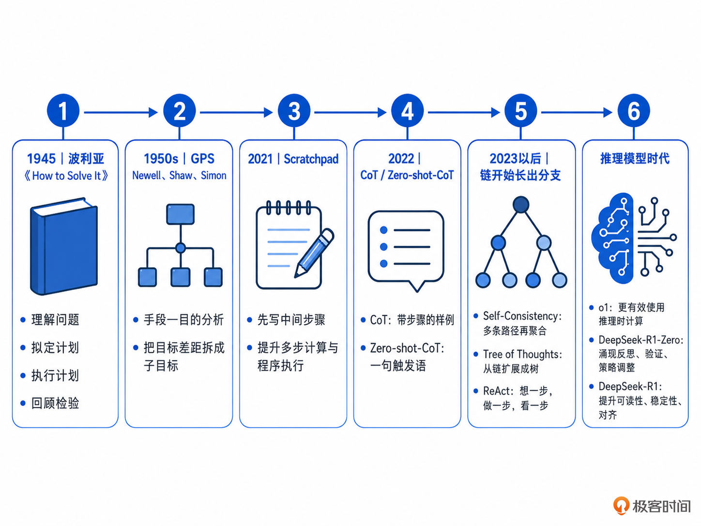
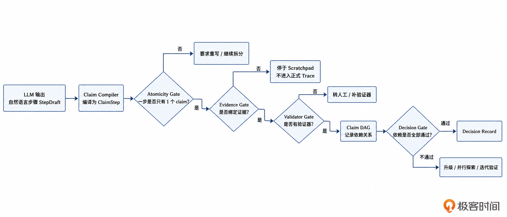
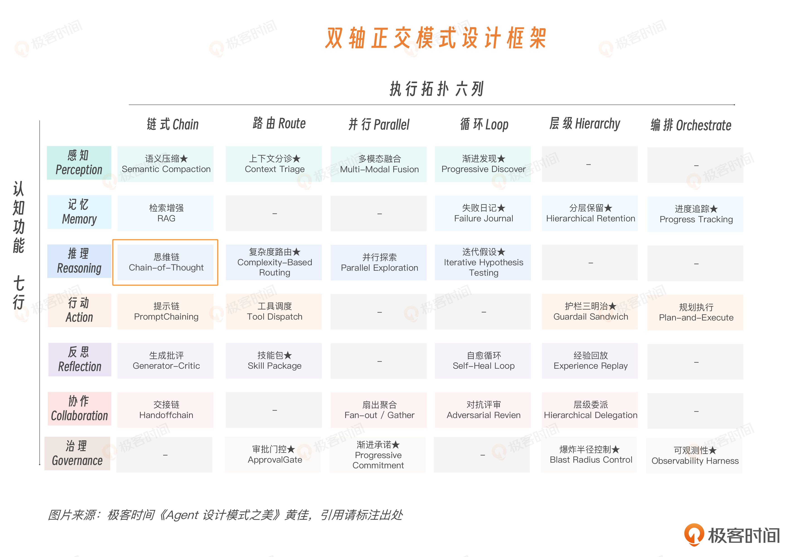
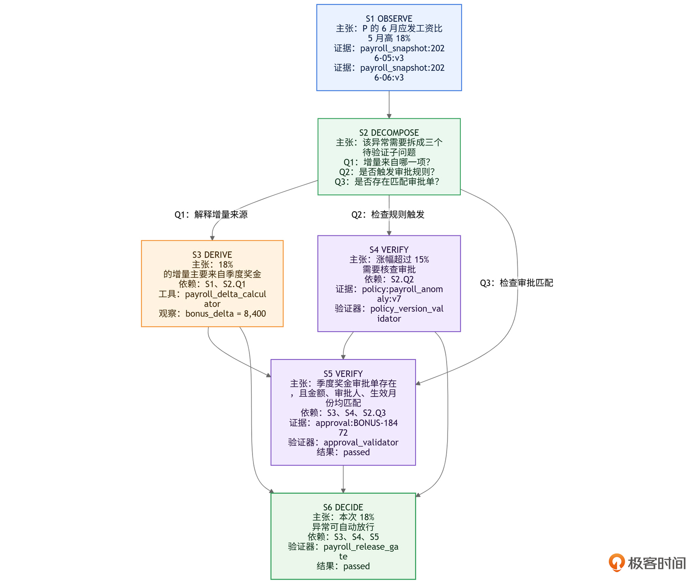
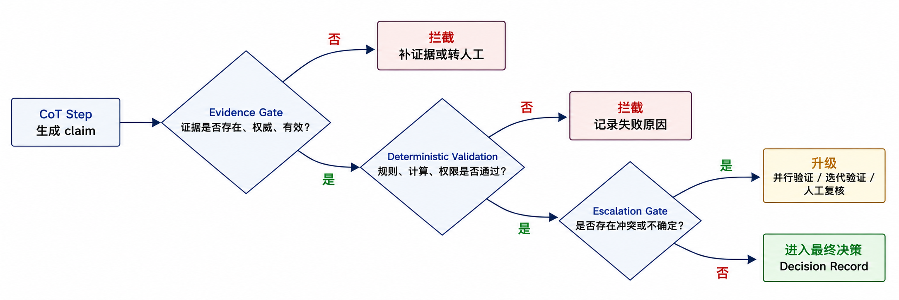

# 17｜思维链：给 Agent 的判断留下一条可检查的路径

**作者**：黄佳

---

## 一句话脉络

CoT 在推理契约中的工程定位：**用一条主路径，把复杂判断拆成若干可验证命题，为最终 Validator 放行做准备。**

---

## CoT 在推理契约中的位置

### 五个问题中的两个

| 问题 | CoT 的回答 |
|---|---|
| 是否启动慎思 | ✅ 需要拆解但还不需要多路径 |
| **采用哪种推理拓扑** | **单条主路径**，前一步输出是后一步输入 |
| 投入多少预算 | — |
| **由什么验证** | **每步都可被工具/数据库/规则引擎独立检查** |
| 什么时候停止 | — |

CoT 不维护多条候选路径（那是并行探索的事），也不是持续观察环境的迭代闭环（那是迭代验证的事）。

---

## 核心原则：一步只表达一个可验证命题

### 不合格的例子

> 综合分析 P 的工资、奖金、政策和历史记录，判断该薪资变化是否合理。

它把观察事实、拆解问题、计算差异、核对规则、查证审批和最终判断全塞进了同一步。系统既不知道核心命题是什么，也不知道用哪个工具验证。

### 三个检查问题

每步必须能回答：

1. 有没有一个**明确的命题**（立论）？
2. 这个命题能不能被工具、规则、数据库或人**独立检查**？
3. 如果这个命题错了，**下游哪些步骤会被影响**？

### 合格链的例子（薪酬异常核验）



```
S1 OBSERVE：P 的 6 月应发工资比 5 月高 18%
   证据：payroll_snapshot:2026-05:v3, payroll_snapshot:2026-06:v3

S2 DECOMPOSE：需要拆成三个子问题：增量来源、规则触发、审批匹配
   依赖：S1

S3 DERIVE：18% 增量主要来自季度奖金
   依赖：S1, S2.Q1
   工具：payroll_delta_calculator

S4 VERIFY：规则要求涨幅超 15% 时核查审批
   依赖：S2.Q2
   证据：policy:payroll_anomaly:v7

S5 VERIFY：季度奖金审批单存在，金额/审批人/月份匹配
   依赖：S3, S4, S2.Q3
   验证器：approval_validator → passed

S6 DECIDE：可自动放行
   依赖：S3, S4, S5
   验证器：payroll_release_gate → passed
```

**普通 CoT** 说："我认为它合理。"
**生产 CoT** 说："S6 依赖 S3、S4、S5；S3 来自工资差异计算器；S4 来自政策版本 v7；S5 由审批验证器通过。所以 S6 可以放行。"

---

## CoT 五步法

| 类型 | 作用 | 必须绑定 |
|---|---|---|
| **OBSERVE** | 把外部事实读进来 | 证据引用 |
| **DECOMPOSE** | 拆成可验证的子问题 | 依赖已观察到的问题 |
| **DERIVE** | 基于已有事实推导/计算中间结果 | 工具或计算动作 |
| **VERIFY** | 对照规则/审批/政策核查 | 证据 + 验证器 |
| **DECIDE** | 做一个局部或最终决定 | 依赖已验证的上游 + 决策闸门 |

---

## 工程实现：六层设计



### 第一层：Step Schema

```python
class StepKind(Enum):
    OBSERVE = "observe"
    DECOMPOSE = "decompose"
    DERIVE = "derive"
    VERIFY = "verify"
    DECIDE = "decide"

@dataclass
class ClaimStep:
    step_id: str
    kind: StepKind
    claim_text: str
    subject: str
    predicate: str
    object: Any = None
    depends_on: list[str] = field(default_factory=list)
    evidence_refs: list[EvidenceRef] = field(default_factory=list)
    action: str | None = None
    observation: Any | None = None
    validator: str | None = None
    status: StepStatus = StepStatus.DRAFT
```

### 第二层：原子性闸门



防止模型把多个判断塞进一个步骤：

- **静态检查**：检测"并且、同时、因此、所以"等连词，命中 ≥2 个就拦
- **类型约束**：OBSERVE 必须有证据、DECOMPOSE 必须依赖问题、VERIFY 必须有验证器……

### 第三层：验证器注册表

```python
validator_registry = ValidatorRegistry()
validator_registry.register("approval_validator", check_approval_exists)
validator_registry.register("policy_validator", check_policy_active)
```

**关键原则**：能用确定性程序验证的，不要交给模型自评。
- 金额 → 计算器
- 政策生效 → 规则引擎
- 审批权限 → 权限系统

### 第四层：依赖图



```
S4 验证失败 → S5 和 S6 的依赖断了
→ 它们不是"低置信度"，是直接作废
```

`dependencies_passed()` 检查所有上游是否 `PASSED`，任何一个失败直接停。

### 第五层：追踪运行器

Trace Runner 的职责不是替模型思考，而是执行结构化步骤、检查依赖、运行验证器、决定是否停止。

```python
class TraceRunner:
    def run(self, trace: ClaimTrace) -> ClaimTrace:
        for step in trace.steps:
            if not validate_step_shape(step):    # 形状检查
                step.status = NEEDS_REVIEW; return
            if not trace.dependencies_passed(step):  # 依赖检查
                step.status = NEEDS_REVIEW; return
            if step.kind in {VERIFY, DECIDE}:    # 验证器执行
                status, obs = self.registry.run(step)
                step.status = status
                if status is not PASSED: return
            else:
                step.status = PASSED
```

### 第六层：LLM 输出草稿 + 程序编译



LLM 的职责是把复杂任务拆成**候选命题**（StepDraft）。程序的职责是把候选命题**编译**成可验证节点（ClaimStep）。

```python
@dataclass
class StepDraft:
    kind: StepKind
    claim_text: str
    suggested_subject: str | None = None
    suggested_predicate: str | None = None
```

LLM 不需要自己决定"我已经有证据了"。证据来自 RAG、数据库、工具。Validator 来自系统注册表。

---

## 三道闸门

| 闸门 | 检查什么 | 失败后 |
|---|---|---|
| **证据闸门** | 证据是否存在、版本是否对、有效期是否覆盖、租户是否匹配 | 停在草稿区，不进决策 |
| **确定性验证闸门** | 由程序验证而不是模型自评 | 升级到并行探索/人审 |
| **升级退出闸门** | 证据缺失/冲突、规则版本不唯一、模型改写事实 | 升级到迭代验证/人工复核 |

---

## 供应侧状态 vs 应用侧轨迹

| | 供应侧推理状态 | 应用侧审计轨迹 |
|---|---|---|
| 用途 | 让模型下一轮接着想 | 让系统可治理、可审计 |
| 保存什么 | Provider reasoning state | Structured ClaimTrace |
| 能否审计 | ❌ 加密包，业务不可读 | ✅ 每一步主张、证据、验证器全记录 |

二者分开：Provider state 负责"续接思考"，Application trace 负责"留下责任链"。

---

## 总结

> CoT 在推理契约里的工程定位，是用一条主路径，把复杂判断拆成若干可验证命题，为最终 Validator 放行做准备。

与提示词技巧的 CoT 不同，生产 CoT 是：

1. **拆**：问题 → 若干可验证命题
2. **绑**：每步绑定证据 + 验证器
3. **连**：通过依赖图形成 DAG
4. **验**：三道闸门依次检查
5. **停**：全部通过 → 放行；失败 → 升级

**该用才用**，简单任务不要硬塞推理。

---

## 思考题

1. 你的 Agent 是不是所有请求都默认"逐步思考"？挑几个最简单的看一眼，有多少其实可以不开思考？
2. 最近一次有争议的 Agent 决策，能不能拆成 OBSERVE→DERIVE→VERIFY→DECIDE，每步挂上证据？哪一步挂不上？
3. 你今天给 trace 加上 claim 和 evidence_refs，找一个跨了多轮工具调用的任务观察一下。

---

## 参考资料

- Pólya. *How to Solve It*. 1945
- Wei et al. *Chain-of-Thought Prompting*. arXiv:2201.11903, NeurIPS 2022
- Wang et al. *Self-Consistency*. arXiv:2203.11171, ICLR 2023
- Yao et al. *Tree of Thoughts*. arXiv:2305.10601, NeurIPS 2023
- Yao et al. *ReAct*. arXiv:2210.03629, ICLR 2023
- Anthropic. *Reasoning Models Don't Always Say What They Think*. arXiv:2505.05410, 2025
